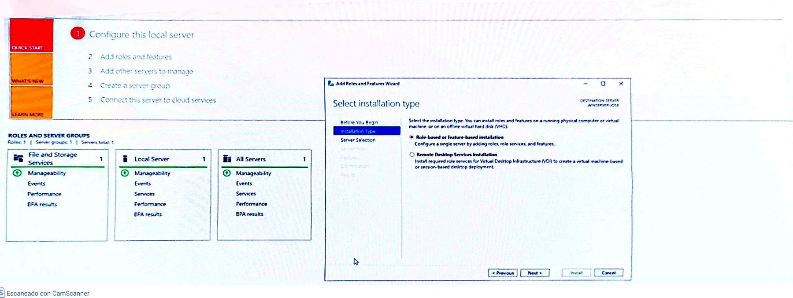
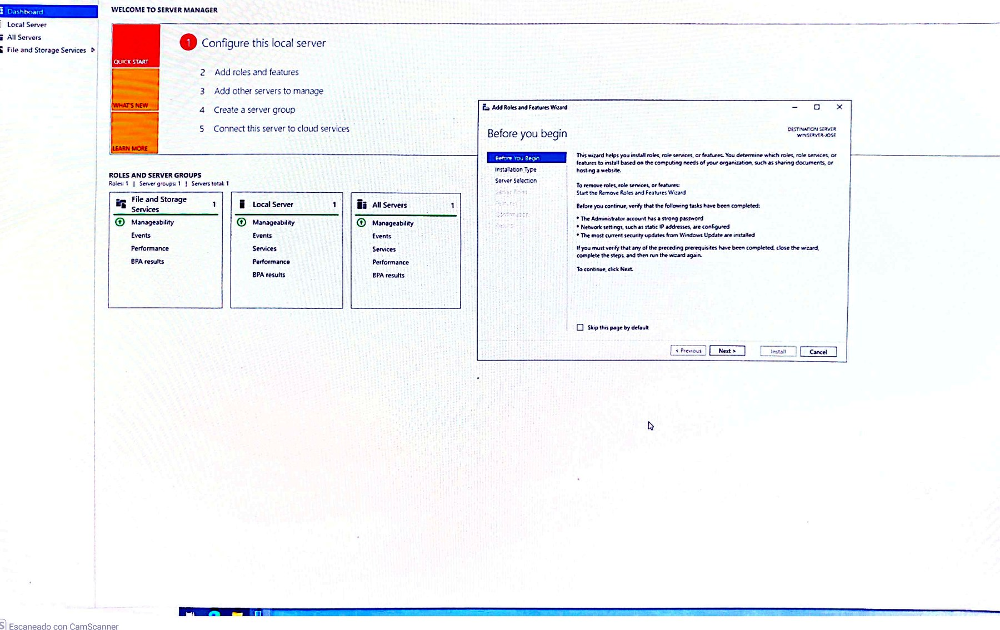
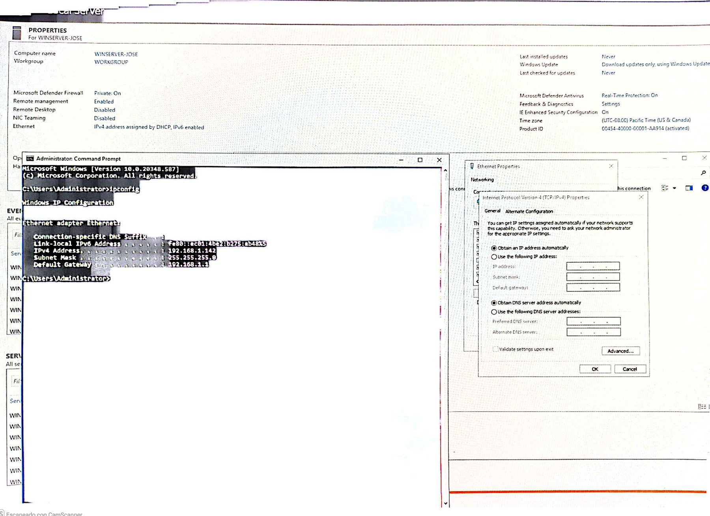
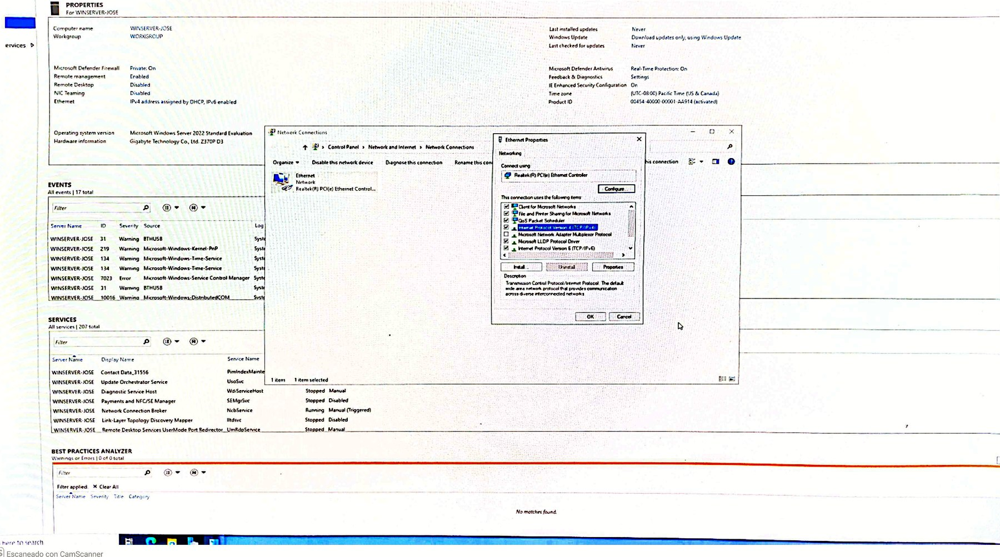
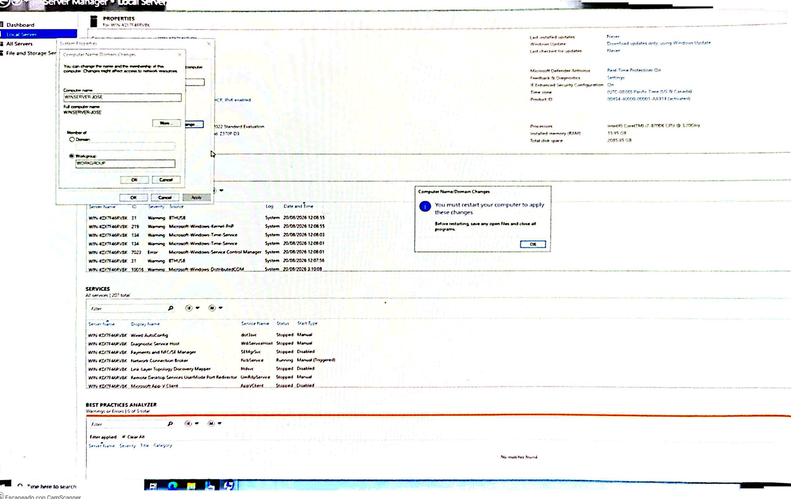
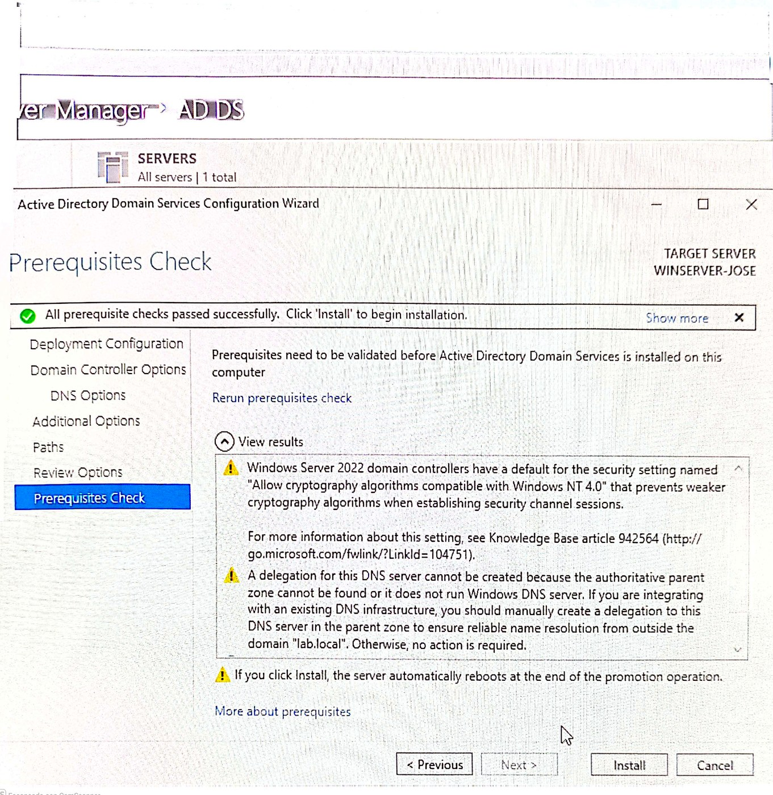
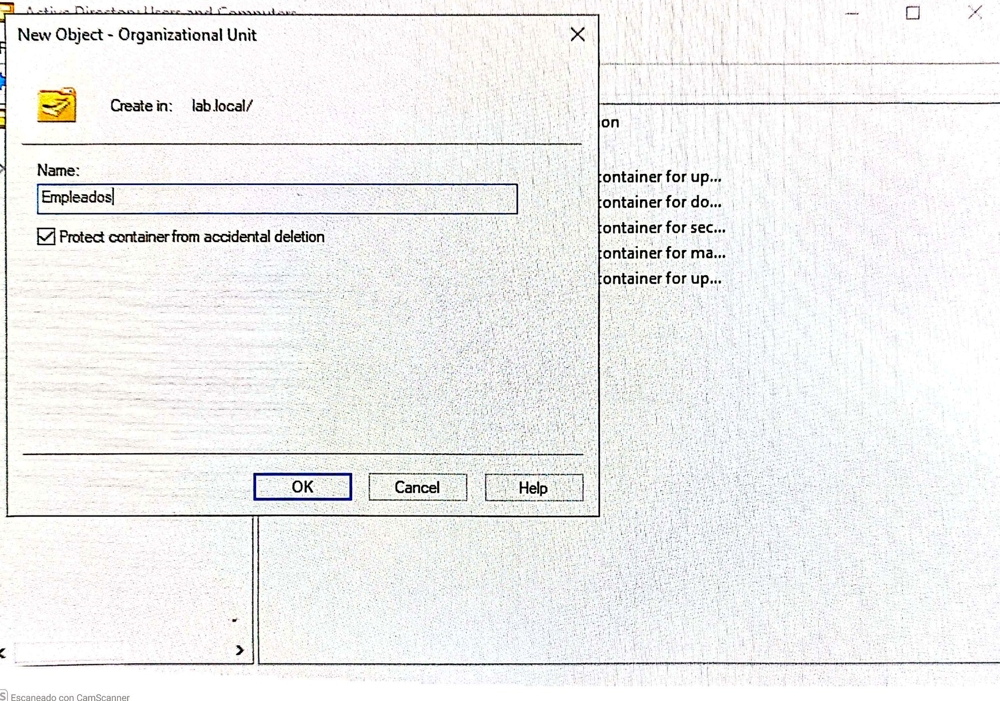

# Lab 07: Windows Server — UEFI/GPT Troubleshooting y Active Directory

**Área:** Windows Server, firmware UEFI/BIOS, particionado GPT/MBR y Active Directory Domain Services  
**Nivel:** Intermedio  
**Estado:** ✅ Completado y documentado  
**Autor:** José María Aparicio Portillo  
**Fecha:** Agosto de 2026  
**Hardware:** Placa base Gigabyte y USB Kingston DataTraveler 2.0 de 16 GB  
**Sistema:** Windows Server 2022 Standard Evaluation, Desktop Experience

## Objetivo

Instalar Windows Server desde un pendrive USB, resolver un conflicto de arranque Legacy/UEFI relacionado con discos GPT y dejar operativo un primer controlador de dominio con Active Directory Domain Services (AD DS).

El laboratorio sigue el flujo:

> **Síntoma → investigación por capas → causa raíz → corrección → verificación → lecciones aprendidas**

## Resultado final

El equipo quedó con Windows Server 2022 instalado en arranque dual junto al Windows 11 existente. El medio de instalación, la BIOS y el disco de destino quedaron alineados en modo UEFI/GPT. Después se configuró una IP estática, se instaló AD DS, se creó el bosque `lab.local`, se promocionó el servidor a controlador de dominio y se creó la OU `Empleados` con el usuario `JoseAparicio`.

> [!WARNING]
> Este laboratorio se realizó sobre un equipo con varios discos y un sistema operativo existente. Antes de seleccionar una partición o utilizar `diskpart`, hay que identificar con precisión el disco de destino y disponer de una copia de seguridad. Un comando como `clean` elimina la tabla de particiones del disco seleccionado.

## Parte 1 — Troubleshooting de instalación y arranque

### Síntoma inicial

Durante la instalación, cualquier disco seleccionado mostraba:

> Windows cannot be installed to this disk. The selected disk is of the GPT partition style.

El mismo mensaje aparecía al cambiar de disco, lo que indicaba que el problema no estaba necesariamente en la partición seleccionada. La hipótesis inicial fue una incompatibilidad entre un instalador arrancado en Legacy/BIOS y discos internos particionados en GPT.

### 1. Primer intento: forzar UEFI desde la BIOS

Se accedió a la BIOS Gigabyte con `Del` y se desactivó **CSM Support**, que permite el arranque Legacy. Al hacerlo, el equipo quedó detenido en el logo de arranque y el teclado USB dejó de responder durante el POST.

La incidencia mostró que un cambio de CSM puede afectar también a la inicialización de periféricos antes de que arranque el sistema operativo. En un equipo de producción conviene preparar previamente un plan de reversión, como un reseteo de CMOS.

### 2. Recuperación de la BIOS mediante CMOS

Se apagó el equipo, se desconectó la corriente, se retiró la pila CR2032 durante unos minutos y se volvió a colocar. La BIOS recuperó sus valores predeterminados y el acceso a `Del` y `F12` volvió a funcionar.

### 3. Configuración UEFI coherente

Con el acceso recuperado, se configuraron las siguientes opciones:

| Opción | Valor |
|---|---|
| CSM Support | **Disabled** |
| Storage Boot Option Control | **UEFI** |
| LAN PXE Boot Option ROM | **UEFI** |
| Boot Option #1 | KingstonDataTraveler 2.0PMAP |

### 4. Verificación del medio de instalación

El error persistió incluso con la BIOS en UEFI puro. Por eso se verificó el formato real del pendrive en lugar de confiar únicamente en la configuración seleccionada en Rufus:

```powershell
diskpart
list disk
select disk X
detail disk
```

El resultado indicó que el USB seguía utilizando **MBR**. El intento anterior de grabación no había llegado realmente al estado `LISTO`.

### 5. Regrabado del USB con Rufus

Se volvió a crear el medio con esta configuración:

| Campo | Valor |
|---|---|
| Imagen | ISO de Windows Server 2022 Evaluation |
| Esquema de partición | **GPT** |
| Sistema de destino | **UEFI (no CSM)** |
| Sistema de archivos | **NTFS** |

La barra de progreso se dejó terminar completamente antes de retirar el pendrive. La verificación del formato real fue más importante que la selección visual de opciones.

### 6. Refresco de la entrada de arranque

Al arrancar el USB regrabado apareció el aviso:

> ERROR: BIOS/LEGACY BOOT OF UEFI-ONLY MEDIA

El aviso confirmó que el medio ya era UEFI-only, pero el equipo todavía estaba intentando utilizar una entrada Legacy anterior. En las prioridades de arranque aparecían dos referencias para el pendrive. Se seleccionó nuevamente la entrada específica del Kingston y se guardó la configuración para que la BIOS redetectara el medio.

### 7. Instalación de Windows Server y dual boot

Después de alinear BIOS, pendrive y disco de destino, la instalación avanzó normalmente. Se seleccionó **Windows Server 2022 Standard Evaluation (Desktop Experience)** y se instaló en `Drive 2 Partition 3`, de 50 GB, evitando el disco con Windows 11 y la partición de datos personales.

Tras el reinicio apareció Windows Boot Manager con dos entradas: **Windows Server** y **Windows 11**. Esto confirmó que el sistema anterior permanecía intacto y que ambos sistemas arrancaban en modo UEFI.

## Evidencia visual — instalación y troubleshooting

### Server Manager y comienzo de la instalación del rol



*Inicio del asistente para añadir roles y características al servidor local.*

### Selección del tipo de instalación



*Se selecciona la instalación basada en roles o características para trabajar sobre el servidor local.*


*Vista del servidor y de los roles disponibles antes de completar la configuración.*

### Configuración del servidor y AD DS


*Paso intermedio del asistente utilizado para preparar el servidor.*



*Selección del rol AD DS y aceptación de las herramientas de administración asociadas.*



*Configuración del asistente antes de la promoción del servidor.*



*Continuación de la configuración previa a la promoción del controlador de dominio.*

## Parte 2 — Configuración inicial de AD DS

### 8. Renombrado del servidor

Antes de instalar AD DS se cambió el nombre predeterminado del equipo a:

```text
WINSERVER-JOSE
```

Renombrar el equipo antes de promocionarlo evita la complejidad de cambiar el nombre de un controlador de dominio ya operativo.

### 9. IP estática

Los datos iniciales obtenidos con `ipconfig` fueron:

| Parámetro | Valor inicial |
|---|---|
| IPv4 asignada por DHCP | `192.168.1.142` |
| Máscara | `255.255.255.0` |
| Puerta de enlace | `192.168.1.1` |

La IP objetivo fue `192.168.1.200`. Como la configuración gráfica no persistía, se utilizó `netsh`:

```powershell
netsh interface show interface
netsh interface ip set address name="Ethernet" static 192.168.1.200 255.255.255.0 192.168.1.1
netsh interface ip set dns name="Ethernet" static 192.168.1.1
netsh interface ip add dns name="Ethernet" 8.8.8.8 index=2
```

La configuración se verificó con `ipconfig` y mediante una prueba de resolución y conectividad con `ping google.com`.

### 10. Instalación y promoción de AD DS

Desde **Server Manager → Add roles and features** se instaló **Active Directory Domain Services**. Después se utilizó la notificación **Promote this server to a domain controller**.

Los valores principales fueron:

| Paso | Valor |
|---|---|
| Deployment Configuration | **Add a new forest** |
| Root domain name | **`lab.local`** |
| DNS delegation | No crear delegación |
| NetBIOS name | `LAB` |
| DSRM password | Distinta de la contraseña de Administrator |

El asistente indicó que todas las comprobaciones previas se habían superado correctamente. Las advertencias sobre delegación DNS no requerían acción en este bosque de laboratorio aislado.



*Todas las comprobaciones previas aparecen superadas; también se documentan las advertencias esperables sobre delegación DNS y reinicio automático.*

### 11. Verificación del dominio

Después del reinicio, el inicio de sesión pasó a utilizar `LAB\Administrator`. En **Active Directory Users and Computers** apareció el dominio `lab.local` con sus contenedores predeterminados, incluido `Domain Controllers`.



*Menú contextual para crear una nueva unidad organizativa dentro del dominio.*

### 12. Creación de la OU `Empleados`

Se creó la unidad organizativa:

```text
lab.local/Empleados
```

La opción **Protect container from accidental deletion** se mantuvo activada.

### 13. Creación del usuario de dominio

Dentro de `Empleados` se creó el usuario:

| Campo | Valor |
|---|---|
| Nombre | Jose |
| Apellido | Aparicio |
| UPN | `JoseAparicio@lab.local` |
| Nombre pre-Windows 2000 | `LAB\JoseAparicio` |
| Cambio de contraseña | Obligatorio en el próximo inicio de sesión |


*Datos de identidad y nombres de inicio de sesión del usuario de dominio.*


*Se marca `User must change password at next logon` para obligar al usuario a sustituir la contraseña temporal.*

## Causa raíz

El problema original fue una incompatibilidad en cadena entre las capas de arranque:

1. El pendrive estaba grabado en **MBR/Legacy**.
2. Los discos internos utilizaban **GPT**.
3. La BIOS se alternó entre Legacy y UEFI durante las pruebas.
4. El medio fue regrabado, pero la entrada de arranque anterior seguía seleccionándose.
5. La solución consistió en verificar y alinear por separado BIOS, medio de instalación y disco de destino.

> **Lección central:** cuando aparece un error de GPT durante la instalación, no hay que asumir que el disco está defectuoso. Hay que comprobar el modo real de arranque, el esquema del USB y el estilo de partición del disco de destino.

## Verificación final

- [x] Windows Server 2022 instalado en Desktop Experience.
- [x] Windows 11 anterior conservado en arranque dual.
- [x] BIOS configurada en UEFI sin CSM.
- [x] Medio Rufus creado con GPT y UEFI no CSM.
- [x] Servidor renombrado como `WINSERVER-JOSE`.
- [x] IP estática configurada como `192.168.1.200`.
- [x] Rol AD DS instalado.
- [x] Bosque `lab.local` creado y operativo.
- [x] Controlador de dominio verificado en ADUC.
- [x] OU `Empleados` creada.
- [x] Usuario `JoseAparicio` creado con cambio de contraseña obligatorio.
- [ ] Probar el inicio de sesión del usuario normal desde un segundo equipo unido al dominio.

## Herramientas utilizadas

- Rufus 4.15.
- `diskpart` y PowerShell.
- `netsh` e `ipconfig`.
- BIOS Gigabyte.
- Reseteo físico de CMOS.
- Server Manager, ADUC y el asistente de configuración de AD DS.

## Siguiente paso recomendado

Unir una segunda máquina física o virtual al dominio `lab.local` y probar el inicio de sesión de `JoseAparicio` desde ese cliente. En un controlador de dominio no conviene utilizar el propio servidor como estación de trabajo para validar el flujo normal de un usuario estándar.

---

**Última actualización:** Agosto de 2026  
**Repositorio:** [IT Support Labs](https://github.com/anudoranador87/it-support-labs)
