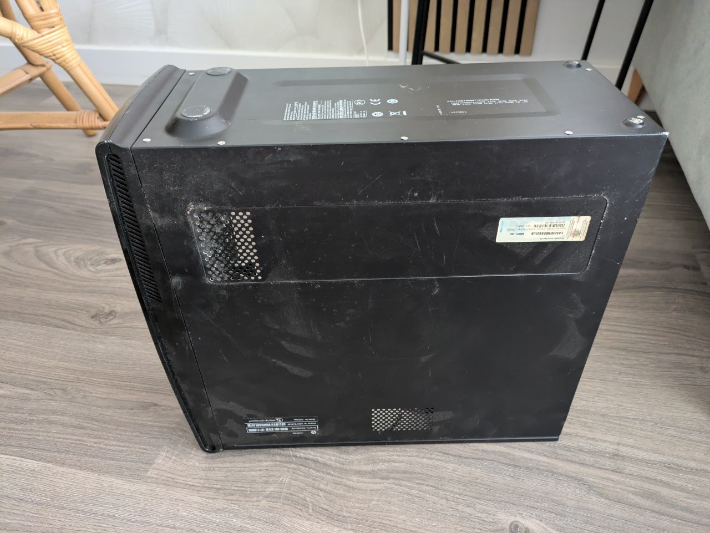
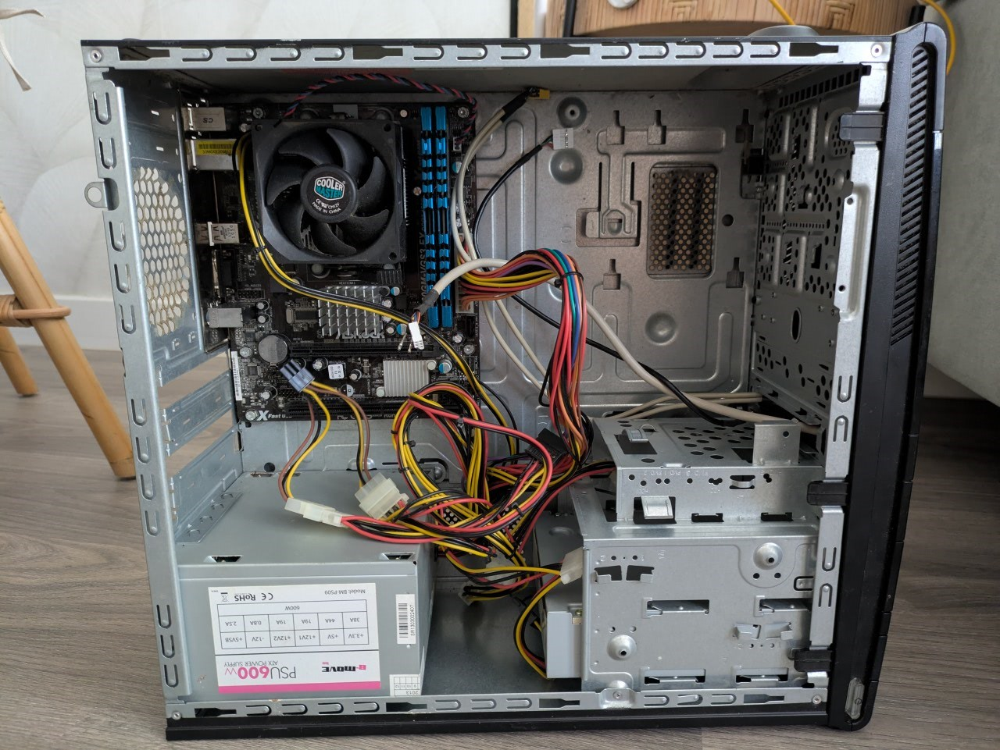
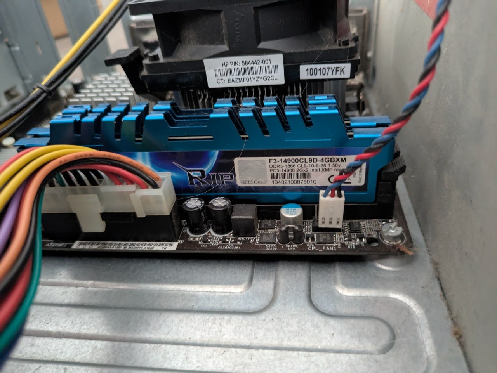

# 🖥️ Lab 01 — Hardware Inventory

**Series:** Hardware Maintenance / IT Support  
**Environment:** Physical hardware (Desktop Tower)  
**Objective:** Identify and document all hardware components of a real desktop PC without disassembly, practicing visual component recognition as a first inspection.  
**Status:** ✅ Completed

---

## Scenario

You are presented with a non-functional desktop unit. Before performing any repair or disassembly, you must perform a visual inventory. Identifying brands, models, and visible physical damage is the standard first step in any IT Support workstation assessment.

---

## 📦 Hardware Inventory

| Component | Brand / Model | Details |
|---|---|---|
| **CPU** | AMD | AM3+ socket. Degraded thermal paste visible |
| **Motherboard** | ASRock 960GM series | X Fast LAN, DDR3, SATA II |
| **RAM** | G.Skill Ripjaws X | DDR3-1866 CL9, 4GB (2x2GB), PC3-14900 |
| **PSU** | B-Move PSU600W | Model BM-PS09, ATX, 600W (2013) |
| **CPU Cooler** | Cooler Master | Standard AM3+ cooler |
| **Hard Drive** | — | **Not present** |
| **GPU** | — | **Not present** — integrated video only |

---

## 🔬 Visual Inspection Findings

1. **Powered off and unplugged the unit.** Safety first.
2. **Removed the side panel** to expose the motherboard.
3. **Visual inspection without touching components** to avoid ESD (Electrostatic Discharge) until ready for repair.
4. **Photographed each identified component** for documentation and client records.
5. **Read visible labels** to identify technical specifications.

### Critical Issues Identified
- **PC does not power on** — cause unknown, pending diagnosis.
- **No hard drive** — system cannot boot from local storage.
- **Thermal paste completely dried out** — visible degradation on CPU surface.
- **Heavy dust buildup** on motherboard and components.
- **Poor cable management** — cables obstructing airflow and visibility.

---

## 🛠️ Next Steps

| Issue | Action | Future Lab |
|---|---|---|
| No power | Diagnose PSU and connections | Lab 02 |
| Dust buildup | Clean with compressed air | Lab 04 |
| Thermal paste | Replace during disassembly | Lab 05 |
| No hard drive | Boot from Live USB | Lab 08 / 09 |

---

## 📸 Photo Documentation

*Fig 1 — Tower exterior, side panel closed*

*Fig 2 — Full interior overview*

*Fig 3 — G.Skill Ripjaws RAM + motherboard zone*

*Fig 4 — Interior from top angle*

*Fig 5 — B-Move PSU600W label*

*Fig 6 — AMD CPU with visibly degraded thermal paste*

*Fig 7 — Full motherboard with Cooler Master*

---

## Key Concepts

**ESD (Electrostatic Discharge)** — Static electricity can destroy computer components. Always ground yourself or use an anti-static wrist strap before touching internal parts.

**Thermal Throttling** — When thermal paste degrades, the CPU cannot dissipate heat. This causes the system to slow down or shut down to prevent permanent damage.

**Post-Visual Diagnosis** — Many issues (like a missing drive or a blown capacitor) can be identified before ever turning the machine on.

---

## Notes

- Full visual inventory completed in ~30 minutes.
- PC is non-functional in current state but recoverable through part replacement and maintenance.

---

## Part of

[`it-support-labs`](https://github.com/anudoranador87/it-support-labs) — Documenting my journey from hotel management to IT support. Google IT Support Certificate + CompTIA A+ in progress.
