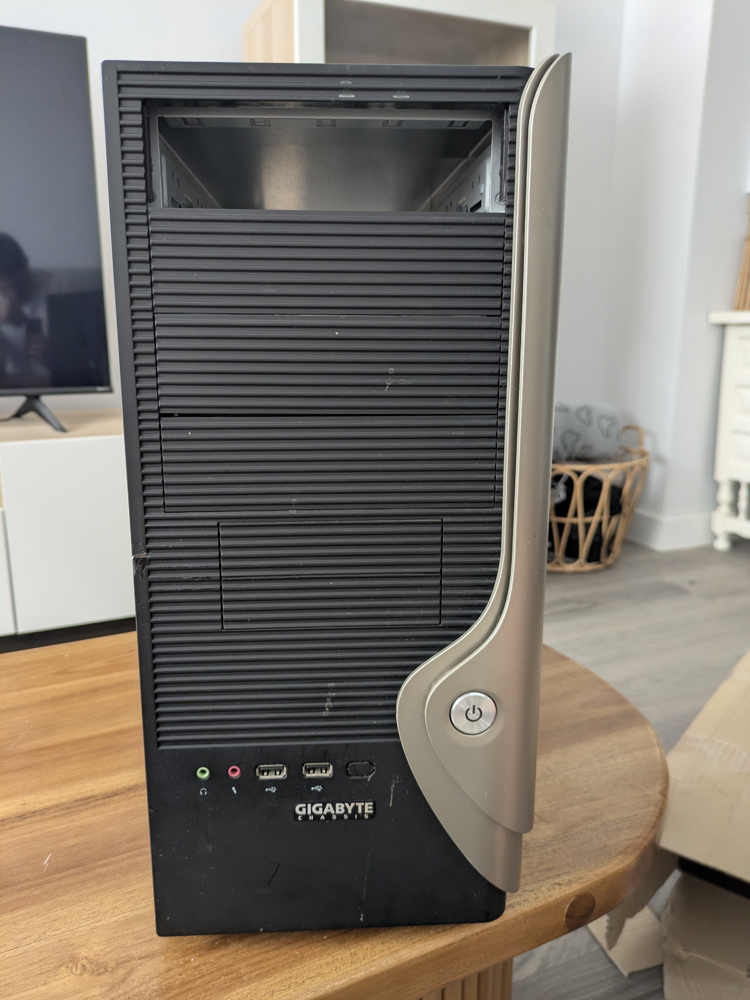

# 🖥️ Lab 03 — Preventive Maintenance

**Series:** Hardware Maintenance / IT Support  
**Environment:** Physical hardware (Laptop)  
**Objective:** Perform preventive maintenance, focusing on internal cooling system cleaning and peripheral (keyboard) restoration, while navigating hardware limitations.  
**Status:** ✅ Completed

---

## Scenario

A laptop is overheating and its keyboard is partially unresponsive. This is a classic "preventive maintenance" ticket. Your goal is to restore thermal efficiency and mechanical functionality without causing further damage to the aging chassis.

---

## 🛠️ Procedures and Findings

### Phase 1 — Thermal Management and Cooling
- **Action:** Disassembled the laptop chassis, extracted the cooling assembly, and thoroughly cleaned the fan and heatsink fins.
- **Challenge:** Several screws were found to be **stripped** (worn-out heads). This prevented the removal of the heat pipe to replace the thermal paste.
- **Observation:** Significant dust buildup was obstructing airflow through the heatsink.
- **Result:** Even without new thermal paste, cleaning the airflow path resulted in a **~40°C reduction** in operating temperature.

### Phase 2 — Keyboard Restoration
- **Action:** Physical cleaning of keyboard keys and switches using compressed air and isopropyl alcohol.
- **Observation:** Keys were unresponsive and sticky due to accumulated debris.
- **Result:** Improved tactile feedback and consistent input response. ✅

### Phase 3 — Hardware Integrity
- **Action:** Detailed mapping of internal component connections during disassembly.
- **Observation:** Discovered and secured several loose screws from previous interventions.
- **Learning:** Proper tool sizing is critical; using the wrong bit size is what leads to the stripped screws found in Phase 1.

---

## 📊 Summary of Results

| Component / Task | Condition Before | Action Taken | Result |
|---|---|---|---|
| **Cooling Fan / Heatsink** | Heavily clogged | Physical cleaning | ✅ ~40°C temp drop |
| **Keyboard** | Sticky / Unresponsive | Mechanical cleaning | ✅ Improved responsiveness |
| **Internal Screws** | Stripped / Missing | Recovered / Secured | ✅ Improved chassis integrity |
| **Thermal Paste** | Degraded (suspected) | Unable to access | ⚠️ Deferred (stripped screws) |

---

## 📸 Photo Documentation

*Fig 1 — Initial disassembly check*

*Fig 2 — Dust accumulation on cooling components*

*Fig 3 — Internal component mapping and screw recovery*

---

## Key Concepts

**Preventive Maintenance (PM)** — Regularly scheduled cleaning and inspection to prevent hardware failure before it happens.

**Thermal Management** — The process of moving heat away from sensitive components (CPU/GPU). Airflow is just as important as the thermal compound.

**Stripped Screws** — A common hurdle in IT support. Caused by using incorrect tools or excessive torque. Requires specialized extraction tools or "rubber band" techniques.

---

## Notes

- Cleaning the heatsink is often the "quick win" for overheating laptops.
- Always document screw locations; laptops often use 3-4 different screw lengths in a single chassis.

---

## Part of

[`it-support-labs`](https://github.com/anudoranador87/it-support-labs) — Documenting my journey from hotel management to IT support. Google IT Support Certificate + CompTIA A+ in progress.
