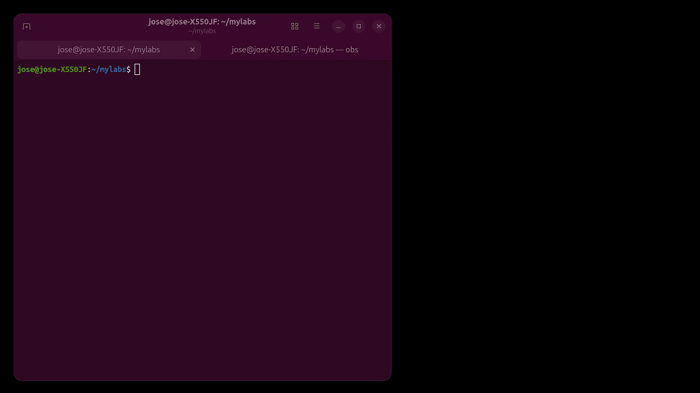
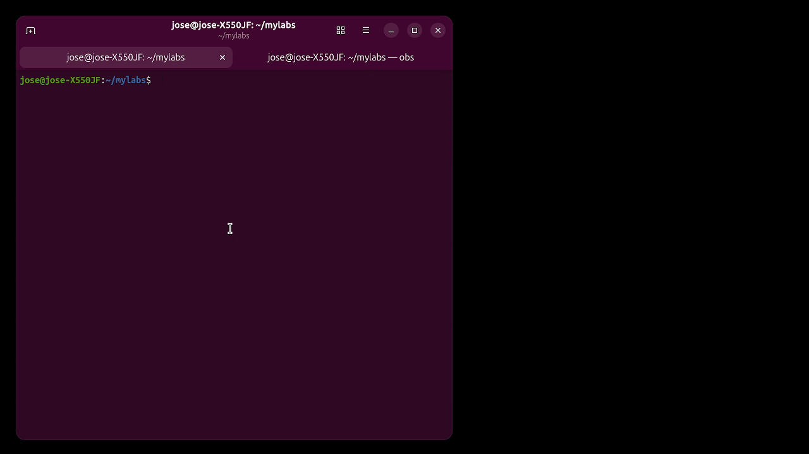
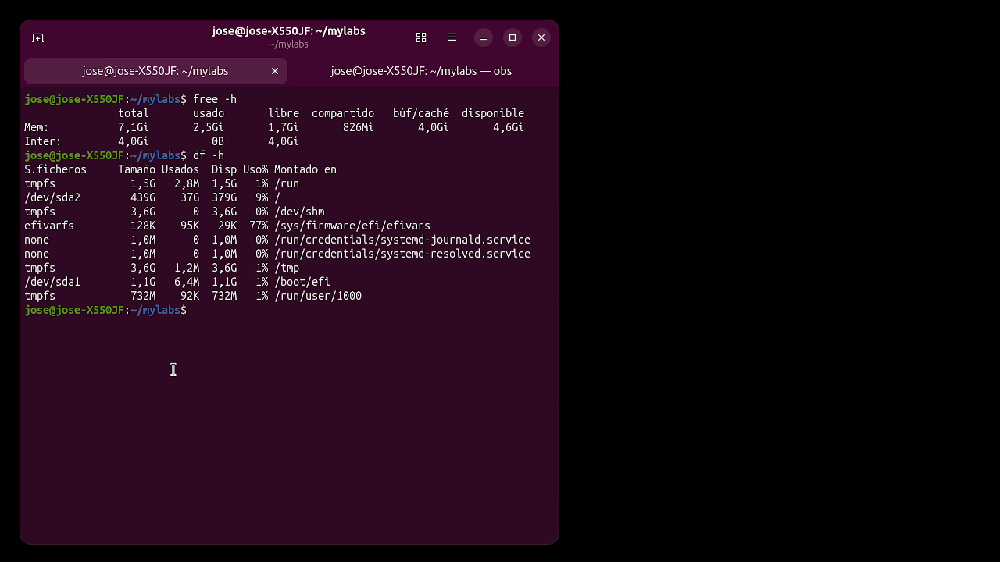
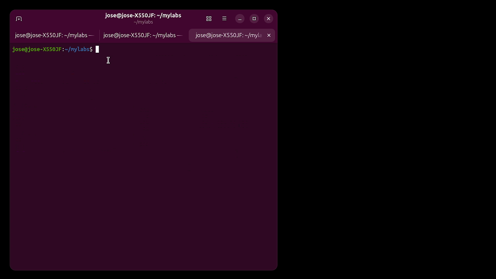
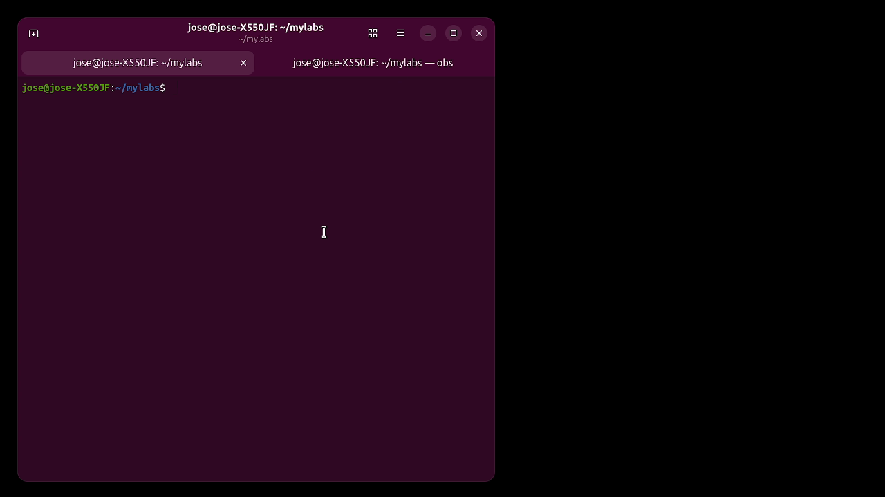

# 📺 Troubleshooting Guide: The Mystery of the Sluggish Server

This guide documents a real-world IT support case: a Linux server that has become painfully slow. Through this narrative, you will learn how to diagnose and resolve performance issues using the command line.

---

## 🎥 The Scenario (Video Walkthrough)

Imagine you receive a high-priority ticket: *"The server is crawling, I can barely type commands."* Before panicking, watch how we approach the problem in this walkthrough:

*Click the thumbnail to watch the full walkthrough on YouTube.*

---

## 🕵️‍♂️ Step 1: Initial Investigation

The first thing a technician does is rule out the "usual suspects." We need to know if the hardware is struggling.

### 🧠 Checking the RAM
Is the system out of memory? We run `free -h` to check. If the system is heavily relying on *Swap*, it will slow down everything.

### 💽 Checking Disk Space
A disk at 100% capacity can freeze a system. We use `df -h /` to verify the root partition and ensure there's room to breathe.

---

## 🔍 Step 2: Identifying the "Culprit"

If memory and disk look healthy, the issue is usually a "rogue" process hogging the CPU cycles.

### 📊 Real-Time Monitoring with `top`
We launch `top` to see the live heartbeat of the system. We can see processes fighting for resources.

### 🎯 Precision Targeting with `ps`
To be absolutely certain and get the exact **PID** (Process ID) for our next move, we run a filtered search for the top CPU consumers.

---

## 🛠️ Step 3: Taking Action

Now that we have the target in our sights, we must decide how to handle it.

### 💀 Option A: Immediate Termination (Kill)
If the process is non-essential or frozen, we terminate it immediately to restore system health.

### ⚖️ Option B: Adjusting Priority (Renice)
If the process must keep running, we lower its priority so it doesn't starve other important services.

---

## ✅ Step 4: Verification & Success

After taking action, we monitor the system to ensure the fix is permanent.

### Final Checklist:
1. **Memory:** Available RAM is back to normal levels.
2. **Disk:** Root partition has plenty of free space.
3. **CPU:** No single process is hogging >90% of the CPU.

Mission accomplished! 🚀
