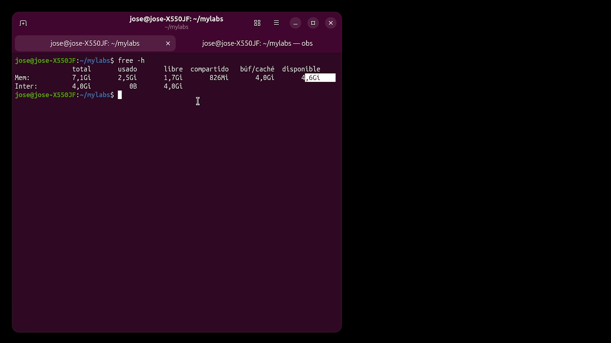
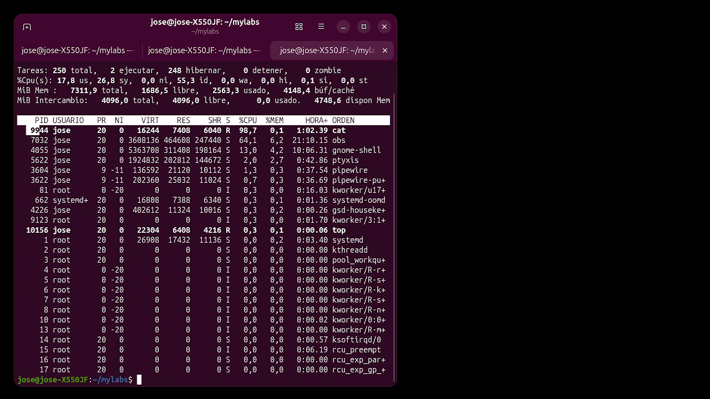
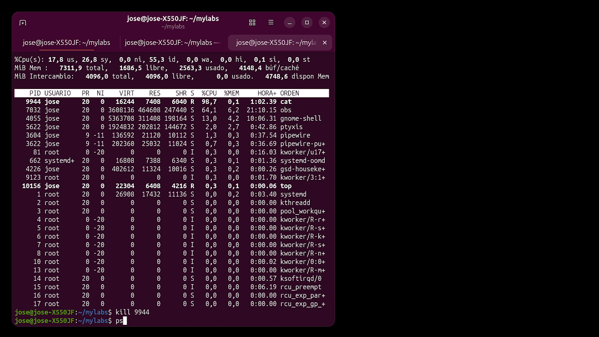
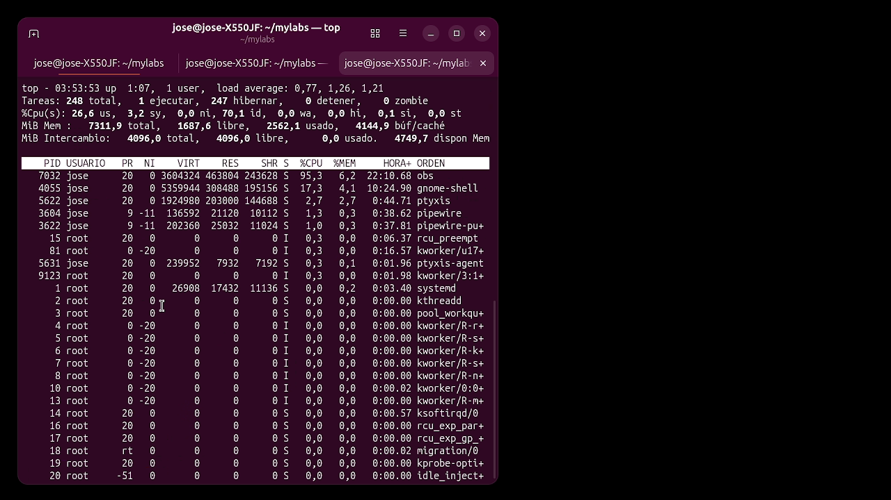
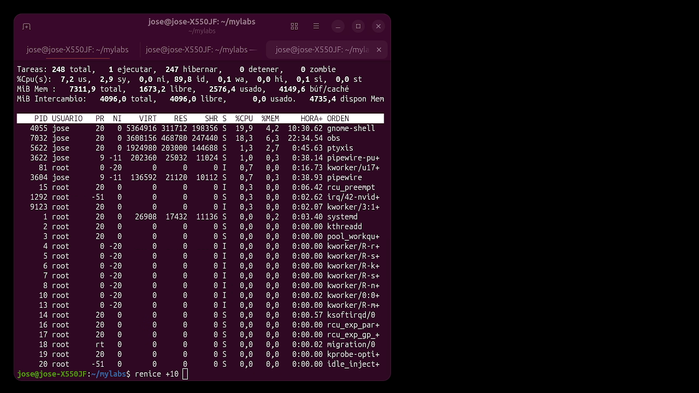

# 📺 IT Support – CPU‑Troubleshooting Lab

A **complete step‑by‑step** guide that shows how to diagnose a sluggish Linux server, locate the offending process, and fix it — all using only the command line. This lab walks through a **real-world scenario**: a system using 98.7% CPU due to a rogue `cat` process, and how to resolve it.

The video **[IT Support CPU usage](https://youtu.be/2mHf1uUctw0)** (YouTube) showcases the whole workflow; the screenshots below show exact outputs at each step.

---  

## 🎥 Video walkthrough  

[](https://youtu.be/2mHf1uUctw0)

*Click to watch the complete walkthrough (all commands shown live).*

---

## 🧭 Complete Lab Flow

This lab has **three phases**: **Diagnosis** → **Identification** → **Resolution**.

### Phase 1️⃣: System Baseline (Diagnosis)

Start by gathering system health data.

| Step | Command | What you should see | Screenshot |
|------|---------|---------------------|-----------|
| **1.1** | `free -h` | Memory usage, swap, available RAM |  |
| **1.2** | `df -h /` | Disk usage on root partition (should be ≥ 20% free) |  |
| **1.3** | `top -b -n 1 \| head -n 15` | Load average, task count, CPU % breakdown |  |

**Expected output (healthy system):**
- Memory: Plenty of free RAM, minimal swap usage
- Disk: ≥ 20% free space
- CPU: Load average < number of cores, no single process > 90%

---

### Phase 2️⃣: Interactive Inspection (Identification)

Open `top` in interactive mode to monitor processes in real-time.

| Step | Command | What to look for | Screenshot |
|------|---------|------------------|-----------|
| **2.1** | `top` (then press `q` to exit) | Sorted by %CPU by default—locate the offending process |  |

**In this lab's scenario:**
- You'll see PID **9944** running `cat` (the command)
- %CPU column shows **98.7%** (nearly all CPU is consumed)
- This process is clearly the culprit—it's hogging the CPU

**Alternative (if you prefer `ps`):**
```bash
ps -eo pid,comm,%cpu --sort=-%cpu | head -n 5
```

---

### Phase 3️⃣: Resolution (Action)

Once you've identified the rogue process, you have **two options**:

#### Option A: Hard Stop (Kill the process)

| Step | Command | What happens | Screenshot |
|------|---------|--------------|-----------|
| **3A.1** | `sudo kill 9944` | Process is terminated immediately |  |
| **3A.2** | `top` (to verify) | The process is gone; load/CPU drop noticeably |  |

**Before kill:**
- Load average: higher, task count: 250, %CPU: 98.7%

**After kill:**
- Load average: lower, task count: 248, %CPU: 19.9%
- System is responsive again

---

#### Option B: Soft Stop (Lower priority with renice)

| Step | Command | What happens | Screenshot |
|------|---------|--------------|-----------|
| **3B.1** | `sudo renice +10 -p 9944` | Process priority reduced; it still runs but at lower priority |  |
| **3B.2** | `top` (to verify) | Process continues but other tasks get more CPU time |  |

**Use `renice` when:**
- The process is important but can wait
- You want to slow it down without killing it
- You want to test if it's truly the culprit

**Use `kill` when:**
- The process is harmful / unwanted
- It's consuming resources and serving no purpose
- You need immediate relief

---

## 📋 Key Commands Reference

### 1. System Diagnostics

```bash
free -h              # RAM & swap usage
df -h /              # Disk space on root partition
lsblk                # Block device layout
vmstat 1 5           # Virtual memory stats (5 samples, 1 sec each)
iostat -x 1 5        # I/O statistics
```

### 2. Process Monitoring

```bash
top                  # Interactive, sorted by CPU (press 'P' for CPU, 'M' for memory)
top -b -n 1          # Single batch snapshot
ps -eo pid,comm,%cpu --sort=-%cpu | head -n 10  # Top 10 by CPU
ps aux | grep <process-name>  # Find specific process
htop                 # Better top (if installed)
```

### 3. Process Management

```bash
kill <PID>           # SIGTERM (graceful) - gives process time to clean up
kill -9 <PID>        # SIGKILL (hard) - instant termination (use sparingly)
renice +10 -p <PID>  # Lower priority (range: -20 to 19; higher number = lower priority)
nice -n 5 <command>  # Start process with lower priority
```

### 4. Load & CPU Details

```bash
uptime               # Load average & uptime
nproc                # Number of CPU cores
cat /proc/cpuinfo    # CPU info
cat /proc/loadavg    # Detailed load average
```

---

## ✅ Success Criteria

After completing this lab, you should be able to:

✓ **Diagnose** system performance using `free`, `df`, `top`  
✓ **Identify** the rogue process consuming CPU  
✓ **Choose** between `kill` (hard stop) and `renice` (soft stop)  
✓ **Verify** improvement by comparing before/after snapshots  
✓ **Explain** why the system is now responsive

**Metric targets:**
- Memory: Plenty of free RAM / minimal swap
- Disk: ≥ 20% free space on root partition
- CPU: No single process > 90% (or it has been addressed)

---

## 🧠 What This Tests (CompTIA A+ Domain 4)

This lab covers:
- **4.3** Process management on Linux
- **4.4** Performance troubleshooting (CPU, memory, disk)
- **4.5** Understanding priorities and scheduling
- **4.6** Using monitoring tools (`top`, `ps`, `free`, `df`)

---

## 📚 Further Reading

- `man free`, `man df`, `man top`, `man ps`, `man kill`, `man renice`  
- **Linux Performance** – https://kernel.org/doc/html/latest/admin-guide/perf.html  
- **Load Average** – https://en.wikipedia.org/wiki/Load_(computing)  
- **Process Signals** – https://en.wikipedia.org/wiki/Signal_(IPC)  

---

## 🎯 Practice Variations

Once you master the lab, try these:

1. **Create a CPU hog manually:** `yes > /dev/null &` (starts background process), then diagnose and kill it
2. **Memory stress test:** `stress-ng --vm 1 --vm-bytes 1G` (uses 1GB RAM)
3. **Disk space alert:** Fill up a partition with `dd if=/dev/zero of=largefile bs=1M count=1000`, then clean it
4. **Multi-process scenario:** Run multiple processes; identify and isolate the worst offender

---

Enjoy the lab and happy debugging! 🚀
