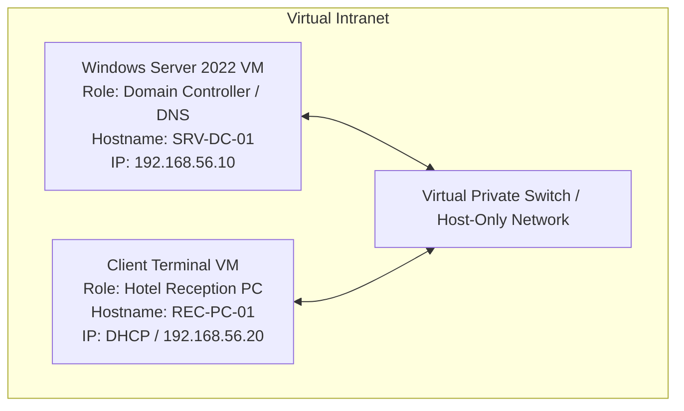
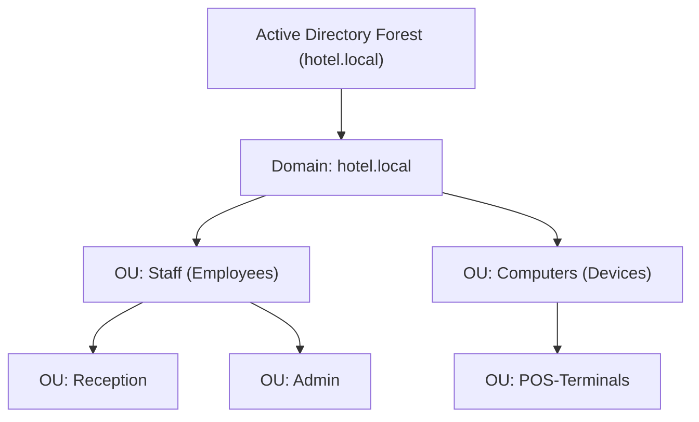

# 🖥️ Lab 09: Windows Server AD Setup — Domain Creation

> **CompTIA A+ Alignment:** 220-1201, Domains 1.0 (Virtualization & Cloud), 2.0 (Networking & Windows), 5.0 (Troubleshooting)  
> **Difficulty:** Advanced | **Estimated Time:** 60 minutes  
> **Status:** 📋 Guide Complete — Ready for Hands-On Screenshots

---

## 🇬🇧 English Guide

### 🎯 Scenario & Objective
A boutique hotel with 20 employee terminals (reception desk, back office, spa, restaurant POS) wants to transition from independent, insecure local computer accounts to centralized user management. 
Currently, if a receptionist changes their password, they must update it on multiple machines. Security policies (lockout, password complexity) are impossible to enforce consistently.

**Objective:** Deploy a secure Windows Server Virtual Machine, configure static network parameters, install the Active Directory Domain Services (AD DS) role, and promote the server to the Domain Controller (DC) for a new forest: `hotel.local`.

### 🗺️ Network & AD Topology

#### Virtual Intranet Topology

#### Active Directory Logical Structure

---

### 📸 Step-by-Step Walkthrough

#### Step 1: Virtual Machine & Network Settings
1. Create a new Windows Server VM in **VirtualBox** (Allocate at least 2 vCPUs, 2048 MB RAM, and 50 GB storage).
2. Change the Network Adapter setting from NAT to **Host-Only Adapter** (or Internal Network) to simulate a secure, isolated private LAN.
3. Boot the Windows Server ISO, complete the install, and log in to the desktop.
4. Open Network Connections (`ncpa.cpl` in Run), open the properties of the Ethernet adapter, and select IPv4.
5. Set the network configuration to:
   * **IP Address:** `192.168.56.10`
   * **Subnet Mask:** `255.255.255.0`
   * **Default Gateway:** Leave empty (isolated lab)
   * **Preferred DNS Server:** `192.168.56.10` (Crucial: A Domain Controller must point to itself or a DNS server that will manage the AD zone).
6. Verify connectivity using `ping 192.168.56.10` in PowerShell.

> [!IMPORTANT]
> Save your configuration screenshot as `01_static_ip_config.png` inside the `img/` folder.
> 
> 

#### Step 2: Install Active Directory Domain Services Role
1. Open **Server Manager** and click **Add roles and features**.
2. Advance through the wizard selecting **Role-based or feature-based installation**.
3. Select your local server (`SRV-DC-01`) from the server pool.
4. On the Roles list, check the box for **Active Directory Domain Services (AD DS)**. Click **Add Features** on the pop-up.
5. Click Next, leave defaults on the Features page, and click **Install**. Wait for the process bar to complete.

> [!IMPORTANT]
> Save your installer screenshot as `02_roles_wizard.png` inside the `img/` folder.
> 
> 

#### Step 3: Promote Server to Domain Controller (DC)
1. In Server Manager, click the notification flag ⚠️ at the top right and select **Promote this server to a domain controller**.
2. In the Deployment Configuration wizard:
   * Select **Add a new forest**.
   * Specify **Root domain name:** `hotel.local`
3. In Domain Controller Options:
   * Keep functional levels at default (Windows Server 2016).
   * Ensure **Domain Name System (DNS) server** is checked.
   * Enter a secure password for the **Directory Services Restore Mode (DSRM)** and write it down.
4. Click Next through DNS Options, NetBIOS name, and Paths.
5. In the Prerequisites Check, verify all validations pass successfully, and click **Install**.
6. The VM will install the components, configure local DNS records, and automatically reboot.

> [!IMPORTANT]
> Save your promotion wizard screenshot as `03_ad_promotion.png` inside the `img/` folder.
> 
> 

#### Step 4: Verification and Directory Check
1. Once rebooted, log in. Notice the login domain prefix has changed to `HOTEL\Administrator`.
2. Open **Server Manager** -> **Tools** -> **Active Directory Users and Computers (ADUC)**.
3. Verify that the root tree node `hotel.local` is visible and expandable.
4. Expand the **Domain Controllers** container and verify that your server is listed as an active DC.
5. Open DNS Manager and verify that forward lookup zones contain SRV records for `_msdcs.hotel.local`.

> [!IMPORTANT]
> Save your ADUC verification screenshot as `04_aduc_verification.png` inside the `img/` folder.
> 
> 

---

### 🧠 Key CompTIA Concepts Aligned
* **Domain Controller (DC):** A server that responds to security authentication requests (logging in, checking permissions) within a Windows domain.
* **DNS Integration:** AD DS relies entirely on DNS to allow clients to find DCs via **SRV (Service) records**. Without DNS, authentication fails.
* **Static IP Necessity:** Servers providing core roles (DNS, DHCP, DC) must have static IPs. If a DC uses DHCP and its IP changes, client computers will lose track of their authentication servers.
* **DSRM Password:** Directory Services Restore Mode is a safe mode boot environment for repairing or recovering an Active Directory database. It has its own local administrator password separate from the domain admin.

---

### ✅ Verification Checklist
- [ ] Server holds a static IP address (`192.168.56.10`) with DNS pointing to its own IP.
- [ ] AD DS and DNS roles are fully installed.
- [ ] Active Directory forest `hotel.local` has been created.
- [ ] Administrator can log in under the domain profile (`HOTEL\Administrator`).
- [ ] ADUC utility is operational.

---

## 🇪🇸 Guía en Español

### 🎯 Escenario y Objetivo
Un hotel boutique con 20 terminales de empleados (recepción, administración, spa, POS de restaurante) desea transicionar de cuentas locales independientes e inseguras en cada equipo a una administración de usuarios centralizada.
Actualmente, si una recepcionista cambia su contraseña, debe actualizarla físicamente en múltiples máquinas. Las políticas de seguridad (bloqueo de cuentas, complejidad de contraseñas) son imposibles de aplicar de manera consistente.

**Objetivo:** Desplegar una Máquina Virtual con Windows Server segura, configurar los parámetros de red estáticos, instalar el rol Active Directory Domain Services (AD DS) y promover el servidor a Controlador de Dominio (DC) para un nuevo bosque: `hotel.local`.

---

### 📸 Guía Paso a Paso Detallada

#### Paso 1: Configuración de la Máquina Virtual y Red
1. Crea una nueva VM de Windows Server en **VirtualBox** (Asigna al menos 2 vCPUs, 2048 MB de RAM y 50 GB de almacenamiento).
2. Cambia el adaptador de red en la configuración de la VM de NAT a **Adaptador sólo-anfitrión** (o Red Interna) para simular una red local privada y segura.
3. Arranca el instalador desde la ISO de Windows Server, completa el proceso de instalación e inicia sesión.
4. Abre las Conexiones de Red (`ncpa.cpl` en Ejecutar), abre las propiedades del adaptador Ethernet y haz doble clic en IPv4.
5. Configura los parámetros de red estáticos:
   * **Dirección IP:** `192.168.56.10`
   * **Máscara de Subred:** `255.255.255.0`
   * **Puerta de enlace predeterminada:** Vacía (laboratorio de red aislada)
   * **Servidor DNS preferido:** `192.168.56.10` (Crucial: Un Controlador de Dominio debe apuntar a sí mismo o a un servidor DNS que gestione la zona de AD).
6. Confirma la conectividad de red ejecutando `ping 192.168.56.10` en PowerShell.

> [!IMPORTANT]
> Guarda tu captura de pantalla de la red como `01_static_ip_config.png` dentro de la carpeta `img/`.

#### Paso 2: Instalación del Rol Active Directory Domain Services
1. Abre el **Administrador del Servidor (Server Manager)** y haz clic en **Agregar roles y características**.
2. Avanza por el asistente seleccionando la **Instalación basada en características o en roles**.
3. Selecciona tu servidor local (`SRV-DC-01`) del grupo de servidores disponibles.
4. En la lista de Roles, marca la casilla **Servicios de dominio de Active Directory (AD DS)**. Haz clic en **Agregar características** en el cuadro de confirmación flotante.
5. Haz clic en Siguiente, mantén las opciones predeterminadas en Características y presiona **Instalar**. Espera a que la barra de progreso finalice.

> [!IMPORTANT]
> Guarda tu captura del asistente de roles como `02_roles_wizard.png` dentro de la carpeta `img/`.

#### Paso 3: Promoción del Servidor a Controlador de Dominio (DC)
1. En el Administrador del Servidor, haz clic en la bandera de notificación ⚠️ amarilla de la esquina superior derecha y selecciona **Promover este servidor a controlador de dominio**.
2. En el asistente de Configuración de Implementación:
   * Selecciona **Agregar un nuevo bosque**.
   * Especifica el **Nombre del dominio raíz:** `hotel.local`
3. En las Opciones del Controlador de Dominio:
   * Mantén los niveles funcionales por defecto (Windows Server 2016).
   * Asegúrate de que la casilla **Servidor del Sistema de nombres de dominio (DNS)** esté marcada.
   * Introduce una contraseña robusta para el **Modo de restauración de servicios de directorio (DSRM)** y anótala en un lugar seguro.
4. Avanza haciendo clic en Siguiente a través de las opciones de DNS, nombre NetBIOS y rutas.
5. En la comprobación de Requisitos Previos, verifica que todas las validaciones pasen satisfactoriamente y haz clic en **Instalar**.
6. El servidor instalará el bosque y los componentes, configurará las zonas DNS locales y se reiniciará automáticamente.

> [!IMPORTANT]
> Guarda tu captura del asistente de promoción como `03_ad_promotion.png` dentro de la carpeta `img/`.

#### Paso 4: Verificación del Dominio y Herramientas
1. Una vez reiniciado, inicia sesión. Verás que el prefijo del nombre de usuario administrador habrá cambiado a `HOTEL\Administrator`.
2. Ve al **Administrador del Servidor** -> **Herramientas** -> **Usuarios y equipos de Active Directory (ADUC)**.
3. Comprueba que el árbol raíz `hotel.local` es visible y se puede desplegar.
4. Abre el contenedor **Domain Controllers** y verifica que tu servidor figura en la lista con el rol de DC activo.
5. Abre el Administrador de DNS y comprueba que las zonas de búsqueda directa contienen los registros de servicio SRV dentro de `_msdcs.hotel.local`.

> [!IMPORTANT]
> Guarda tu captura de verificación de ADUC como `04_aduc_verification.png` dentro de la carpeta `img/`.

---

### 🧠 Conceptos Clave de CompTIA Alineados
* **Controlador de Dominio (DC):** Servidor central que responde a las peticiones de autenticación (logins, comprobación de permisos) dentro de un dominio Windows.
* **Integración DNS:** AD DS depende totalmente de DNS para permitir a los clientes localizar los DCs mediante **registros de servicio SRV**. Sin DNS operativo, la autenticación fallará.
* **Necesidad de IP Estática:** Los servidores de infraestructura crítica (DNS, DHCP, DCs) requieren IPs fijas. Si la IP del DC cambiara por DHCP, los equipos clientes perderían la conexión con el servidor de autenticación.
* **Contraseña DSRM:** El Modo de Restauración de Servicios de Directorio es un entorno de arranque seguro (modo a prueba de fallos) exclusivo para reparar bases de datos dañadas de AD. Cuenta con su propia contraseña de administrador local independiente de las contraseñas del dominio.

---

### ✅ Lista de Verificación
- [ ] El servidor cuenta con dirección IP estática (`192.168.56.10`) y el DNS apunta a su propia IP.
- [ ] Los roles AD DS y DNS están instalados correctamente.
- [ ] Se ha creado con éxito el bosque de Active Directory `hotel.local`.
- [ ] El administrador puede iniciar sesión en el dominio (`HOTEL\Administrator`).
- [ ] La consola de administración de Usuarios y Equipos de AD (ADUC) está operativa.

---

**Author:** José María Aparicio Portillo  
**Last Updated:** July 22, 2026
