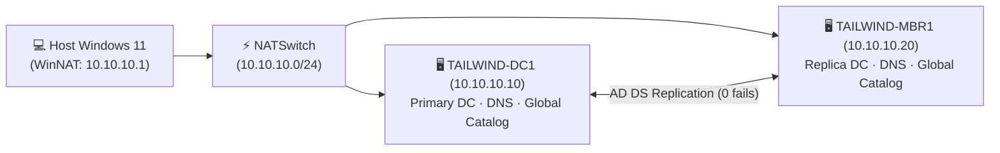
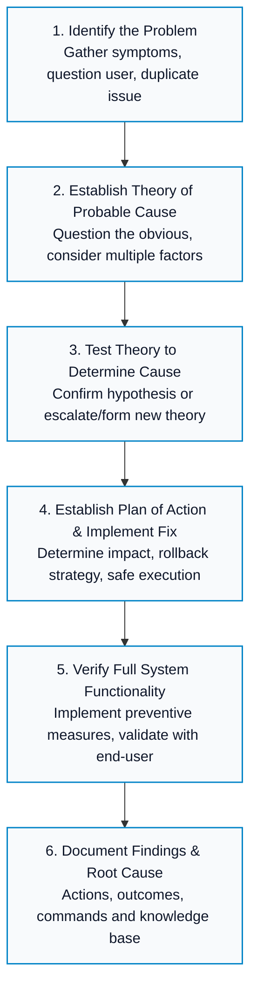

# 🛠️ IT Support & Systems Engineering Labs

[-red?style=flat-square&logo=comptia)](LABS-ROADMAP.md)

Hands-on IT Support and Systems Administration practice focused on real-world troubleshooting, Windows Server, Active Directory, Hyper-V virtualization, Linux kernel/network debugging, security policies, and IT service methodology.

This repository documents practical work through real scenarios, step-by-step commands, technical logs, screenshots, and verifiable outcomes.

---

## 🌟 Featured Projects & Labs

| Project | Status | Skills Demonstrated | Evidence & Artifacts |
|---|---|---|---|
| 🪟 **[Windows Server UEFI/GPT & Active Directory](labs/windows-server-uefi-gpt-ad-ds/)** |  | UEFI/GPT boot repair, Windows Server 2022 dual-boot, static IP, AD DS, DNS zones, GPO password policies, and Linux (SSSD) domain join. | 📸 18+ Screenshots, logs and full verification |
| 🌐 **[Active Directory Multi-DC HA Environment](labs/active-directory-multi-dc/)** |  | Hyper-V virtual NAT networking, PowerShell automation, multi-DC multi-master replication with 0 failures, DNS, and least-privilege delegation. | 🎥 Video, PowerShell scripts, and command evidence |
| 🐧 **[Linux Wi-Fi Driver & Kernel Fix](labs/linux-wifi-driver-fix/)** |  | Hardware bus identification (`lspci`/`lsusb`), kernel ring buffer (`dmesg`), kernel module management (`modprobe`/`lsmod`), and DKMS driver builds. | 📝 Step-by-step guide and verification checklist |

👉 **[Browse All Practical Labs Directory →](labs/README.md)**

---

## 🟢 Current Live Project

### 🏢 [Active Directory — Multi-DC High Availability Environment](labs/active-directory-multi-dc/)

Currently building a Windows Server 2022 Active Directory enterprise environment on Hyper-V. Both `TAILWIND-DC1` and `TAILWIND-MBR1` are deployed and operating with active multi-master replication (0 failures verified via `repadmin /replsummary`).

* **Environment:** Hyper-V Generation 2 VMs, `10.10.10.0/24` virtual NAT subnet
* **Current Status:** Phases 0 to 10 completed and verified.
* **Next Focus:** Organizational Unit (OU) structure, role-based security groups, Fine-Grained Password Policies (FGPP), and permission delegation.

📖 **[Open Current Lab Documentation →](labs/active-directory-multi-dc/)** · 🗺️ **[View Roadmap & Milestones →](LABS-ROADMAP.md)**

---

## 🧰 Interactive Web Tools (Live on GitHub Pages)

Interactive utilities built to visualize and accelerate everyday IT Support and SysAdmin tasks:

| Tool | Focus & Description | Live Interactive App |
|---|---|---|
| 🌐 **[IP Subnet Calculator](tools/subnet-calculator/)** | Fast IPv4 CIDR breakdown, network/broadcast range, usable host calculation, and binary visualizer. | [🚀 Launch Subnet Tool](https://anudoranador87.github.io/it-support-labs/tools/subnet-calculator/) |
| 🗄️ **[RAID Storage Calculator](tools/raid-calculator/)** | Compares usable capacity, fault tolerance, read/write speed, and parity overhead across RAID 0, 1, 5, 6, 10. | [🚀 Launch RAID Tool](https://anudoranador87.github.io/it-support-labs/tools/raid-calculator/) |
| 🔒 **[Linux Permissions Visualizer](tools/linux-permissions-visualizer/)** | Interactive chmod permissions calculator (octal vs. symbolic `rwx`), special bits (SUID, SGID, Sticky), and command generator. | [🚀 Launch Permissions Tool](https://anudoranador87.github.io/it-support-labs/tools/linux-permissions-visualizer/) |

---

## 🧭 Troubleshooting & Documentation Methodology

Every practical case study follows the standard **CompTIA / ITIL Support Lifecycle**:

---

## 🎯 Technical Competency Matrix

| Domain | Practical Knowledge & Tools |
|---|---|
| **Windows & Active Directory** | Windows Server 2022, UEFI/GPT boot repair, PowerShell 7, AD DS, DNS Server, GPO, OUs, Security Groups, Kerberos, SSSD integration. |
| **Networking & Protocols** | TCP/IP, IPv4/IPv6, CIDR subnets, DNS resolution (`nslookup`/`dig`), DHCP scopes, NAT switches, Wireshark, firewall rules. |
| **Linux & Systems** | Ubuntu Desktop/Server, Bash scripting, systemd, `dmesg`, `lspci`/`lsusb`, kernel module loading (`modprobe`/`lsmod`), DKMS driver builds, SSH. |
| **Virtualization & Storage** | Hyper-V Manager, Generation 2 VMs, vSwitches (Internal/NAT/External), dynamic disks, RAID configurations (0, 1, 5, 6, 10). |
| **ITSM & Support Best Practices** | CompTIA 6-step troubleshooting methodology, least-privilege security model, ticket triage, clear root-cause analysis, and verification checklists. |

---

## 👤 Portfolio & Contact

Target roles: **IT Support Specialist · Technical Support Engineer · Help Desk L1/L2 · Junior Systems Administrator**

📍 Based in **Málaga, Spain** · Fluent in English & Spanish

* 💼 **LinkedIn:** [linkedin.com/in/joseaparicio87](https://www.linkedin.com/in/joseaparicio87/)
* 💻 **GitHub:** [@anudoranador87](https://github.com/anudoranador87)
* 🌐 **Interactive Portfolio:** [Jose Maria - Portfolio](https://anudoranador87.github.io/JoseMaria-Frontend-Portfolio/)

> **"Build. Troubleshoot. Verify. Document."**

