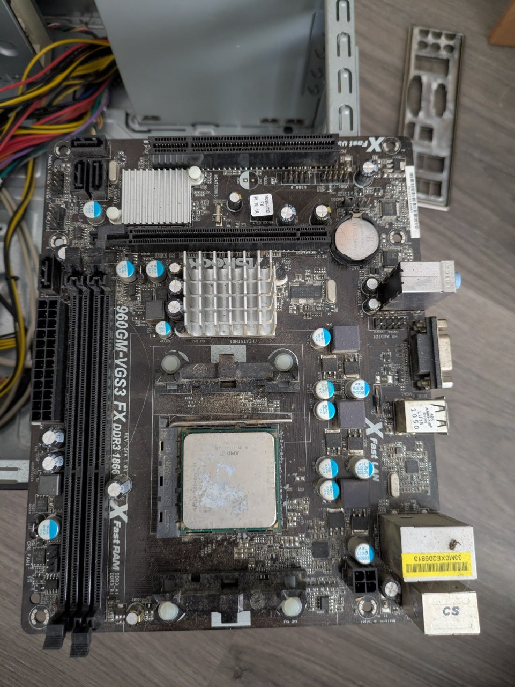
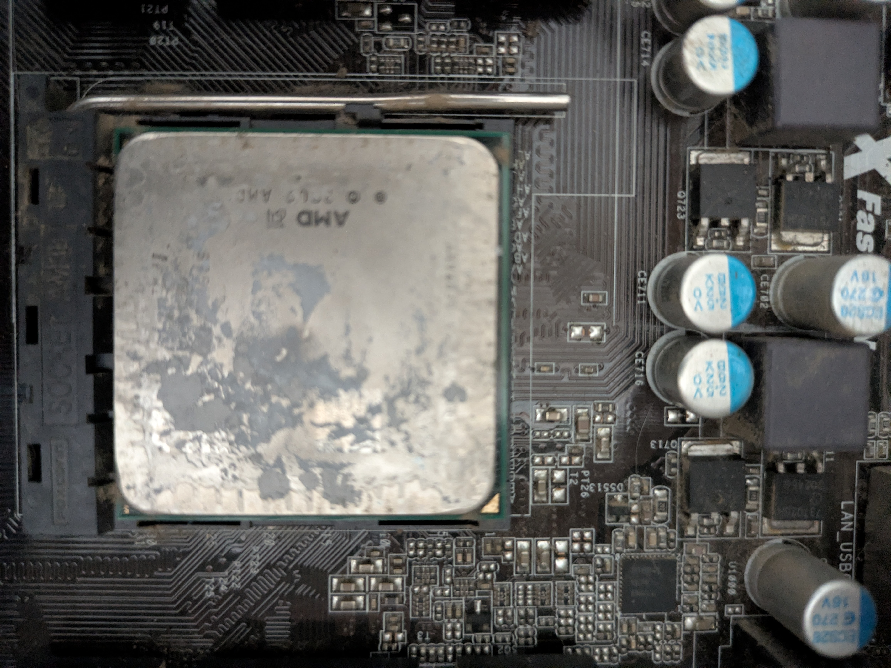
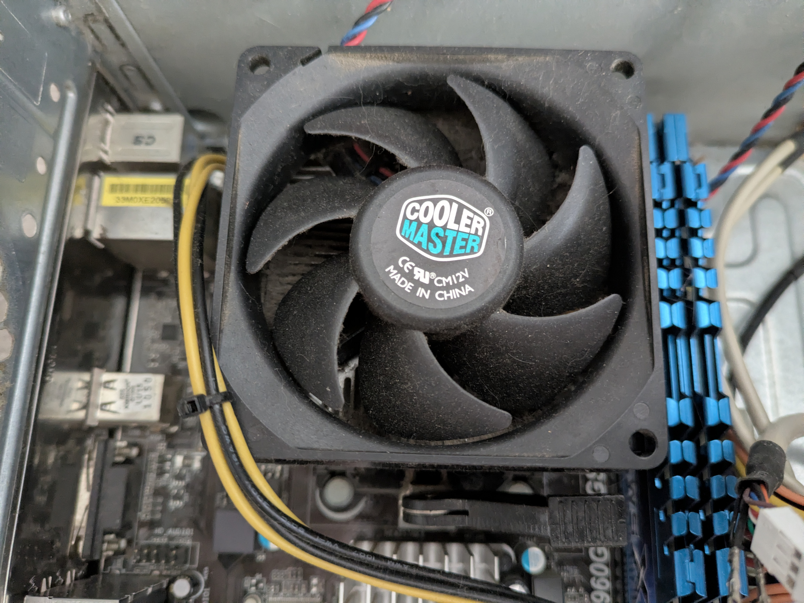

# Lab 01 — Hardware Inventory (Desktop Tower)

## Objective
Identify and document all hardware components of a real desktop PC without disassembly, practicing visual component recognition as a first inspection — standard first step in IT Support.

## Hardware Used
- ATX desktop tower
- Smartphone for photos

## Steps Performed
1. Powered off and unplugged the unit
2. Removed the side panel
3. Visual inspection without touching components
4. Photographed each identified component
5. Read visible labels and model numbers
6. Documented full inventory

## Components Identified

| Component | Brand / Model | Details |
|---|---|---|
| CPU | AMD | AM3+ socket. Degraded thermal paste visible |
| Motherboard | ASRock 960GM series | X Fast LAN, DDR3, SATA II |
| RAM | G.Skill Ripjaws X | DDR3-1866 CL9, 4GB (2x2GB), PC3-14900 |
| PSU | B-Move PSU600W | Model BM-PS09, ATX, 600W (2013) |
| CPU Cooler | Cooler Master | Standard AM3+ cooler |
| Hard Drive | — | **Not present** |
| GPU | — | **Not present** — integrated video only |

## Issues Found
- **PC does not power on** — cause unknown, pending diagnosis
- **No hard drive** — system cannot boot from local storage
- **No GPU** — integrated graphics only
- **Thermal paste completely dried out** — visible degradation on CPU surface
- **Heavy dust buildup** on motherboard and components
- **Poor cable management** — cables obstructing airflow and visibility

## Next Steps
| Issue | Action | Lab |
|---|---|---|
| No hard drive | Boot from Live USB | Lab 08 / 09 |
| Thermal paste | Replace during disassembly | Lab 05 |
| Dust buildup | Clean with compressed air | Lab 04 |
| No power | Diagnose PSU and connections | Lab 02 |

## Result
Full visual inventory completed. Four critical issues identified during first inspection. PC is non-functional in current state but recoverable.

## Technical Notes
- Dried thermal paste on the CPU suggests the cooler was removed at some point without proper re-application. This alone can cause system failure under load.
- ASRock 960GM is compatible with AMD FX processors — upgrade potential for future lab use.
- The absence of a hard drive and GPU suggests components were removed before storage.

## Time Spent
~30 minutes

## Photos

*Fig 1 — Tower exterior, side panel closed*

*Fig 2 — Full interior overview*

*Fig 3 — G.Skill Ripjaws RAM + motherboard zone*

*Fig 4 — Interior from top angle*

*Fig 5 — B-Move PSU600W label*

*Fig 6 — AMD CPU with visibly degraded thermal paste*

*Fig 7 — Full motherboard with Cooler Master*

---

*Lab completed as part of Google IT Support Professional Certificate preparation and CompTIA A+ study path.*
