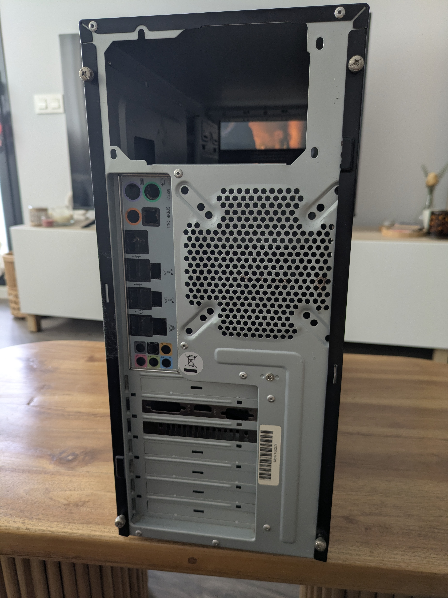

# Lab 03 — Preventive Maintenance: Physical Cleaning and Thermal Management

**Series:** Hardware Maintenance / IT Support
**Environment:** Physical hardware (Laptop)
**Objective:** Perform preventive maintenance, focusing on internal cooling system cleaning and peripheral (keyboard) restoration, while navigating hardware limitations.
**Status:** ✅ Completed

---

## 🛠️ Procedures and Findings

### Phase 1 — Thermal Management and Cooling
*   **Action:** Disassembled the laptop chassis, extracted the cooling assembly, and thoroughly cleaned the fan and heatsink fins.
*   **Challenge (Hardware Limitation):** During disassembly, several screws were found to be stripped (worn-out heads). This made the process difficult and prevented the removal of the heat pipe to replace the thermal paste.
*   **Observation:** Significant dust buildup was obstructing airflow through the heatsink.
*   **Result:** Despite not being able to replace the thermal paste, the cleaning of the cooling system alone resulted in a **~40°C reduction** in operating temperature under load.

### Phase 2 — Keyboard Restoration
*   **Action:** Physical cleaning of keyboard keys and switches.
*   **Observation:** Keys were unresponsive and sticky due to accumulated debris.
*   **Result:** Improved tactile feedback and consistent input response.

### Phase 3 — Hardware Integrity and Learning
*   **Action:** Detailed mapping of internal component connections during disassembly.
*   **Observation:** During reassembly, discovered a few loose screws from previous interventions, which were successfully recovered and secured.
*   **Learning:** Gained deeper insight into laptop internal architecture and cable management, reinforcing the importance of using proper tools to avoid stripping screws.

---

## 📊 Summary of Results

| Component / Task | Condition Before | Action Taken | Result |
|---|---|---|---|
| **Cooling Fan / Heatsink** | Heavily clogged | Physical cleaning | ✅ ~40°C temp drop |
| **Keyboard** | Sticky / Unresponsive | Mechanical cleaning | ✅ Improved responsiveness |
| **Internal Screws** | Striped / Missing | Recovered / Secured | ✅ Improved chassis integrity |
| **Thermal Paste** | Degraded (suspected) | Unable to access | ⚠️ Deferred (stripped screws) |

---

## 💡 Technical Lessons
1.  **Stripped Screws:** Using incorrect screwdriver sizes or excessive force ruins screw heads. This is a critical blocker for full maintenance (like thermal paste replacement).
2.  **Airflow is Key:** Cleaning the heatsink and fan, even without full thermal compound replacement, can drastically improve thermal performance.
3.  **Documentation:** Knowing internal cable routing is essential for safe disassembly and reassembly.

---

## 📸 Photo Documentation

*Fig 1 — Initial disassembly check*

*Fig 2 — Dust accumulation on cooling components*

*Fig 3 — Internal component mapping and screw recovery*

---

*Lab documented as part of IT Support maintenance practice.*
