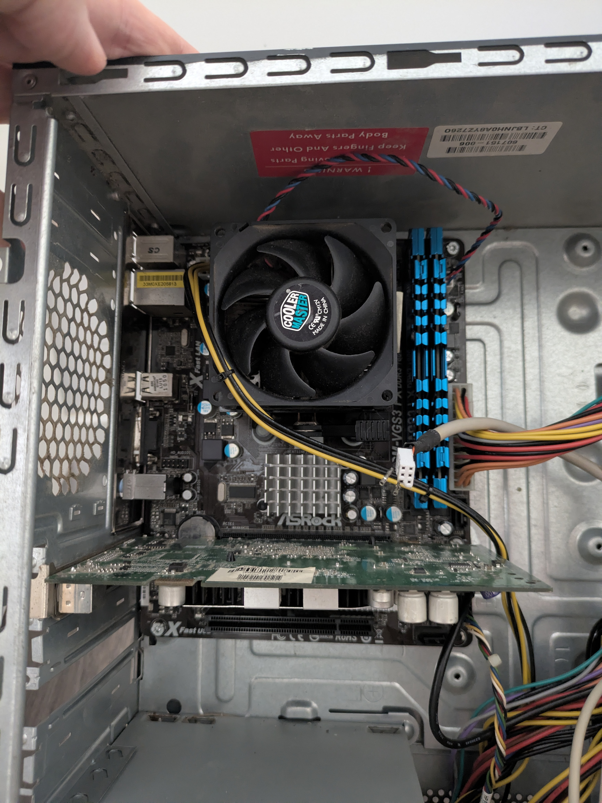
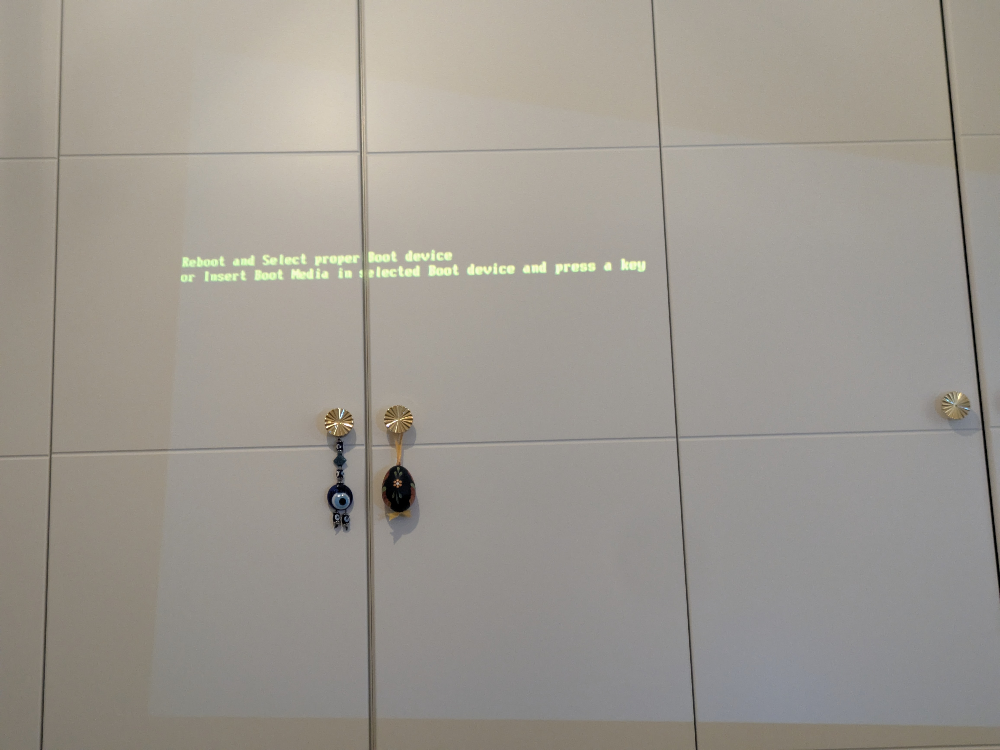
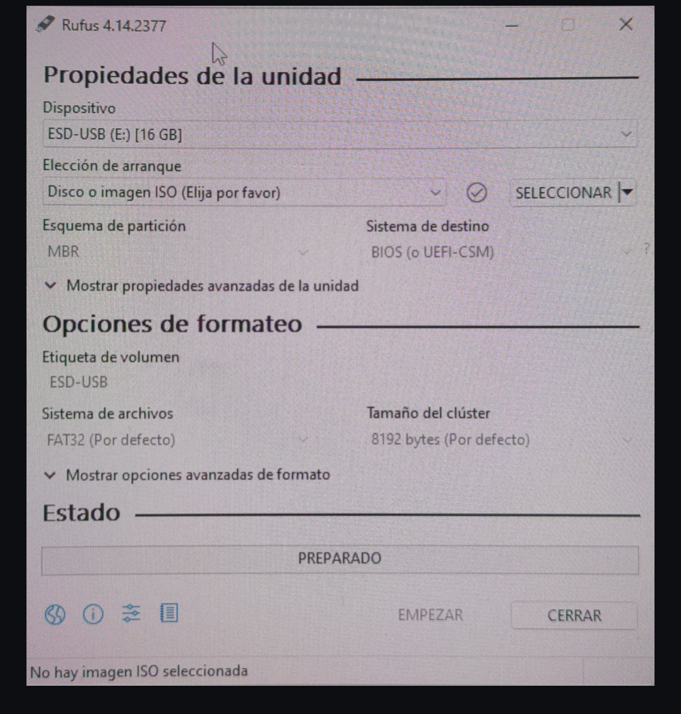
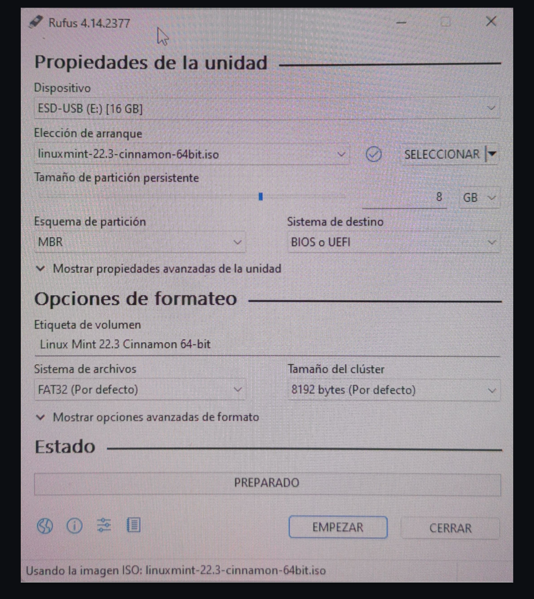

# 🖥️ Lab 02 — System Diagnosis and Configuration

**Series:** CompTIA A+ / IT Support Fundamentals  
**Environment:** Physical hardware (desktop PC, ~2009–2013)  
**Objective:** Recover and test an old machine using a Linux Mint Live-USB as a technical support practice station.  
**Status:** 🟡 In progress — Blocked by electrical failure on USB controller

---

## 📦 Hardware Inventory

| Component | Identification | Status |
|---|---|---|
| **CPU** | AMD Athlon II — Socket AM3 (© 2009) | ⚠️ Degraded thermal paste |
| **Motherboard** | ASRock 960GM-VGS3 FX — AM3+ — DDR3 1866 | ✅ Functional |
| **RAM** | G.Skill Ripjaws F3-14900CL9D-4GBXM — DDR3-1866 CL9 — 4 GB (2×2GB) | ✅ Functional |
| **PSU** | U-MOVE BM-PS09 — 600W ATX | ✅ Functional |
| **CPU Cooler** | Cooler Master (HP label P/N: 584442-001 — recycled) | ⚠️ Noisy due to throttling |
| **Integrated GPU** | AMD Radeon HD 4250 (AMD 960G chipset) | ✅ Stable video signal |
| **Dedicated GPU** | PCIe card (model unidentified) | ❌ No video output |
| **Storage** | No drive installed | ❌ No HDD/SSD |
| **USB Ports** | All ports (front and rear) | ❌ No +5V power |
| **Live-USB** | Linux Mint 22.3 Cinnamon 64-bit — 8 GB persistence (MBR) | ✅ Created and ready |

> **RAM note:** G.Skill kit labelled "Intel XMP ready" installed on an AMD board.  
> It will run correctly at base DDR3 speed. The XMP profile may not activate automatically.

---

## 🔬 Phase 1 — Hardware and Video Diagnosis

### Step 1 — Initial boot with dedicated GPU

- **Action:** Powered on the machine with the dedicated graphics card installed in the PCIe x16 slot.  
- **Result:** System boots electrically (fans active), but **no video signal** from any connector.  


### Step 2 — Cross-test with projector

- **Action:** Connected a projector to the VGA output of the dedicated GPU as an alternative test peripheral.  
- **Result:** No video signal. Monitor ruled out as the cause. **Failure confirmed on dedicated GPU** or BIOS primary display setting.  


### Step 3 — Switch to integrated GPU and thermal diagnosis

- **Action:** Removed dedicated GPU. VGA cable connected directly to the motherboard output (integrated AMD Radeon HD 4250).  
- **Result:** Stable video signal on monitor. ✅  
- **On-screen message:**
  ```
  Reboot and Select proper Boot device
  or Insert Boot Media in selected Boot device and press a key...
  ```
- **Diagnosis:** POST completed successfully. CPU, RAM, and chipset responding correctly. The message indicates the BIOS exhausted its boot sequence without finding a valid bootable device.

#### ⚠️ Critical finding — Thermal paste

- The machine runs at a constant high noise level.  
- **Identified cause:** Thermal paste completely degraded (dry, cracked, uneven coverage).  
- **Estimated age:** 13–15 years without replacement (since manufacture ~2009).  
- **Technical consequence:** Minimal heat transfer → CPU temperature rises → sensor triggers throttling → fan runs at 100% RPM to compensate.  
- **Required action:** Replace thermal paste before any extended use of the machine.  


---

## 🛠️ Phase 2 — Boot Media Preparation

### Step 4 — Live-USB creation on secondary machine

**Tool:** Rufus 4.14.2377  
**ISO used:** `linuxmint-22.3-cinnamon-64bit.iso`

| Parameter | Selected value | Justification |
|---|---|---|
| Target device | ESD-USB (E:) — 16 GB | Available USB drive |
| Partition scheme | **MBR** | Maximum compatibility with pre-2012 hardware |
| Target system | **BIOS or UEFI** | Covers both modes for this board |
| Persistence | **8 GB** | Allows saving settings, files, and progress between sessions |
| File system | FAT32 (default) | Required for BIOS/UEFI legacy boot |
| Cluster size | 8192 bytes (default) | Standard for this use case |

  


> **Result:** Live-USB created successfully. Ready for deployment on any compatible machine.

---

## 🔍 Phase 3 — Peripheral Blockage and Fault Isolation

### Step 5 — Boot attempt from USB

- **Action:** Inserted Live-USB into the test machine and restarted.  
- **Result:** BIOS ignores the USB. Repeats `Reboot and Select proper Boot device` error.  
- **Cause:** Boot priority order does not have USB as the first device.  
- **Critical problem:** When attempting to access the BIOS (`Del` / `F2`), keyboard is unresponsive. No status LEDs, no optical signal on mouse. **All USB peripherals are unpowered.**

### Step 6 — Short circuit ruling and physical inspection

The following inspections were performed to determine whether the failure is permanent hardware damage or a recoverable condition:

| Inspected component | Finding | Conclusion |
|---|---|---|
| White front panel cable (torn pins) | Fully disconnected | ✅ Ruled out as short circuit cause |
| Front audio cable (yellow) | Correctly connected | ✅ Independent line, no impact |
| Jumper `USB_PWR1` (rear USB power) | Cap correctly in place | ✅ No missing jumper |
| CMOS battery | Present on the board | 🔄 Pending: physical reset as next step |

### Final diagnosis — Root cause identified

> **The failure is electrical, not logical.**  
> The **+5V USB** line on the motherboard's USB controller is inoperative. Without power on the USB ports, it is not possible to use a keyboard, mouse, or USB drive through that path. The rest of the system (CPU, RAM, chipset, integrated video) is functioning correctly.

---

## 📊 Current System Status

| Subsystem | Status |
|---|---|
| POST / Electrical boot | ✅ Correct |
| CPU + RAM + Chipset | ✅ Functional |
| Integrated video (AMD 960G) | ✅ Stable VGA signal |
| Dedicated video (PCIe GPU) | ❌ No image |
| Storage | ❌ No device |
| USB ports (front and rear) | ❌ No +5V power |
| Thermal paste | ⚠️ Degraded — urgent replacement needed |
| Linux Mint Live-USB | ✅ Created and ready |

---

## 🚀 Next Steps

### Path A — Immediate fix (BIOS access)
Use a **keyboard with a native PS/2 connector** (round purple port) or an active PS/2 adapter.  
The PS/2 port operates on hardware interrupt lines independent of the USB controller, allowing BIOS interaction without relying on the +5V USB line.

### Path B — Permanent lab fix
Install a **PCIe → USB expansion card**.  
Connected to the PCIe bus, it generates its own independent data and +5V power lines separate from the motherboard controller. Allows keyboard and Live-USB to be connected simultaneously.

### Path C — Pending maintenance (independent of USB blockage)
- Clean old thermal paste with isopropyl alcohol.  
- Apply new paste (dot or spread method as preferred).  
- Verify CPU temperature with `sensors` or `htop` after booting into Linux Mint.

---

## 💡 Lab highlight

Despite the electrical blockage on this machine, a portable **Linux Mint 22.3 environment with 8 GB persistence** was successfully created, ready to be deployed on any compatible machine for daily system administration command practice.

---

## 🗂️ Suggested file structure for this lab

```
hardware-labs/
├── img/
│   ├── foto_01_gpu_dedicada_instalada.jpg
│   ├── foto_02_error_boot_proyectado.jpg
│   ├── foto_03_pasta_termica_degradada.jpg
│   ├── foto_04_rufus_sin_iso.png
│   └── foto_05_rufus_configurado_listo.png
├── lab-001-inventario-componentes.md
├── lab-002-system-diagnostics.md      ← This document
└── README.md
```

---

*Lab documented as part of the CompTIA A+ preparation process (220-1201 / 220-1202)*  
*Real hardware — Home lab environment*
