# Lab 07: Windows Server and Active Directory Setup

> **A complete troubleshooting case study covering UEFI/GPT boot configuration, Windows Server installation and initial Active Directory deployment.**

| Field | Detail |
|---|---|
| **Status** | Completed and documented |
| **Environment** | Windows Server 2022 Standard Evaluation, Desktop Experience |
| **Focus** | UEFI/BIOS, GPT/MBR, Windows Server, AD DS and verification |
| **Hardware** | Gigabyte motherboard · Kingston DataTraveler 2.0 USB, 16 GB |
| **Date** | August 2026 |

## Executive summary

The Windows Server installation repeatedly failed with a GPT partition-style error. The issue was not a defective target disk: the installation media had been created in MBR/Legacy mode while the internal disks used GPT. After the boot mode, installation media and target disk were aligned to UEFI/GPT, Windows Server installed successfully alongside the existing Windows 11 system.

The server was then renamed, configured with a static IP address and promoted to a domain controller for the `lab.local` forest. Active Directory Domain Services was verified through Active Directory Users and Computers, including the creation of the `Empleados` OU and the `JoseAparicio` domain user.

## Problem and impact

The installer displayed the following message for every selected disk:

> Windows cannot be installed to this disk. The selected disk is of the GPT partition style.

Changing the selected disk did not resolve the error. This indicated a configuration mismatch between the installer boot mode and the partition style of the target disk rather than a problem with one particular disk.

## Investigation and resolution

### 1. Isolate the boot-mode mismatch

The initial hypothesis was that the installer had booted in Legacy/BIOS mode while the internal disks used GPT. CSM Support was disabled in the Gigabyte BIOS to force UEFI mode. This temporarily caused the system to stop at the boot logo and the USB keyboard to become unavailable during POST.

A CMOS reset restored the BIOS defaults and recovered access to the `Del` and `F12` boot controls. This reinforced the importance of having a rollback path when changing firmware settings.

### 2. Verify the installation media instead of trusting the selected options

The USB was inspected with `diskpart`:

```powershell
diskpart
list disk
select disk X
detail disk
```

The output showed that the USB was still using **MBR**, despite the previous Rufus configuration. The media was recreated with the following settings:

| Setting | Value |
|---|---|
| Image | Windows Server 2022 Evaluation ISO |
| Partition scheme | **GPT** |
| Target system | **UEFI (non-CSM)** |
| File system | **NTFS** |

The process was allowed to finish completely before removing the USB. The actual disk format was then verified rather than inferred from the graphical options.

### 3. Refresh the boot entry

The re-created USB displayed:

> ERROR: BIOS/LEGACY BOOT OF UEFI-ONLY MEDIA

This confirmed that the USB was now UEFI-only, but the firmware was still selecting an older Legacy entry. The specific Kingston UEFI boot entry was selected from the boot priorities, allowing the installation to proceed.

### 4. Install Windows Server safely

Windows Server 2022 Standard Evaluation with Desktop Experience was installed on `Drive 2 Partition 3`, a 50 GB partition. The existing Windows 11 disk and personal data partition were deliberately avoided.

After the restart, Windows Boot Manager showed both **Windows Server** and **Windows 11**, confirming that the existing operating system had been preserved and that both systems were using UEFI boot.

## Active Directory configuration

The server was renamed to `WINSERVER-JOSE` before the AD DS promotion. A static network configuration was applied after the initial DHCP assignment:

| Parameter | Value |
|---|---|
| Initial DHCP IPv4 | `192.168.1.142` |
| Target static IPv4 | `192.168.1.200` |
| Subnet mask | `255.255.255.0` |
| Gateway | `192.168.1.1` |

The configuration was applied and verified with `ipconfig`, `netsh` and a connectivity/resolution test with `ping google.com`.

Active Directory Domain Services was installed through **Server Manager → Add Roles and Features**, and the server was promoted using **Promote this server to a domain controller**.

| Configuration | Value |
|---|---|
| Deployment | Add a new forest |
| Root domain | `lab.local` |
| NetBIOS name | `LAB` |
| DNS delegation | Not created for this isolated lab forest |
| Domain controller | `WINSERVER-JOSE` |

The `lab.local/Empleados` organisational unit was created with accidental-deletion protection enabled. The `JoseAparicio` domain user was then created with a password change required at next logon.

## Evidence

### Server Manager and role installation


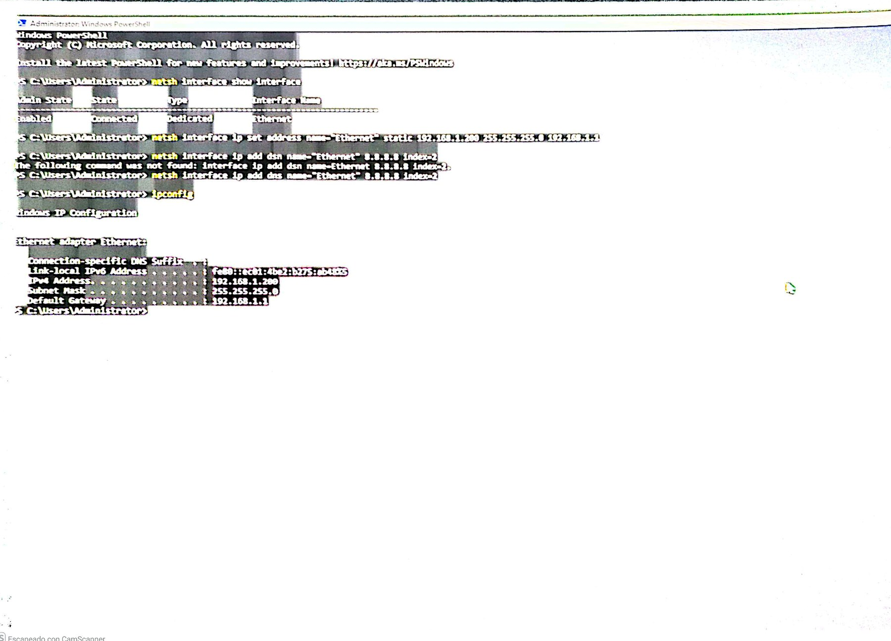

### AD DS configuration

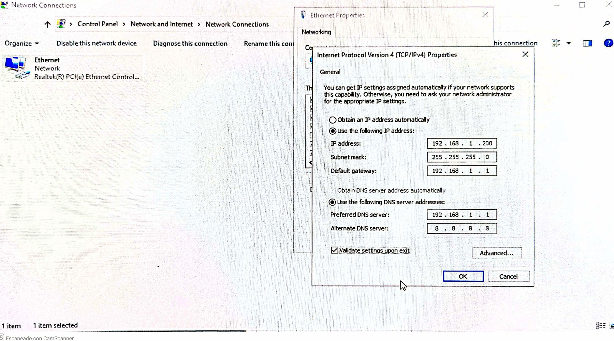


### Identity and domain verification


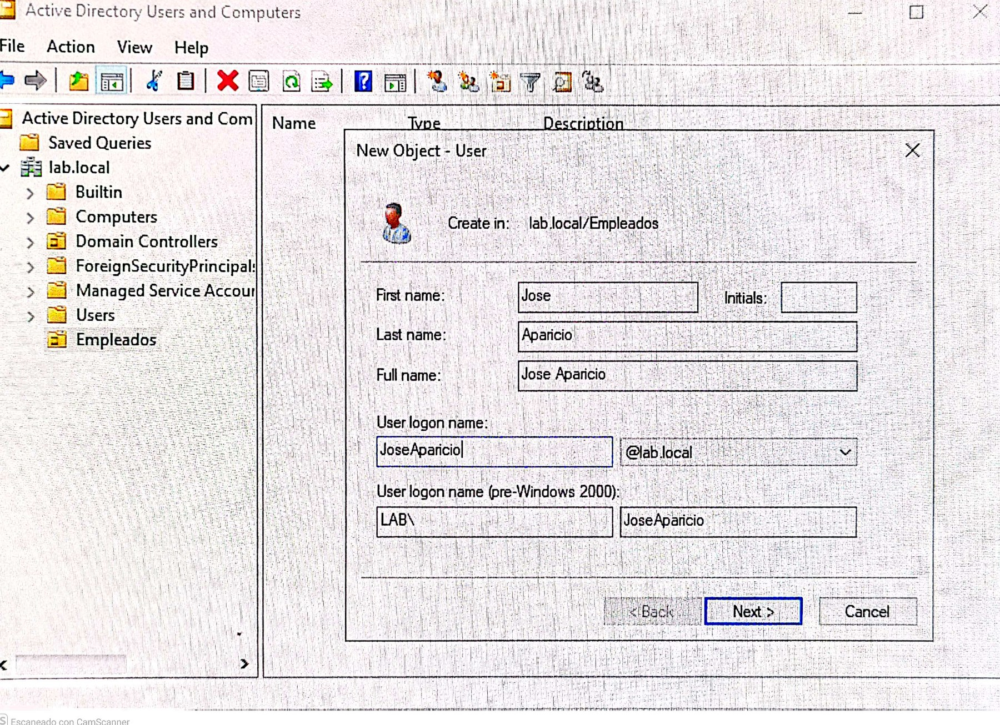

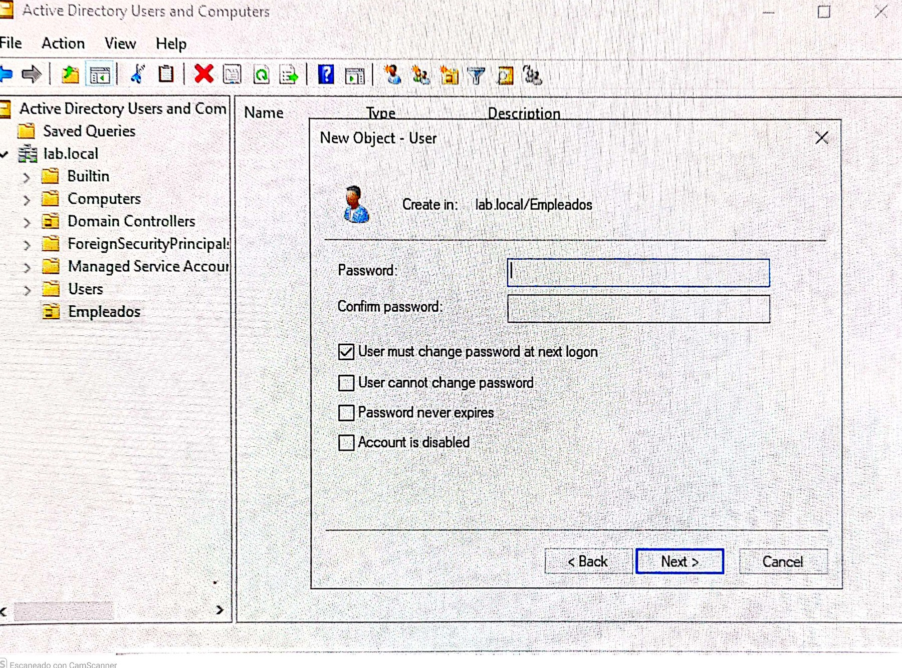

## Root cause

The failure resulted from a chain mismatch across three layers:

1. The installation USB was created in **MBR/Legacy** mode.
2. The internal disks used **GPT**.
3. The firmware boot mode and the selected USB boot entry were not aligned.

The resolution was to verify and align the BIOS configuration, USB media format and target disk partition style independently.

> **Key lesson:** a GPT installation error does not automatically mean that the target disk is faulty. Verify the actual boot mode, the USB partition scheme and the target disk before changing or cleaning any disk.

## Verification checklist

- [x] Windows Server 2022 installed with Desktop Experience.
- [x] Existing Windows 11 installation preserved in dual boot.
- [x] BIOS configured for UEFI with CSM disabled.
- [x] Rufus media created with GPT and UEFI non-CSM.
- [x] Server renamed to `WINSERVER-JOSE`.
- [x] Static IP configured as `192.168.1.200`.
- [x] AD DS installed and promoted.
- [x] `lab.local` forest created and operational.
- [x] Domain controller verified in Active Directory Users and Computers.
- [x] `Empleados` OU created.
- [x] `JoseAparicio` domain user created with a mandatory password change.
- [ ] Normal-user logon tested from a second domain-joined client.

## Tools used

`diskpart` · PowerShell · `netsh` · `ipconfig` · `ping` · Gigabyte BIOS · CMOS reset · Rufus · Server Manager · Active Directory Users and Computers · AD DS configuration wizard

## Next validation

The remaining validation is to join a second physical or virtual client to `lab.local` and test `JoseAparicio` authentication from that client. This separates the domain-user workflow from the domain controller itself and provides a more realistic support scenario.

---

## Lab 07 evidence: Active Directory, GPO and DNS

The following evidence extends this case study with the completed Active Directory structure, security-group membership, a Group Policy linked to the employees OU, password-policy settings and DNS host-record configuration.

### 1. Organizational units and test users

The `Empleados` organizational unit contains three test users. The `Equipos` and `Grupos` organizational units are also visible in the domain hierarchy. This structure separates employees, computer accounts and groups so that permissions and policies can be managed according to their purpose.

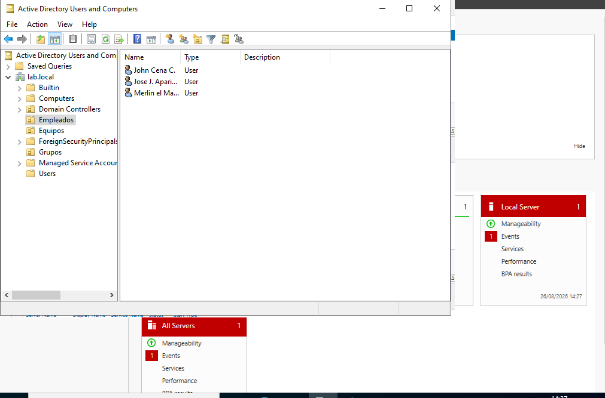

### 2. Reception_Staff security group

The `Reception_Staff` security group contains the three test users from `Empleados`. This represents a practical onboarding workflow in which access is assigned through group membership rather than individually to each user.

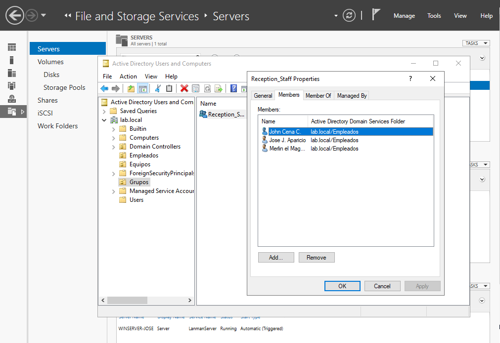

### 3. GPO linked to the Empleados OU

A new Group Policy Object was created and linked directly to the `Empleados` OU. Limiting the link to the relevant OU avoids applying the policy unnecessarily to the whole domain and follows a least-privilege approach.

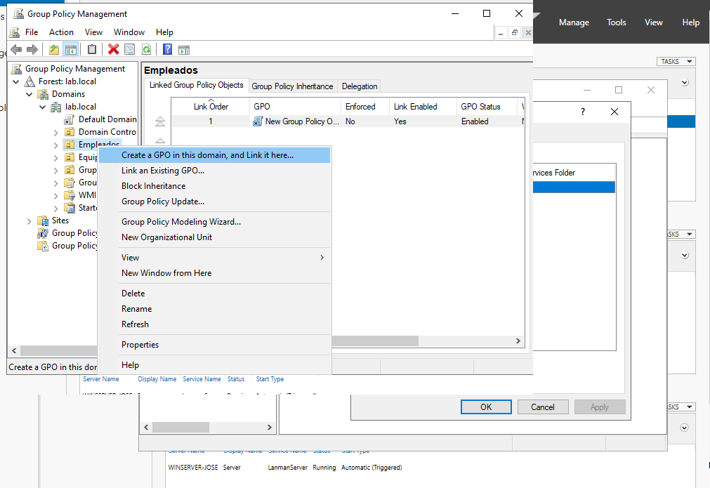

The Group Policy Management console confirms that the link is enabled and that the GPO is applied to `Empleados`.

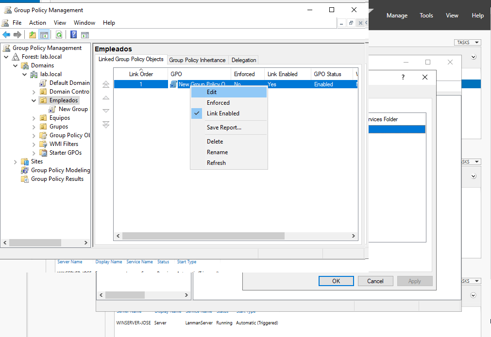

### 4. Password-policy configuration

The policy was edited under `Computer Configuration → Policies → Windows Settings → Security Settings → Account Policies`. The evidence shows a minimum password length of **10 characters** and a maximum password age of **30 days**.

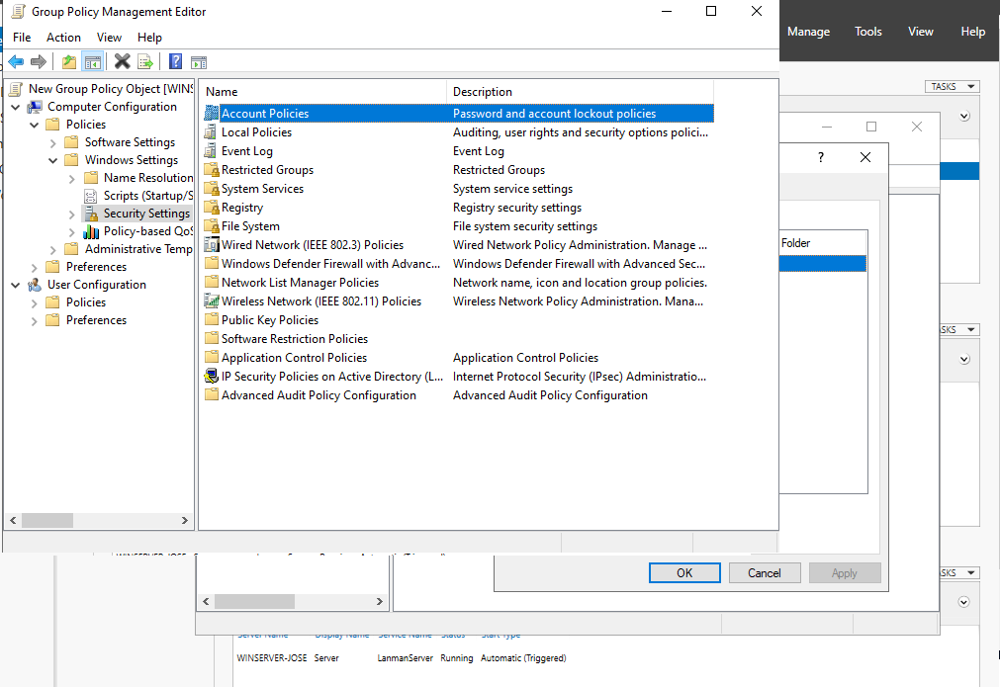

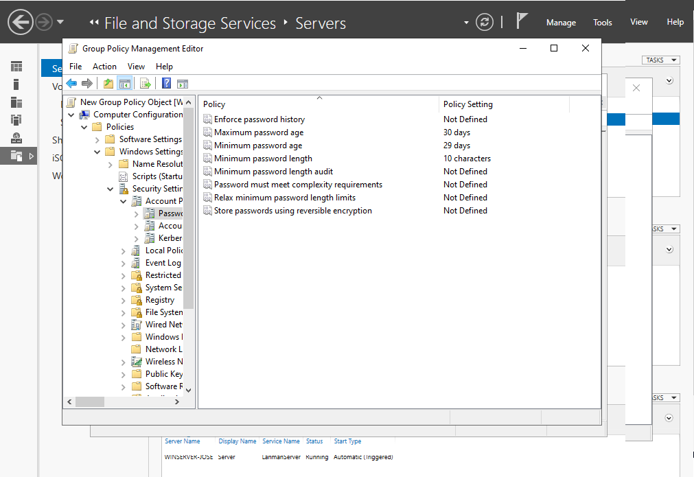

Password complexity requirements were enabled so that passwords must meet Windows complexity rules instead of accepting simple passwords.

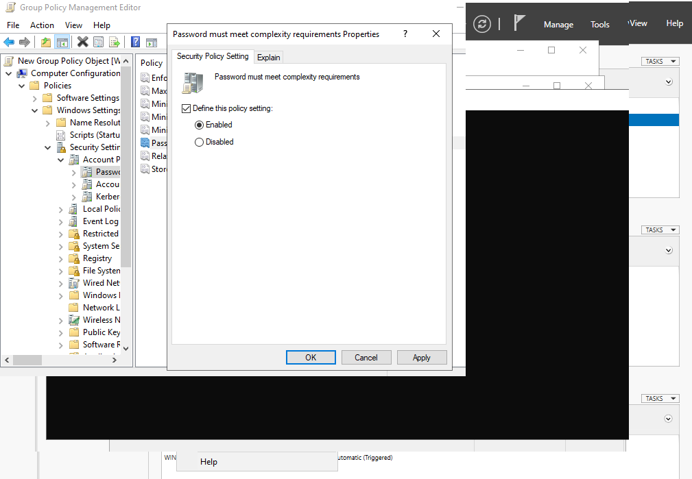

### 5. DNS Host (A) record

A Host (A) record was created in the `lab.local` forward lookup zone. The record maps `PC01.lab.local` to the test address `192.168.1.50`.

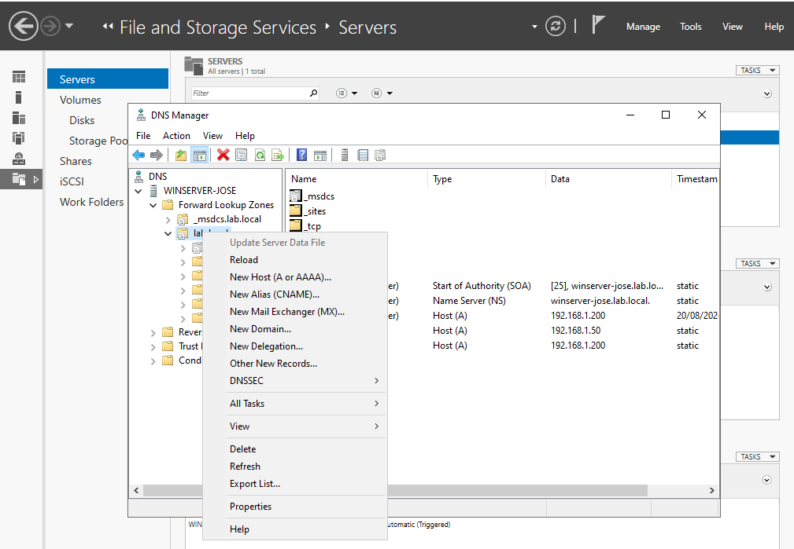

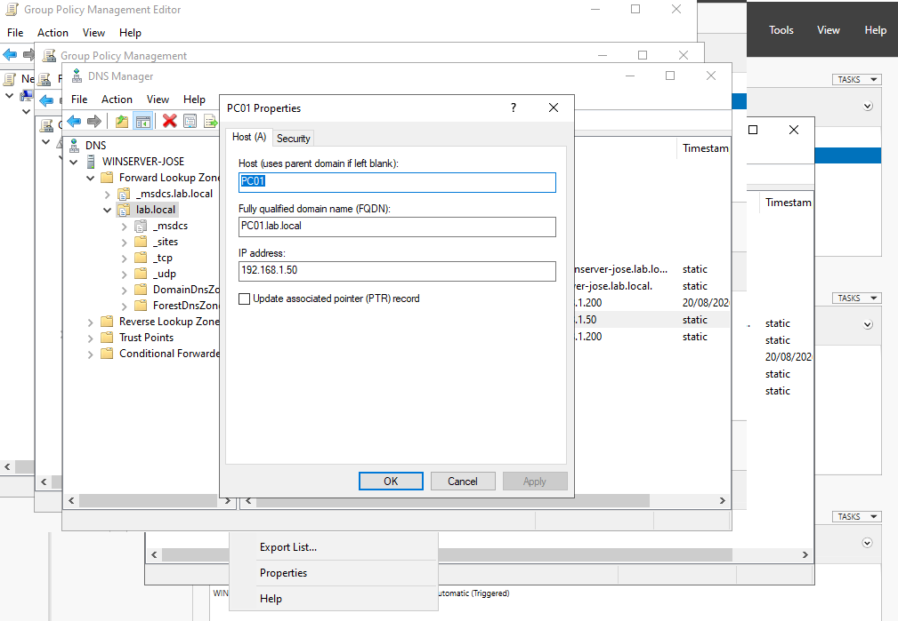

The final operational verification should be performed from Command Prompt:

```cmd
nslookup pc01.lab.local
```

A successful result should return `192.168.1.50`. The command-output screenshot can be added to this section when available so the DNS configuration is documented from creation through end-to-end verification.

### Evidence status

| Requirement | Evidence |
|---|---|
| `Empleados` OU with three users | Documented above with an embedded screenshot |
| `Equipos` and `Grupos` OUs | Visible in the ADUC hierarchy screenshot |
| `Reception_Staff` security group | Documented above with an embedded membership screenshot |
| GPO linked to `Empleados` | Documented above with embedded Group Policy Management screenshots |
| Minimum password length of 10 characters | Shown in the embedded Password Policy screenshot |
| Maximum password age of 30 days | Shown in the embedded Password Policy screenshot |
| Password complexity enabled | Shown in the embedded policy-settings screenshot |
| DNS Host (A) record for `PC01` | Documented above with embedded DNS screenshots |
| `nslookup pc01.lab.local` verification | Pending command-output screenshot |
| Account lockout after five failed attempts | Not visible in the supplied screenshots; add evidence after verification |

> The screenshots are embedded with relative Markdown image paths, so GitHub renders them directly inside this README rather than displaying them as ordinary text links.

---

[Back to the IT Support Labs portfolio](../../README.md)
