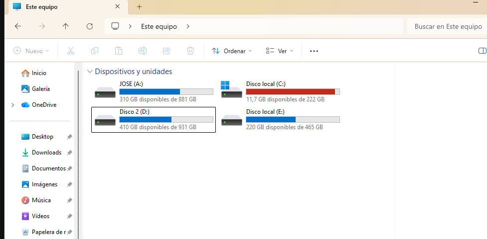

# Active Directory Domain Services — Laboratorio Multi-DC

> Despliegue de un dominio Windows Server 2022 con dos Domain Controllers, gestión de identidades, delegación y políticas de seguridad, sobre Hyper-V.

## Contexto (Situation)

Proyecto de laboratorio basado en **Microsoft Applied Skills — AZ-1008**, diseñado como pieza de portfolio profesional para demostrar competencias reales en administración de Active Directory Domain Services. Forma parte de la transición profesional hacia IT Support, complementando la formación teórica con implementación práctica.

## Objetivo (Task)

El objetivo final de este laboratorio es desplegar y gestionar una infraestructura virtualizada completa que incluya:
- Despliegue de un bosque AD DS con dos Domain Controllers (Alta Disponibilidad).
- Gestión de OUs, usuarios, grupos y delegación de permisos (Principio de Mínimo Privilegio).
- Implementación de políticas de seguridad (FGPP, restricción NTLM, auditoría).

---

## Progreso del Proyecto (Action)

### Fase 0 — Requisitos verificados

Antes de levantar el entorno, se comprobó que el host físico cumple con los recursos necesarios para virtualizar la infraestructura planificada:
- **RAM y Almacenamiento**: Se validó que el equipo dispone de memoria suficiente (mínimo 16 GB recomendados para correr fluidamente 2 DCs y el host) y espacio en disco libre para soportar discos dinámicos de 60GB.
- **Virtualización**: Se confirmó que la virtualización por hardware (Intel VT-x / AMD-V) está habilitada en la BIOS/UEFI.

#### Evidencia de verificación:




### Fase 1 — Instalación de Hyper-V

Para aislar el entorno de Active Directory y simular un centro de datos local, se ha habilitado el rol de Hyper-V (hipervisor nativo de Windows) y sus herramientas de administración en el sistema operativo host.

#### Evidencia de configuración:


### Fase 2 — Configuración de rutas de Hyper-V

Para garantizar un rendimiento óptimo de las máquinas virtuales, se definieron las rutas de almacenamiento de los discos virtuales y archivos de configuración.

> **Decisión técnica:** Se mantuvieron las rutas por defecto de Hyper-V en la unidad A:, elegida por ser la de mayor capacidad y velocidad del equipo.

#### Evidencia de configuración:


---
*Este proyecto está actualmente en desarrollo. Las siguientes secciones y fases se irán documentando a medida que se despliegue la infraestructura.*

### Fase 3 — Creación de la red virtual NAT

Una vez preparado Hyper-V, el siguiente paso fue crear la red virtual que utilizarán las máquinas del laboratorio.

Para mantener el entorno aislado de la red física del equipo, se creó un **switch virtual de tipo Internal** denominado `NATSwitch` y posteriormente se configuró una red privada `10.10.10.0/24` con NAT.

#### Configuración realizada

La red se creó mediante PowerShell ejecutado como administrador, utilizando tres comandos principales:

1. **Crear el switch virtual**

   Se creó un switch virtual de tipo `Internal` llamado `NATSwitch`.

2. **Asignar la dirección IP al adaptador virtual**

   Se configuró la dirección `10.10.10.1/24` en el adaptador virtual asociado al switch.

3. **Crear la regla NAT**

   Se creó una red NAT para permitir que las máquinas virtuales puedan acceder a redes externas a través del host, manteniendo al mismo tiempo aislada la infraestructura del laboratorio.

La configuración resultante utiliza la siguiente red:

| Parámetro | Configuración |
|---|---|
| Red | `10.10.10.0/24` |
| Gateway | `10.10.10.1` |
| Switch virtual | `NATSwitch` |
| Tipo de switch | `Internal` |
| NAT | Configurado |

#### Verificación

Una vez creada la infraestructura de red, se utilizaron comandos de PowerShell para comprobar que el switch virtual y la configuración IP habían quedado correctamente establecidos.

La verificación confirmó la existencia de `NATSwitch` y de la dirección `10.10.10.1` asociada a la red virtual.

#### Decisión técnica

Se eligió una red **Internal + NAT** en lugar de conectar directamente las máquinas virtuales a la red física mediante un switch externo.

Esto permite mantener el laboratorio separado de la red doméstica o de producción, mientras que las máquinas virtuales pueden seguir teniendo conectividad hacia el exterior cuando sea necesaria.

Esta separación resulta especialmente útil para un laboratorio de **Active Directory**, ya que permite trabajar con servidores, DNS, políticas y configuraciones de red sin modificar directamente la infraestructura física.

#### Evidencia

**Vídeo — Creación y verificación de la red virtual NAT**

[](https://youtu.be/TNneEzF2-Q8)

> El vídeo muestra la creación de `NATSwitch`, la configuración de la dirección IP `10.10.10.1` y la creación de la red NAT `10.10.10.0/24`, seguida de las comprobaciones realizadas mediante PowerShell.

📺 **[Ver vídeo completo en YouTube](https://youtu.be/TNneEzF2-Q8)**

#### Artefacto técnico

Los comandos utilizados durante esta fase se han guardado en:

```text
scripts/setup-network.ps1
```
### Fase 4 — Creación de TAILWIND-DC1

Con la red virtual `NATSwitch` ya operativa, el siguiente paso fue aprovisionar la primera máquina virtual que actuará como Domain Controller del bosque `tailwindtraders.internal`.

#### Configuración realizada

La VM se creó mediante el asistente **New Virtual Machine** de Hyper-V Manager, con los siguientes parámetros:

| Parámetro | Configuración |
|---|---|
| Nombre | `TAILWIND-DC1` |
| Generación | `Generation 2` |
| Memoria asignada | `4096 MB` |
| Red virtual | `NATSwitch` |
| Disco virtual | Dinámico, tamaño por defecto |
| Fuente de instalación | ISO de Windows Server 2022 |

#### Decisión técnica

Se eligió **Generation 2** en lugar de Generation 1 porque es el requisito de arranque UEFI/Secure Boot necesario para instalar Windows Server 2022 de forma compatible con las funciones de seguridad modernas del sistema operativo.

#### Evidencia

**Captura — Resumen del asistente New Virtual Machine**


> La captura muestra el resumen final del asistente, confirmando Generation 2, 4096 MB de RAM, la red `NATSwitch` seleccionada y la ISO de Windows Server 2022 como origen de instalación.

### Fase 5 — Configuración de IP estática en DC1

Con la VM `TAILWIND-DC1` ya instalada, se le asignó una dirección IP estática dentro de la red `10.10.10.0/24` creada en la Fase 3, requisito indispensable antes de promocionar el servidor a Domain Controller.

#### Configuración realizada

| Parámetro | Valor |
|---|---|
| Dirección IP | `10.10.10.10` |
| Máscara de subred | `255.255.255.0` |
| Puerta de enlace | `10.10.10.1` |
| DNS preferido | `127.0.0.1` |

#### Decisión técnica

Se configuró una IP estática en lugar de dejar el adaptador en DHCP porque un Domain Controller no puede depender de una dirección que cambie: los clientes del dominio, los registros DNS y la replicación entre DCs necesitan una IP estable y predecible en todo momento.

El DNS preferido se apuntó a `127.0.0.1` (localhost) en lugar de a un DNS externo, anticipando que este servidor asumirá el rol de DNS Server del dominio en la Fase 8, al promocionarse como Domain Controller.

#### Verificación

Se confirmó la configuración mediante `ipconfig /all` en PowerShell:

```text
Ethernet adapter Ethernet:
   IPv4 Address. . . . . . . . . . . : 10.10.10.10(Preferred)
   Subnet Mask . . . . . . . . . . . : 255.255.255.0
   Default Gateway . . . . . . . . . : 10.10.10.1
   DNS Servers . . . . . . . . . . . : 127.0.0.1
```

#### Evidencia

**Captura — Propiedades IPv4 configuradas**


### Fase 7 — Instalación del rol AD DS

Con el servidor ya renombrado a `TAILWIND-DC1`, se instaló el rol de Active Directory Domain Services mediante el asistente **Add Roles and Features** de Server Manager.

#### Decisión técnica

Es importante distinguir entre **instalar el rol** y **promocionar el servidor**: instalar el rol únicamente copia al servidor los binarios y componentes necesarios de AD DS, igual que instalar cualquier otro software — la máquina sigue siendo un servidor miembro normal, sin dominio. Promocionar el servidor (Fase 8) es el paso independiente que realmente crea el bosque, configura la base de datos de Active Directory e instala DNS. Separar ambas operaciones permite instalar el software con antelación sin comprometer todavía la configuración del servidor.

#### Evidencia

**Captura — Selección del rol AD DS**


**Captura — Instalación completada**


> La primera captura muestra la selección del rol Active Directory Domain Services en el asistente. La segunda confirma que la instalación finalizó correctamente en `TAILWIND-DC1`, mostrando el enlace para promocionar el servidor a controlador de dominio (paso correspondiente a la Fase 8).
