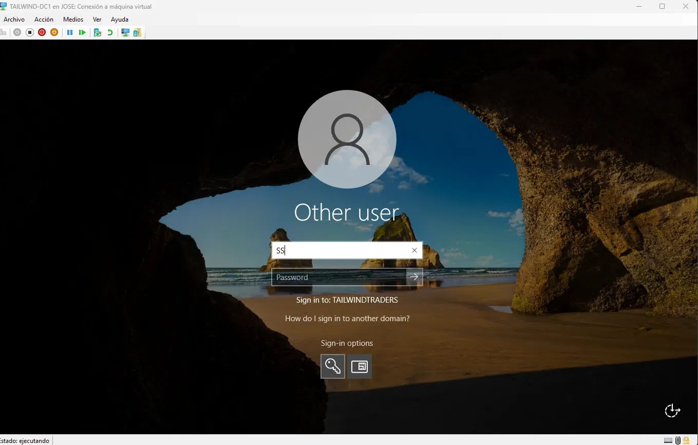
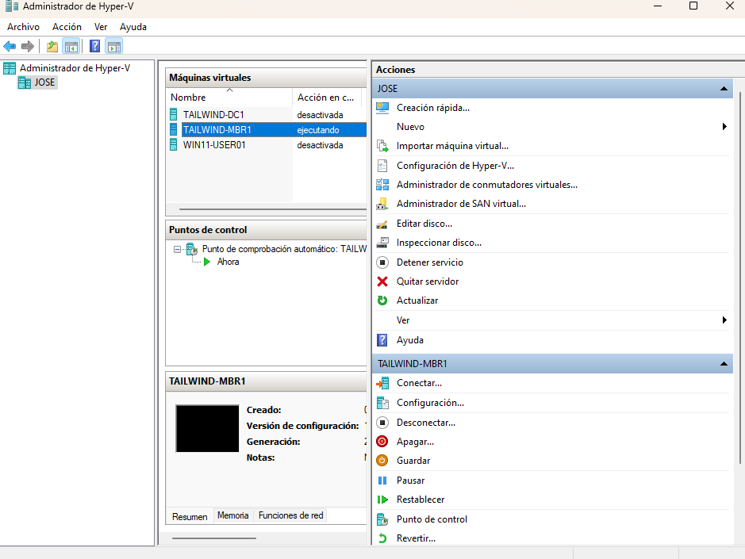
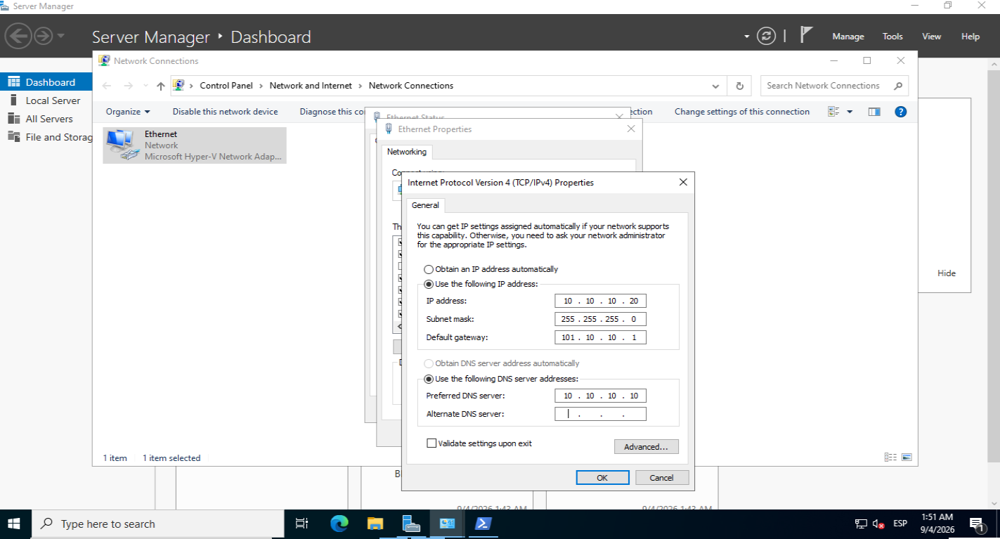
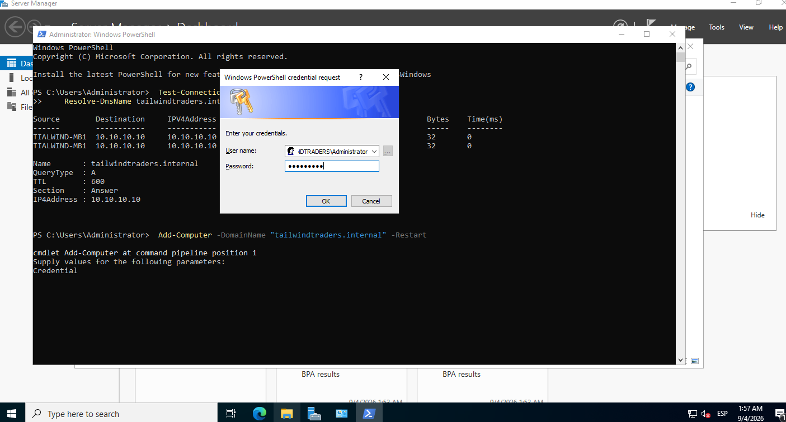
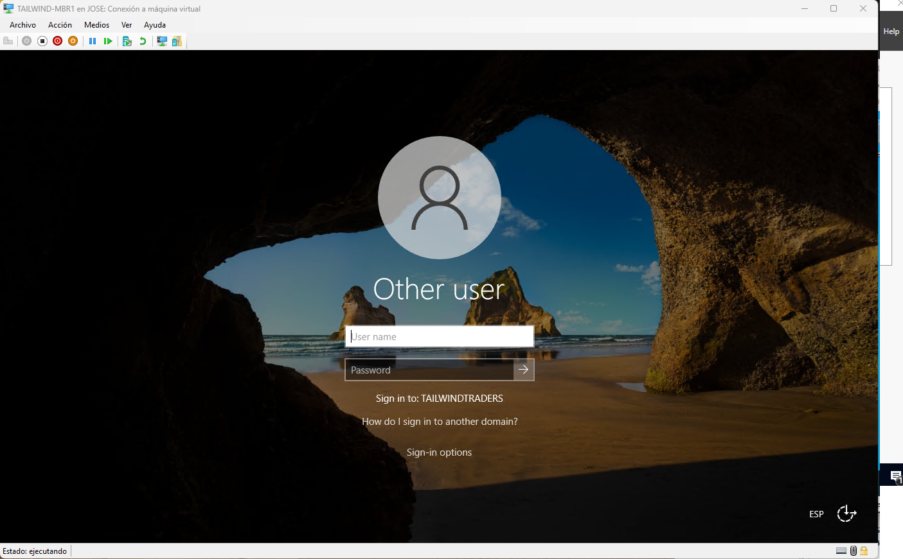
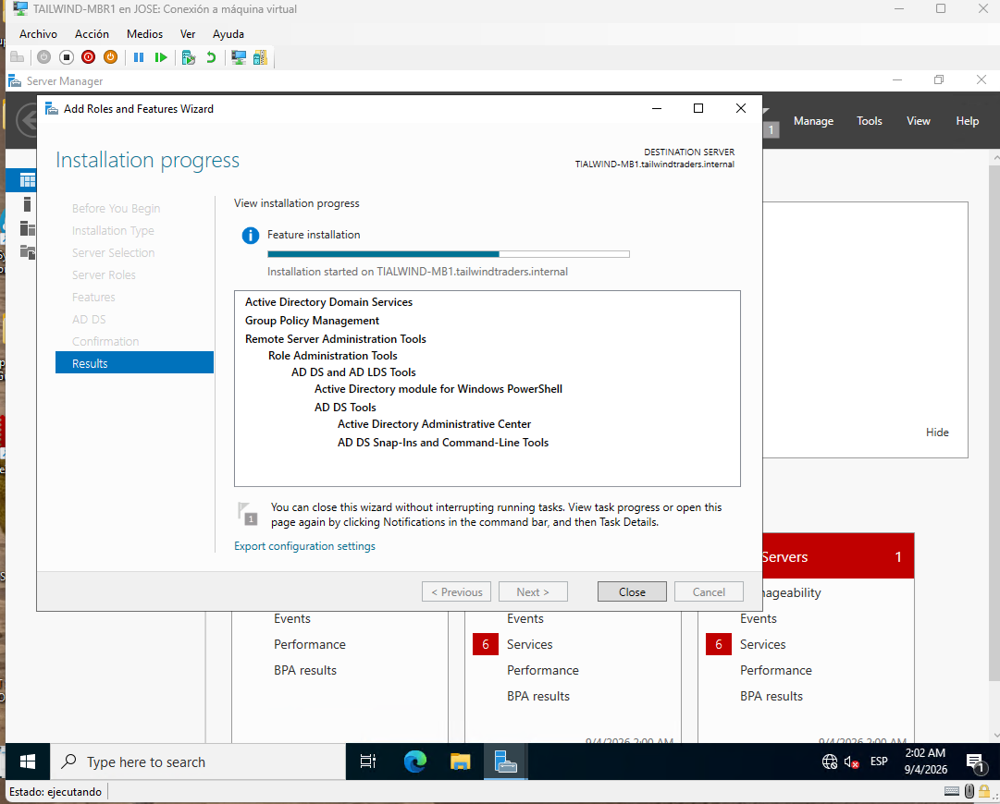
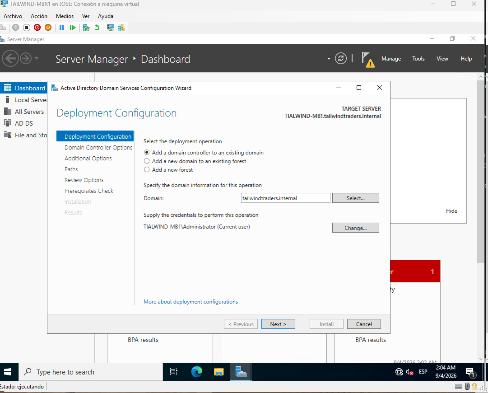

# Active Directory Domain Services — Multi-DC Environment

**🌐 Idioma:** [English](README.md) | **Español**

> Despliegue de un dominio Windows Server 2022 con dos Domain Controllers, gestión de identidades, delegación y políticas de seguridad, sobre Hyper-V.

## Contexto (Situation)

Proyecto de laboratorio basado en **Microsoft Applied Skills — AZ-1008**, diseñado como pieza de portfolio profesional para demostrar competencias reales en administración de Active Directory Domain Services. Forma parte de la transición profesional hacia IT Support, complementando la formación teórica con implementación práctica.

## Objetivo (Task)

El objetivo final de este laboratorio es desplegar y gestionar una infraestructura virtualizada completa que incluya:

- Despliegue de un bosque AD DS con dos Domain Controllers (Alta Disponibilidad).
- Gestión de OUs, usuarios, grupos y delegación de permisos (Principio de Mínimo Privilegio).
- Implementación de políticas de seguridad (FGPP, restricción NTLM, auditoría).

---

## Progreso del Proyecto (Action)

### Fase 0 — Requisitos verificados

Antes de levantar el entorno, se comprobó que el host físico cumple con los recursos necesarios para virtualizar la infraestructura planificada:

- **RAM y Almacenamiento**: Se validó que el equipo dispone de memoria suficiente (mínimo 16 GB recomendados para correr fluidamente 2 DCs y el host) y espacio en disco libre para soportar discos dinámicos de 60GB.
- **Virtualización**: Se confirmó que la virtualización por hardware (Intel VT-x / AMD-V) está habilitada en la BIOS/UEFI.

#### Evidencia de verificación:

[System Info y RAM](evidence/screenshots/fase00-systeminfo.png)
[Virtualización](evidence/screenshots/fase00-virtualizacion.png)
[Espacio en disco](evidence/screenshots/fase00-disk-space.png)

### Fase 1 — Instalación de Hyper-V

Para aislar el entorno de Active Directory y simular un centro de datos local, se ha habilitado el rol de Hyper-V (hipervisor nativo de Windows) y sus herramientas de administración en el sistema operativo host.

#### Evidencia de configuración:

[Hyper-V habilitado](evidence/screenshots/fase01-hyperv.png)

### Fase 2 — Configuración de rutas de Hyper-V

Para garantizar un rendimiento óptimo de las máquinas virtuales, se definieron las rutas de almacenamiento de los discos virtuales y archivos de configuración.

> **Decisión técnica:** Se mantuvieron las rutas por defecto de Hyper-V en la unidad A:, elegida por ser la de mayor capacidad y velocidad del equipo.

#### Evidencia de configuración:

[Rutas de Hyper-V configuradas](evidence/screenshots/fase02-rutas-hyperv.png)

---

*Este proyecto está actualmente en desarrollo. Las siguientes secciones y fases se irán documentando a medida que se despliegue la infraestructura.*

### Fase 3 — Creación de la red virtual NAT

Una vez preparado Hyper-V, el siguiente paso fue crear la red virtual que utilizarán las máquinas del laboratorio.

Para mantener el entorno aislado de la red física del equipo, se creó un **switch virtual de tipo Internal** denominado `NATSwitch` y posteriormente se configuró una red privada `10.10.10.0/24` con NAT.

#### Configuración realizada

La red se creó mediante PowerShell ejecutado como administrador, utilizando tres comandos principales:

1. **Crear el switch virtual**

   Se creó un switch virtual de tipo `Internal` llamado `NATSwitch`.
2. **Asignar la dirección IP al adaptador virtual**

   Se configuró la dirección `10.10.10.1/24` en el adaptador virtual asociado al switch.
3. **Crear la regla NAT**

   Se creó una red NAT para permitir que las máquinas virtuales puedan acceder a redes externas a través del host, manteniendo al mismo tiempo aislada la infraestructura del laboratorio.

La configuración resultante utiliza la siguiente red:

| Parámetro Configuración  |                 |
| ------------------------ | --------------- |
| Red                      | `10.10.10.0/24` |
| Gateway                  | `10.10.10.1`    |
| Switch virtual           | `NATSwitch`     |
| Tipo de switch           | `Internal`      |
| NAT                      | Configurado     |

#### Verificación

Una vez creada la infraestructura de red, se utilizaron comandos de PowerShell para comprobar que el switch virtual y la configuración IP habían quedado correctamente establecidos.

La verificación confirmó la existencia de `NATSwitch` y de la dirección `10.10.10.1` asociada a la red virtual.

#### Decisión técnica

Se eligió una red **Internal + NAT** en lugar de conectar directamente las máquinas virtuales a la red física mediante un switch externo.

Esto permite mantener el laboratorio separado de la red doméstica o de producción, mientras que las máquinas virtuales pueden seguir teniendo conectividad hacia el exterior cuando sea necesaria.

Esta separación resulta especialmente útil para un laboratorio de **Active Directory**, ya que permite trabajar con servidores, DNS, políticas y configuraciones de red sin modificar directamente la infraestructura física.

#### Evidencia

**Vídeo — Creación y verificación de la red virtual NAT**

[NAT Virtual Network — Hyper-V | IT Support Lab](https://youtu.be/TNneEzF2-Q8) ([image](https://img.youtube.com/vi/TNneEzF2-Q8/maxresdefault.jpg))

> El vídeo muestra la creación de `NATSwitch`, la configuración de la dirección IP `10.10.10.1` y la creación de la red NAT `10.10.10.0/24`, seguida de las comprobaciones realizadas mediante PowerShell.

📺 [**Ver vídeo completo en YouTube**](https://youtu.be/TNneEzF2-Q8)

#### Artefacto técnico

Los comandos de creación y verificación se han guardado en el script de PowerShell [setup-network.ps1](scripts/setup-network.ps1).

### Fase 4 — Creación de TAILWIND-DC1

Con la red virtual `NATSwitch` ya operativa, el siguiente paso fue aprovisionar la primera máquina virtual que actuará como Domain Controller del bosque `tailwindtraders.internal`.

#### Configuración realizada

La VM se creó mediante el asistente **New Virtual Machine** de Hyper-V Manager, con los siguientes parámetros:

| Parámetro Configuración  |                              |
| ------------------------ | ---------------------------- |
| Nombre                   | `TAILWIND-DC1`               |
| Generación               | `Generation 2`               |
| Memoria asignada         | `4096 MB`                    |
| Red virtual              | `NATSwitch`                  |
| Disco virtual            | Dinámico, tamaño por defecto |
| Fuente de instalación    | ISO de Windows Server 2022   |

#### Decisión técnica

Se eligió **Generation 2** en lugar de Generation 1 porque es el requisito de arranque UEFI/Secure Boot necesario para instalar Windows Server 2022 de forma compatible con las funciones de seguridad modernas del sistema operativo.

#### Evidencia

**Captura — Resumen del asistente New Virtual Machine**

[TAILWIND-DC1 — Resumen de creación](evidence/screenshots/Fase04-TAILWIND-DC1.png)

> La captura muestra el resumen final del asistente, confirmando Generation 2, 4096 MB de RAM, la red `NATSwitch` seleccionada y la ISO de Windows Server 2022 como origen de instalación.

### Fase 5 — Configuración de IP estática en DC1

Con la VM `TAILWIND-DC1` ya instalada, se le asignó una dirección IP estática dentro de la red `10.10.10.0/24` creada en la Fase 3, requisito indispensable antes de promocionar el servidor a Domain Controller.

#### Configuración realizada

| Parámetro Valor   |                 |
| ----------------- | --------------- |
| Dirección IP      | `10.10.10.10`   |
| Máscara de subred | `255.255.255.0` |
| Puerta de enlace  | `10.10.10.1`    |
| DNS preferido     | `127.0.0.1`     |

#### Decisión técnica

Se configuró una IP estática en lugar de dejar el adaptador en DHCP porque un Domain Controller no puede depender de una dirección que cambie: los clientes del dominio, los registros DNS y la replicación entre DCs necesitan una IP estable y predecible en todo momento.

El DNS preferido se apuntó a `127.0.0.1` (localhost) en lugar de a un DNS externo, anticipando que este servidor asumirá el rol de DNS Server del dominio en la Fase 8, al promocionarse como Domain Controller.

#### Verificación

Se confirmó la configuración mediante `ipconfig /all` en PowerShell:

```text
Ethernet adapter Ethernet:
   IPv4 Address. . . . . . . . . . . : 10.10.10.10(Preferred)
   Subnet Mask . . . . . . . . . . . : 255.255.255.0
   Default Gateway . . . . . . . . . : 10.10.10.1
   DNS Servers . . . . . . . . . . . : 127.0.0.1
```

#### Evidencia

**Captura — Propiedades IPv4 configuradas**

[IP estática configurada en DC1](evidence/screenshots/fase05-ip-estatica-dc1.png)

### Fase 7 — Instalación del rol AD DS

Con el servidor ya renombrado a `TAILWIND-DC1`, se instaló el rol de Active Directory Domain Services mediante el asistente **Add Roles and Features** de Server Manager.

#### Decisión técnica

Es importante distinguir entre **instalar el rol** y **promocionar el servidor**: instalar el rol únicamente copia al servidor los binarios y componentes necesarios de AD DS, igual que instalar cualquier otro software — la máquina sigue siendo un servidor miembro normal, sin dominio. Promocionar el servidor (Fase 8) es el paso independiente que realmente crea el bosque, configura la base de datos de Active Directory e instala DNS. Separar ambas operaciones permite instalar el software con antelación sin comprometer todavía la configuración del servidor.

#### Evidencia

**Captura — Selección del rol AD DS**

[Selección de Active Directory Domain Services](evidence/screenshots/fase07-seleccion-rol-adds.png)

**Captura — Instalación completada**

[Instalación del rol AD DS completada en TAILWIND-DC1](evidence/screenshots/fase07-instalacion-completada.png)

> La primera captura muestra la selección del rol Active Directory Domain Services en el asistente. La segunda confirma que la instalación finalizó correctamente en `TAILWIND-DC1`, mostrando el enlace para promocionar el servidor a controlador de dominio (paso correspondiente a la Fase 8).

### Fase 8 — Promoción de TAILWIND-DC1 a Domain Controller

Tras instalar el rol de Active Directory Domain Services en la Fase 7, `TAILWIND-DC1` todavía era un servidor independiente: disponía de los componentes de AD DS, pero no alojaba ningún dominio. En esta fase se realizó la promoción que crea el directorio, configura DNS integrado y convierte el servidor en el primer **Domain Controller** de la infraestructura.

#### Configuración realizada

Desde la notificación de Server Manager se inició **Promote this server to a domain controller**. Como el laboratorio no contaba con una infraestructura de Active Directory previa, se seleccionó **Add a new forest** y se creó el dominio raíz `tailwindtraders.internal`.

| Parámetro Configuración aplicada Motivo  |                            |                                                                                                     |
| ---------------------------------------- | -------------------------- | --------------------------------------------------------------------------------------------------- |
| Tipo de despliegue                       | Nuevo bosque               | `TAILWIND-DC1` es el primer DC del laboratorio.                                                     |
| Dominio raíz                             | `tailwindtraders.internal` | Identifica el espacio de nombres interno de Active Directory.                                       |
| Nivel funcional de bosque y dominio      | Windows Server 2016        | Es suficiente para los objetivos del laboratorio y mantiene compatibilidad con el diseño planteado. |
| DNS Server                               | Instalado                  | AD DS utiliza DNS para localizar controladores de dominio y servicios del directorio.               |
| Global Catalog                           | Habilitado                 | El primer DC debe actuar como catálogo global para las consultas del bosque.                        |
| Nombre NetBIOS                           | `TAILWINDTRADERS`          | Permite utilizar el formato corto de inicio de sesión `TAILWINDTRADERS\\Administrator`.              |
| Rutas de AD DS                           | Predeterminadas            | Para este entorno de laboratorio no se requieren discos independientes para NTDS, logs o SYSVOL.    |

Durante el asistente se definió también una contraseña de **Directory Services Restore Mode (DSRM)**. Esta credencial es exclusiva del modo de recuperación de los servicios de directorio y no equivale a la contraseña habitual de administrador del dominio; debe conservarse de forma segura y no se publica en el repositorio.

#### Advertencia de delegación DNS

La comprobación de requisitos previos puede mostrar una advertencia indicando que no es posible crear una delegación DNS. En este caso es un comportamiento esperado: se está creando un bosque nuevo en una red aislada y no existe una zona DNS padre externa que deba delegar `tailwindtraders.internal`. No fue un error bloqueante, por lo que se continuó con la instalación.

Al finalizar, Windows configuró AD DS, DNS, SYSVOL y los servicios relacionados; el servidor se reinició automáticamente para completar la promoción.

#### Verificación posterior al reinicio

La pantalla de inicio de sesión muestra **Sign-in to: TAILWINDTRADERS**, lo que confirma que el servidor ya reconoce el contexto del dominio creado. A partir de este punto es posible autenticarse con la cuenta de dominio `TAILWINDTRADERS\\Administrator` y administrar el bosque mediante las herramientas de Active Directory.

### Estado de las fases

| Fase | Objetivo | Estado | Evidencia / habilidad demostrada |
|---|---|---|---|
| 0 | Verificar requisitos del host | Completada | Recursos, virtualización y almacenamiento validados. |
| 1 | Instalar Hyper-V | Completada | Rol y herramientas de administración habilitados. |
| 2 | Configurar rutas de Hyper-V | Completada | Ubicaciones de configuración y discos virtuales definidas. |
| 3 | Crear red Internal + NAT | Completada | `NATSwitch`, red `10.10.10.0/24` y NAT verificados. |
| 4 | Crear `TAILWIND-DC1` | Completada | VM Generation 2 conectada a `NATSwitch`. |
| 5 | Configurar IP estática en DC1 | Completada | `10.10.10.10` y DNS local configurados. |
| 6 | Renombrar el servidor como `TAILWIND-DC1` | Completada; evidencia pendiente | El nombre se confirma en las fases posteriores; falta documentar su ejecución como fase independiente. |
| 7 | Instalar el rol AD DS | Completada | Capturas de selección e instalación del rol. |
| 8 | Promover DC1 y crear el bosque | Completada | Vídeo, captura de inicio de sesión y verificaciones técnicas reproducibles. |
| 9 | Desplegar y unir `TAILWIND-MBR1` | Completada | VM Gen 2, IP estática `10.10.10.20`, resolución DNS y unión al dominio. |
| 10 | Promover MBR1 a segundo DC y verificar replicación | Completada | Rol AD DS, promoción en dominio existente y replicación multi-DC con 0 fallos. |
| Próximo | Gestión de identidades y OUs | Planificado | Estructura de OUs, usuarios, grupos de seguridad y delegación de mínimo privilegio. |

> Las fases planificadas no se consideran evidencia completada hasta que se ejecuten, verifiquen y documenten.

#### Verificación técnica reproducible

Además de comprobar el inicio de sesión, las siguientes pruebas permiten validar que AD DS y DNS funcionan en `TAILWIND-DC1`:

```powershell
Get-ADDomain | Select-Object DNSRoot, NetBIOSName, DomainMode
Get-ADForest | Select-Object RootDomain, ForestMode
Get-Service DNS, NTDS | Select-Object Name, Status, StartType
Get-DnsServerZone | Select-Object ZoneName, IsDsIntegrated
Resolve-DnsName -Type SRV _ldap._tcp.dc._msdcs.tailwindtraders.internal
dcdiag
```

| Prueba | Confirmación esperada | Archivo de evidencia |
|---|---|---|
| Dominio y bosque | Se muestran `tailwindtraders.internal` y `TAILWINDTRADERS`; nivel funcional Windows Server 2016. | [`evidence/command-output/fase08-dominio-bosque.txt`](evidence/command-output/fase08-dominio-bosque.txt) |
| Registro SRV | Resuelve `_ldap._tcp.dc._msdcs.tailwindtraders.internal` hacia DC1 (`10.10.10.10`). | [`evidence/command-output/fase08-registro-srv.txt`](evidence/command-output/fase08-registro-srv.txt) |
| Diagnóstico de salud | `dcdiag` supera todas las pruebas de conectividad y servicios. | [`evidence/command-output/fase08-dcdiag.txt`](evidence/command-output/fase08-dcdiag.txt) |

#### Evidencia

**Vídeo — Promoción de TAILWIND-DC1 a Domain Controller**

[](https://youtu.be/g94RQIU15MM)

> El vídeo documenta la creación del bosque `tailwindtraders.internal`, la configuración de DNS y Global Catalog, el reinicio del servidor y el inicio de sesión con `TAILWINDTRADERS\Administrator`.

📺 **[Ver vídeo completo en YouTube](https://youtu.be/g94RQIU15MM)**

**Captura — Inicio de sesión en el dominio**



> La captura posterior al reinicio evidencia que `TAILWIND-DC1` ya ha sido promocionado: la interfaz indica que el inicio de sesión se realizará en el dominio `TAILWINDTRADERS`, en lugar de contra una cuenta local del servidor.

---

### Fase 9 — Aprovisionamiento y unión al dominio de TAILWIND-MBR1

Para establecer la arquitectura de alta disponibilidad con múltiples controladores de dominio, se aprovisionó una segunda máquina virtual y se unió al bosque `tailwindtraders.internal`.

#### Configuración realizada

1. **Aprovisionamiento de la VM:**
   - Nombre: `TAILWIND-MBR1`
   - Generación: `Generation 2` (arranque UEFI y Secure Boot habilitado)
   - Red virtual: `NATSwitch`
   - Sistema operativo: Windows Server 2022 Standard (Desktop Experience)

2. **Configuración de red (IPv4):**
   - Dirección IP: `10.10.10.20`
   - Máscara de subred: `255.255.255.0`
   - Puerta de enlace: `10.10.10.1`
   - **DNS preferido:** `10.10.10.10` *(imprescindible: apunta a `TAILWIND-DC1` para resolver los registros SRV internos de AD)*

3. **Validación previa a la unión:**
   - Se comprobó la conectividad IP mediante `Test-Connection 10.10.10.10`.
   - Se validó la resolución de nombres con `Resolve-DnsName tailwindtraders.internal`, confirmando que las consultas al dominio raíz eran resueltas correctamente a través del DC1.

4. **Unión al dominio:**
   - Unión al dominio `tailwindtraders.internal` mediante credenciales administrativas (`TAILWINDTRADERS\Administrator`).
   - Verificación de la cuenta de equipo creada en el dominio tras el reinicio automático.

#### Decisión técnica

Antes de intentar unir un equipo a un dominio de Active Directory, el cliente o servidor miembro **debe usar obligatoriamente el Domain Controller interno como su servidor DNS principal**. Un servidor DNS público o no configurado falla porque no conoce los registros de localización de servicios (`SRV`) de Active Directory (`_ldap._tcp.dc._msdcs.<dominio>`). Establecer la resolución DNS directa hacia DC1 garantiza que la negociación de unión al dominio se complete sin errores.

#### Evidencia

**Captura — Aprovisionamiento de la VM en Hyper-V**



**Captura — Configuración de IP estática y DNS**



**Captura — Ejecución de unión al dominio**



**Captura — Inicio de sesión en el dominio desde MBR1**



---

### Fase 10 — Promoción a segundo Domain Controller y verificación de replicación

Con `TAILWIND-MBR1` unido al dominio, se promocionó a Domain Controller réplica, completando la infraestructura de Alta Disponibilidad (Multi-DC).

#### Configuración realizada

1. **Instalación del rol AD DS:** Se instalaron los binarios de Active Directory Domain Services y las herramientas de administración remota (RSAT) mediante Server Manager.
2. **Asistente de promoción:**
   - Se seleccionó **"Add a domain controller to an existing domain"** indicando el dominio `tailwindtraders.internal`.
   - Se autenticó con credenciales de administrador de dominio (`TAILWINDTRADERS\Administrator`).
   - Se habilitaron las funciones de **Domain Name System (DNS) server** y **Global Catalog (GC)**.
   - Se configuró la contraseña de Directory Services Restore Mode (DSRM).
   - Se replicó la base de datos inicial (`NTDS.dit`), el esquema y la carpeta SYSVOL a través de la red virtual desde `TAILWIND-DC1`.

#### Decisión técnica y Alta Disponibilidad

Desplegar dos controladores de dominio elimina el punto único de fallo (SPOF) en la autenticación y resolución de identidades:
- **Redundancia y tolerancia a fallos:** Si `TAILWIND-DC1` entra en mantenimiento programado, se reinicia o sufre caídas, `TAILWIND-MBR1` continúa procesando inicios de sesión Kerberos/NTLM y consultas DNS sin interrupción de servicio.
- **Replicación multimaestro:** Las modificaciones realizadas en los objetos de Active Directory en cualquiera de los dos DCs se sincronizan automáticamente en el otro, manteniendo la coherencia de todo el bosque.
- **Catálogo Global:** Al configurar ambos servidores como Catálogos Globales, las consultas de pertenencia a grupos universales y búsquedas a nivel de bosque se resuelven de forma local e inmediata.

#### Verificación técnica reproducible

Tras el reinicio automático posterior a la promoción, se validó el estado de salud de la replicación multimaestro mediante PowerShell:

```powershell
repadmin /replsummary
repadmin /showrepl
Get-ADDomainController -Filter * | Select-Object Name, IPv4Address, IsGlobalCatalog, Site
```

| Prueba | Confirmación esperada | Archivo de evidencia |
|---|---|---|
| Resumen de replicación | 0 fallos (`0 / 5 fails`) entre DC1 y MBR1 en todas las particiones del directorio con delta < 5 minutos. | [`evidence/command-output/fase10-replsummary.txt`](evidence/command-output/fase10-replsummary.txt) |
| Consulta de DCs activos | Ambos controladores (`TAILWIND-DC1` y `TIALWIND-MB1`) reportados como Catálogos Globales activos en `Default-First-Site-Name`. | [`evidence/command-output/fase10-domain-controllers.txt`](evidence/command-output/fase10-domain-controllers.txt) |

#### Evidencia

**Captura — Instalación del rol AD DS**



**Captura — Promoción a dominio existente**



