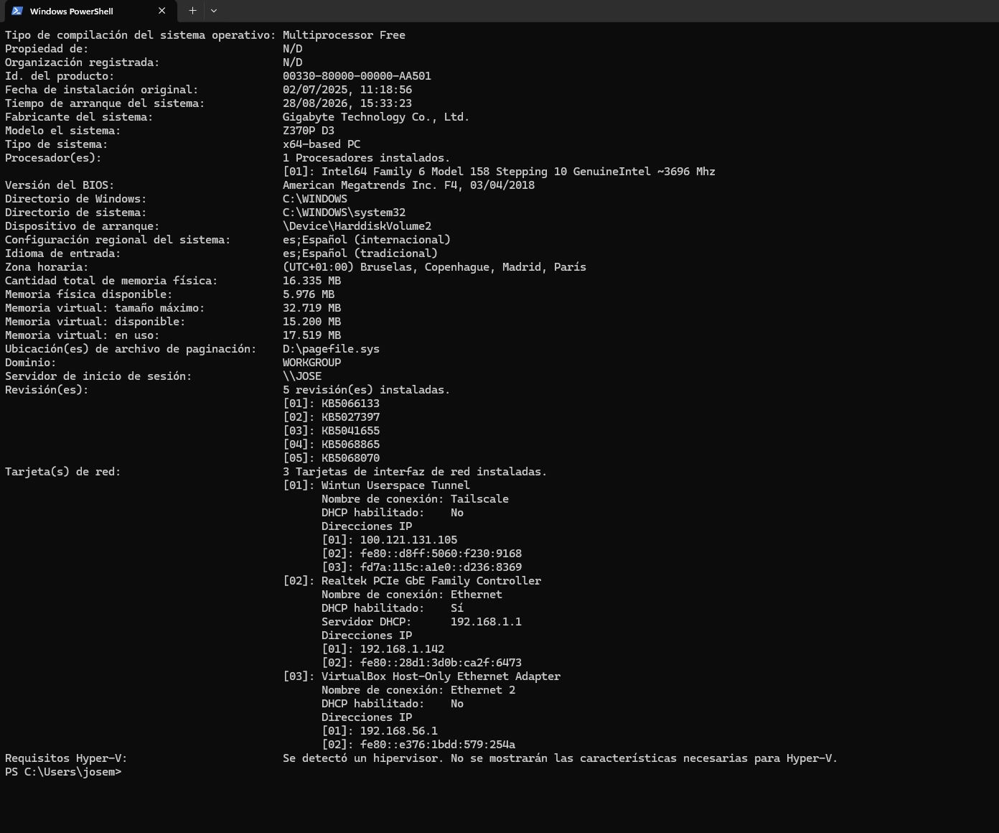
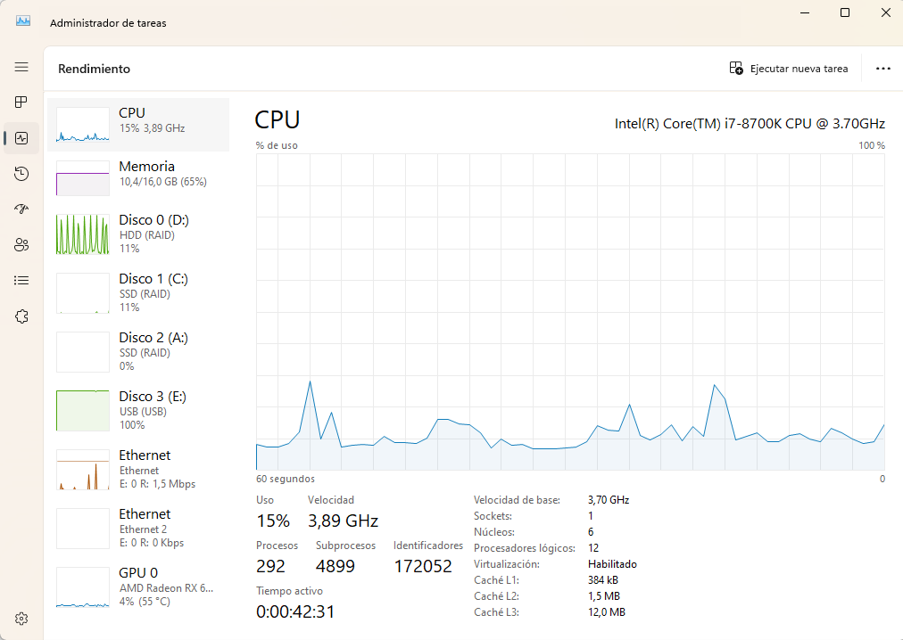
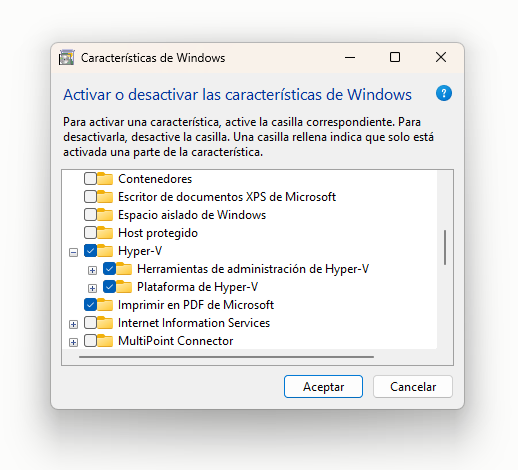
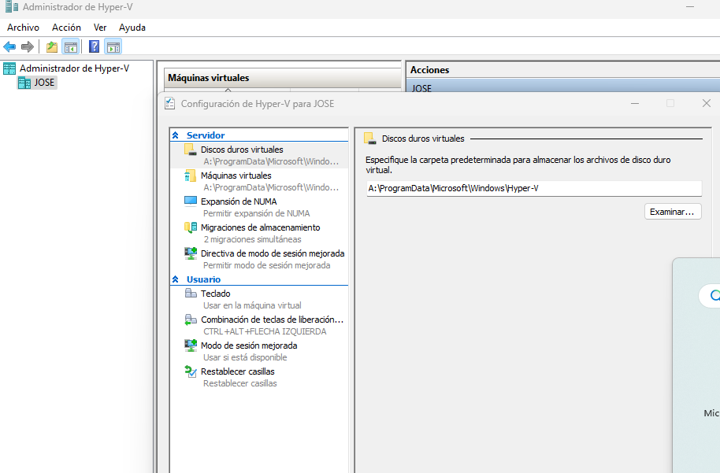
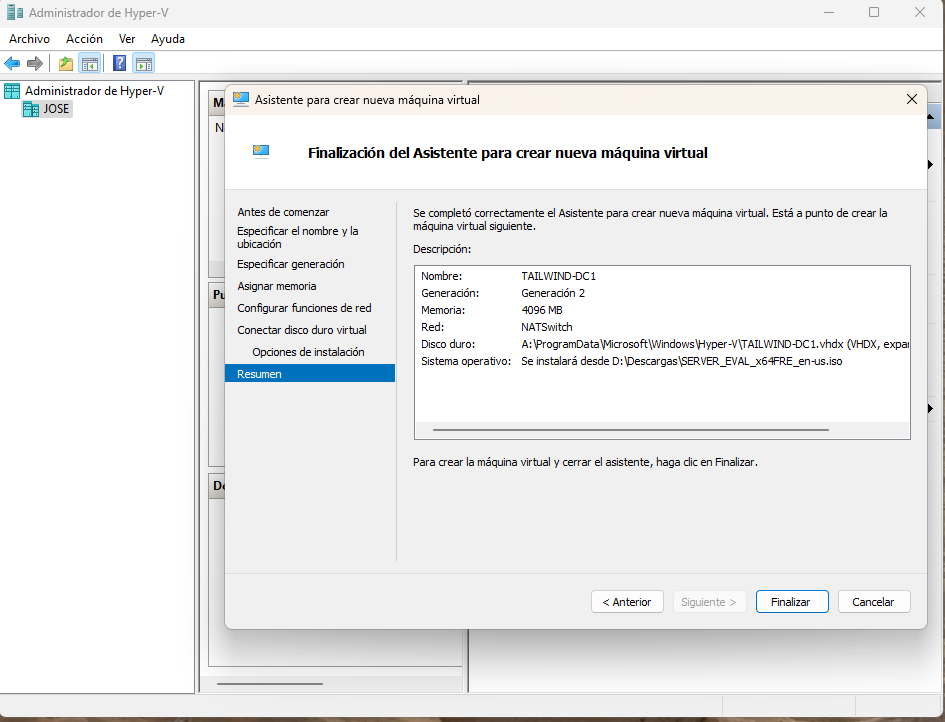
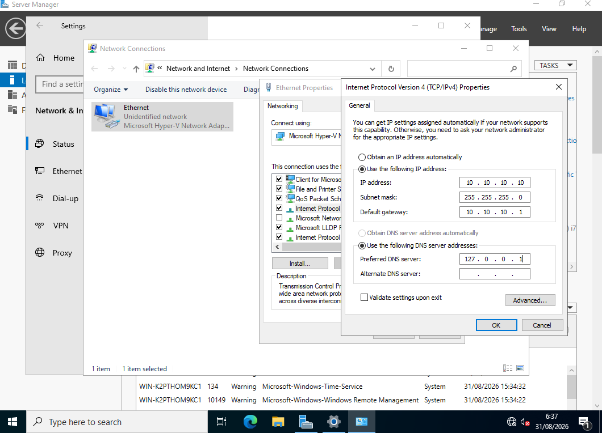
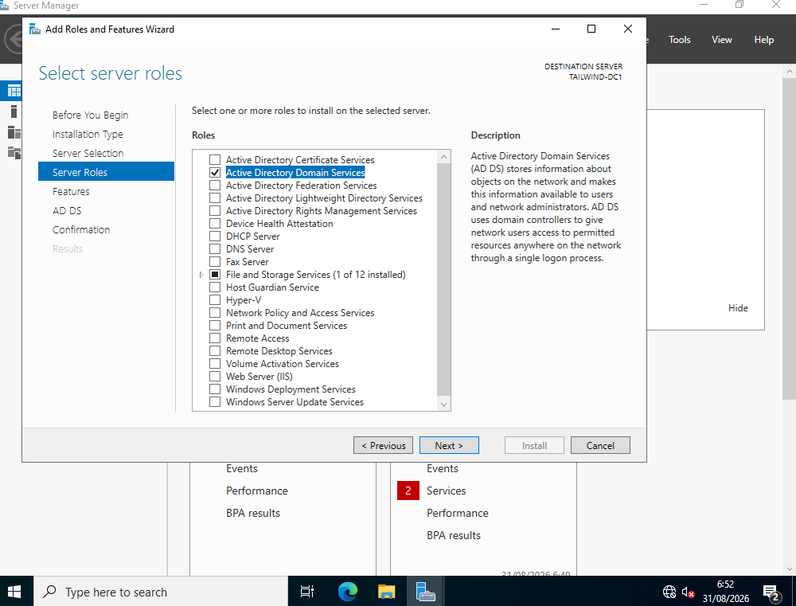
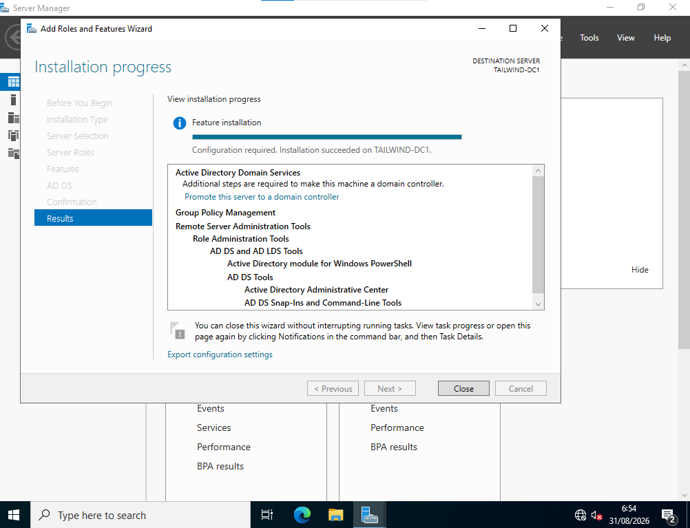

# Active Directory Domain Services — Multi-DC Environment

**🌐 Language:** **English** | [Español](README.es.md)

> Deployment of a Windows Server 2022 domain with two Domain Controllers, identity management, delegation, and security policies, on Hyper-V.

## Context (Situation)

Lab project based on **Microsoft Applied Skills — AZ-1008**, designed as a professional portfolio piece to demonstrate real-world skills in Active Directory Domain Services administration. Part of a professional transition into IT Support, complementing theoretical training with hands-on implementation.

## Objective (Task)

The end goal of this lab is to deploy and manage a complete virtualized infrastructure including:
- Deployment of an AD DS forest with two Domain Controllers (High Availability).
- Management of OUs, users, groups, and permission delegation (Principle of Least Privilege).
- Implementation of security policies (FGPP, NTLM restriction, auditing).

---

### Phase Status

| Phase | Objective | Status | Evidence / Demonstrated Skill |
|---|---|---|---|
| 0 | Verify host requirements | Completed | Resources, virtualization, and storage validated. |
| 1 | Install Hyper-V | Completed | Role and management tools enabled. |
| 2 | Configure Hyper-V paths | Completed | Configuration and virtual disk paths defined. |
| 3 | Create Internal + NAT network | Completed | `NATSwitch`, `10.10.10.0/24` network, and NAT verified. |
| 4 | Create `TAILWIND-DC1` | Completed | Generation 2 VM connected to `NATSwitch`. |
| 5 | Configure static IP on DC1 | Completed | `10.10.10.10` and local DNS configured. |
| 6 | Rename server to `TAILWIND-DC1` | Completed; evidence pending | Name confirmed in subsequent phases; pending independent documentation. |
| 7 | Install AD DS role | Completed | Role selection and installation screenshots. |
| 8 | Promote DC1 and create forest | Completed | Video, domain logon screenshot, and technical verifications outlined below. |
| 9 | Deploy and join `TAILWIND-MBR1` | Completed | Generation 2 VM, static IP `10.10.10.20`, DNS resolution, and domain join. |
| 10 | Promote MBR1 to Secondary DC & Verify Replication | Completed | AD DS role, DC promotion into existing domain, and 0-fail multi-DC replication. |
| Next | Identity Management & OUs | Planned | OUs structure, users, security groups, and least-privilege delegation. |

> Planned phases are not considered completed evidence until executed, verified, and documented.

### Phase 0 — Requirements verified

Before standing up the environment, the physical host was checked against the resources needed for the planned virtualized infrastructure:
- **RAM and Storage**: Confirmed the machine has sufficient memory (16 GB minimum recommended to run 2 DCs and the host smoothly) and enough free disk space to support 60 GB dynamic disks.
- **Virtualization**: Confirmed hardware virtualization (Intel VT-x / AMD-V) is enabled in the BIOS/UEFI.

#### Verification evidence:





### Phase 1 — Hyper-V installation

To isolate the Active Directory environment and simulate a local data center, the Hyper-V role (Windows' native hypervisor) and its management tools were enabled on the host operating system.

#### Configuration evidence:



### Phase 2 — Hyper-V path configuration

To ensure optimal virtual machine performance, storage paths for virtual disks and configuration files were defined.

> **Technical decision:** Default Hyper-V paths were kept on drive A:, chosen for being the machine's highest-capacity and fastest drive.

#### Configuration evidence:



---
*This project is currently in progress. The following sections and phases will be documented as the infrastructure is deployed.*

### Phase 3 — Virtual NAT network creation

With Hyper-V ready, the next step was creating the virtual network to be used by the lab's machines.

To keep the environment isolated from the machine's physical network, an **Internal-type virtual switch** named `NATSwitch` was created, followed by a private `10.10.10.0/24` network configured with NAT.

#### Configuration performed

The network was created via PowerShell run as administrator, using three main commands:

1. **Create the virtual switch**

   An `Internal`-type virtual switch named `NATSwitch` was created.

2. **Assign the IP address to the virtual adapter**

   The address `10.10.10.1/24` was configured on the virtual adapter associated with the switch.

3. **Create the NAT rule**

   A NAT network was created to allow virtual machines to reach external networks through the host, while keeping the lab infrastructure isolated.

The resulting configuration uses the following network:

| Parameter | Configuration |
|---|---|
| Network | `10.10.10.0/24` |
| Gateway | `10.10.10.1` |
| Virtual switch | `NATSwitch` |
| Switch type | `Internal` |
| NAT | Configured |

#### Verification

Once the network infrastructure was created, PowerShell commands were used to confirm that the virtual switch and IP configuration had been correctly established.

Verification confirmed the existence of `NATSwitch` and the address `10.10.10.1` associated with the virtual network.

#### Technical decision

An **Internal + NAT** network was chosen instead of connecting the virtual machines directly to the physical network via an external switch.

This keeps the lab separated from the home or production network, while still allowing the virtual machines to have outbound connectivity when needed.

This separation is especially useful for an **Active Directory** lab, since it allows working with servers, DNS, policies, and network configurations without directly modifying the physical infrastructure.

#### Evidence

**Video — Creating and verifying the virtual NAT network**

[](https://youtu.be/TNneEzF2-Q8)

> The video shows the creation of `NATSwitch`, configuration of the IP address `10.10.10.1`, and creation of the `10.10.10.0/24` NAT network, followed by the checks performed via PowerShell.

📺 **[Watch the full video on YouTube](https://youtu.be/TNneEzF2-Q8)**

#### Technical artifact

The creation and verification commands have been saved in the PowerShell script [setup-network.ps1](scripts/setup-network.ps1).

### Phase 4 — Creating TAILWIND-DC1

With the `NATSwitch` virtual network already operational, the next step was provisioning the first virtual machine that will act as the Domain Controller for the `tailwindtraders.internal` forest.

#### Configuration performed

The VM was created using Hyper-V Manager's **New Virtual Machine** wizard, with the following parameters:

| Parameter | Configuration |
|---|---|
| Name | `TAILWIND-DC1` |
| Generation | `Generation 2` |
| Assigned memory | `4096 MB` |
| Virtual network | `NATSwitch` |
| Virtual disk | Dynamic, default size |
| Installation source | Windows Server 2022 ISO |

#### Technical decision

**Generation 2** was chosen instead of Generation 1 because it is the UEFI/Secure Boot requirement needed to install Windows Server 2022 in a way compatible with the operating system's modern security features.

#### Evidence

**Screenshot — New Virtual Machine wizard summary**



> The screenshot shows the wizard's final summary, confirming Generation 2, 4096 MB of RAM, the `NATSwitch` network selected, and the Windows Server 2022 ISO as the installation source.

### Phase 5 — Static IP configuration on DC1

With the `TAILWIND-DC1` VM already installed, a static IP address was assigned within the `10.10.10.0/24` network created in Phase 3, an essential requirement before promoting the server to Domain Controller.

#### Configuration performed

| Parameter | Value |
|---|---|
| IP address | `10.10.10.10` |
| Subnet mask | `255.255.255.0` |
| Default gateway | `10.10.10.1` |
| Preferred DNS | `127.0.0.1` |

#### Technical decision

A static IP was configured instead of leaving the adapter on DHCP because a Domain Controller cannot depend on an address that changes: domain clients, DNS records, and replication between DCs all require a stable, predictable IP address at all times.

The preferred DNS was pointed to `127.0.0.1` (localhost) instead of an external DNS, anticipating that this server would take on the domain's DNS Server role in Phase 8, upon being promoted to Domain Controller.

#### Verification

The configuration was confirmed via `ipconfig /all` in PowerShell:

```text
Ethernet adapter Ethernet:
   IPv4 Address. . . . . . . . . . . : 10.10.10.10(Preferred)
   Subnet Mask . . . . . . . . . . . : 255.255.255.0
   Default Gateway . . . . . . . . . : 10.10.10.1
   DNS Servers . . . . . . . . . . . : 127.0.0.1
```

#### Evidence

**Screenshot — Configured IPv4 properties**



### Phase 7 — AD DS role installation

With the server already renamed to `TAILWIND-DC1`, the Active Directory Domain Services role was installed via Server Manager's **Add Roles and Features** wizard.

#### Technical decision

It's important to distinguish between **installing the role** and **promoting the server**: installing the role only copies the necessary AD DS binaries and components to the server, just like installing any other software — the machine remains a regular member server, with no domain. Promoting the server (Phase 8) is the separate step that actually creates the forest, configures the Active Directory database, and installs DNS. Separating both operations allows installing the software ahead of time without yet committing to the server's configuration.

#### Evidence

**Screenshot — AD DS role selection**



**Screenshot — Installation completed**



> The first screenshot shows the Active Directory Domain Services role selection in the wizard. The second confirms the installation finished successfully on `TAILWIND-DC1`, showing the link to promote the server to domain controller (corresponding to Phase 8).

### Phase 8 — Promoting TAILWIND-DC1 to Domain Controller

After installing the Active Directory Domain Services role in Phase 7, `TAILWIND-DC1` was still a standalone server: it had the AD DS components, but hosted no domain. In this phase, the promotion was carried out, creating the directory, configuring integrated DNS, and turning the server into the infrastructure's first **Domain Controller**.

#### Configuration performed

From the Server Manager notification, **Promote this server to a domain controller** was launched. Since the lab had no pre-existing Active Directory infrastructure, **Add a new forest** was selected and the root domain `tailwindtraders.internal` was created.

| Parameter | Configuration applied | Reason |
|---|---|---|
| Deployment type | New forest | `TAILWIND-DC1` is the lab's first DC. |
| Root domain | `tailwindtraders.internal` | Identifies Active Directory's internal namespace. |
| Forest and domain functional level | Windows Server 2016 | Sufficient for the lab's objectives and maintains compatibility with the planned design. |
| DNS Server | Installed | AD DS uses DNS to locate domain controllers and directory services. |
| Global Catalog | Enabled | The first DC must act as the global catalog for forest-wide queries. |
| NetBIOS name | `TAILWINDTRADERS` | Allows using the short logon format `TAILWINDTRADERS\Administrator`. |
| AD DS paths | Default | This lab environment doesn't require separate disks for NTDS, logs, or SYSVOL. |

During the wizard, a **Directory Services Restore Mode (DSRM)** password was also set. This credential is exclusive to directory services recovery mode and is not the same as the regular domain administrator password; it must be kept secure and is not published in the repository.

#### DNS delegation warning

The prerequisites check may show a warning stating that a DNS delegation cannot be created. This is expected behavior in this case: a new forest is being created on an isolated network, and there is no external parent DNS zone that needs to delegate `tailwindtraders.internal`. It was not a blocking error, so the installation proceeded.

Upon completion, Windows configured AD DS, DNS, SYSVOL, and related services; the server restarted automatically to complete the promotion.

#### Post-restart verification

The sign-in screen shows **Sign-in to: TAILWINDTRADERS**, confirming the server now recognizes the context of the created domain. From this point on, it is possible to authenticate with the domain account `TAILWINDTRADERS\Administrator` and manage the forest using Active Directory tools.

#### Reproducible Technical Verification

In addition to verifying the domain sign-in screen, the following tests validate that AD DS and DNS are fully functional on `TAILWIND-DC1`. These are executed in PowerShell with administrative privileges:

```powershell
Get-ADDomain | Select-Object DNSRoot, NetBIOSName, DomainMode
Get-ADForest | Select-Object RootDomain, ForestMode
Get-Service DNS, NTDS | Select-Object Name, Status, StartType
Get-DnsServerZone | Select-Object ZoneName, IsDsIntegrated
Resolve-DnsName -Type SRV _ldap._tcp.dc._msdcs.tailwindtraders.internal
dcdiag
```

| Test | Expected Confirmation | Evidence File |
|---|---|---|
| Domain and Forest | Displays `tailwindtraders.internal` and `TAILWINDTRADERS`; functional level indicates Windows Server 2016. | [`evidence/command-output/fase08-dominio-bosque.txt`](evidence/command-output/fase08-dominio-bosque.txt) |
| SRV Record | Resolves `_ldap._tcp.dc._msdcs.tailwindtraders.internal` to DC1 (`10.10.10.10`). | [`evidence/command-output/fase08-registro-srv.txt`](evidence/command-output/fase08-registro-srv.txt) |
| DC Health Diagnostics | `dcdiag` passes connectivity, advertising, and core directory tests. | [`evidence/command-output/fase08-dcdiag.txt`](evidence/command-output/fase08-dcdiag.txt) |

> The replication check (`repadmin /replsummary`) will be executed once `TAILWIND-MBR1` is promoted as the second Domain Controller.

#### Evidence

**Video — Promoting TAILWIND-DC1 to Domain Controller**

[](https://youtu.be/g94RQIU15MM)

> The video documents the creation of the `tailwindtraders.internal` forest, DNS and Global Catalog configuration, the server restart, and signing in as `TAILWINDTRADERS\Administrator`.

📺 **[Watch the full video on YouTube](https://youtu.be/g94RQIU15MM)**

**Screenshot — Domain sign-in screen**


> The post-restart screenshot shows `TAILWIND-DC1` has been promoted: the interface indicates sign-in will occur against the `TAILWINDTRADERS` domain, rather than a local account on the server.

### Phase 9 — Provisioning and Domain Join of TAILWIND-MBR1

To establish a Multi-Domain Controller high-availability architecture, a second virtual machine was provisioned and joined to the `tailwindtraders.internal` forest.

#### Configuration Performed

1. **Virtual Machine Provisioning:**
   - Name: `TAILWIND-MBR1`
   - Generation: `Generation 2` (UEFI / Secure Boot enabled)
   - Virtual Switch: `NATSwitch`
   - OS: Windows Server 2022 Standard (Desktop Experience)

2. **Network Configuration (IPv4):**
   - IP Address: `10.10.10.20`
   - Subnet Mask: `255.255.255.0`
   - Default Gateway: `10.10.10.1`
   - **Preferred DNS Server:** `10.10.10.10` *(crucial: points to `TAILWIND-DC1` to resolve internal AD SRV records)*

3. **Pre-Join Validation:**
   - ICMP and layer-3 connectivity were tested using `Test-Connection 10.10.10.10`.
   - Name resolution was confirmed using `Resolve-DnsName tailwindtraders.internal`, verifying that queries to the root domain returned `10.10.10.10` via DC1.

4. **Domain Join:**
   - Joined to `tailwindtraders.internal` using domain administrative credentials (`TAILWINDTRADERS\Administrator`).
   - Verified post-reboot sign-in context to confirm the computer account was created in the domain.

#### Technical Decision

Before attempting to join an Active Directory domain, the client or member server **must use the internal Domain Controller as its primary DNS resolver**. Using a public resolver (like 8.8.8.8) or an unconfigured gateway fails because public DNS servers cannot locate internal Active Directory Service Location (`SRV`) records (`_ldap._tcp.dc._msdcs.<domain>`). Establishing point-to-point DNS resolution against DC1 ensures the domain join negotiation succeeds seamlessly.

#### Evidence

**Screenshot — VM Provisioning in Hyper-V**


**Screenshot — Static IP and DNS Configuration**


**Screenshot — Domain Join Execution**


**Screenshot — Domain Sign-in on MBR1**


---

### Phase 10 — Secondary Domain Controller Promotion & Replication Verification

With `TAILWIND-MBR1` joined to the domain, it was promoted to become a replica Domain Controller, completing the High Availability (Multi-DC) infrastructure.

#### Configuration Performed

1. **AD DS Role Installation:** Installed Active Directory Domain Services binaries and Remote Server Administration Tools (RSAT) via Server Manager.
2. **Promotion Operation:**
   - Selected **"Add a domain controller to an existing domain"** targeting `tailwindtraders.internal`.
   - Authenticated using domain administrator credentials (`TAILWINDTRADERS\Administrator`).
   - Enabled **Domain Name System (DNS) server** and **Global Catalog (GC)** roles.
   - Configured Directory Services Restore Mode (DSRM) credentials.
   - Initial directory database (`NTDS.dit`), schema, and SYSVOL were replicated across the virtual network from `TAILWIND-DC1`.

#### Technical Decision & High Availability

Deploying two Domain Controllers eliminates the single point of failure (SPOF) for identity and authentication services:
- **Redundancy & Fault Tolerance:** If `TAILWIND-DC1` undergoes planned maintenance, unexpected downtime, or hardware faults, `TAILWIND-MBR1` continues authenticating Kerberos/NTLM logon requests and serving DNS queries.
- **Multi-Master Replication:** Changes made to AD objects on either controller automatically replicate to the other, maintaining a consistent directory database across the forest.
- **Global Catalog:** Designating both DCs as Global Catalogs allows forest-wide object lookups and universal group membership queries to be resolved locally by either server.

#### Reproducible Technical Verification

After the automatic post-promotion reboot, multi-master replication and directory health were verified via PowerShell:

```powershell
repadmin /replsummary
repadmin /showrepl
Get-ADDomainController -Filter * | Select-Object Name, IPv4Address, IsGlobalCatalog, Site
```

| Test | Expected Confirmation | Evidence File |
|---|---|---|
| Replication Summary | 0 fails (`0 / 5 fails`) across all directory partitions between DC1 and MBR1 with delta < 5 minutes. | [`evidence/command-output/fase10-replsummary.txt`](evidence/command-output/fase10-replsummary.txt) |
| Active DCs Query | Both `TAILWIND-DC1` (`10.10.10.10`) and `TIALWIND-MB1` (`10.10.10.20`) reported as active Global Catalogs in `Default-First-Site-Name`. | [`evidence/command-output/fase10-domain-controllers.txt`](evidence/command-output/fase10-domain-controllers.txt) |

#### Evidence

**Screenshot — AD DS Role Installation**


**Screenshot — Promoting to Existing Domain**


