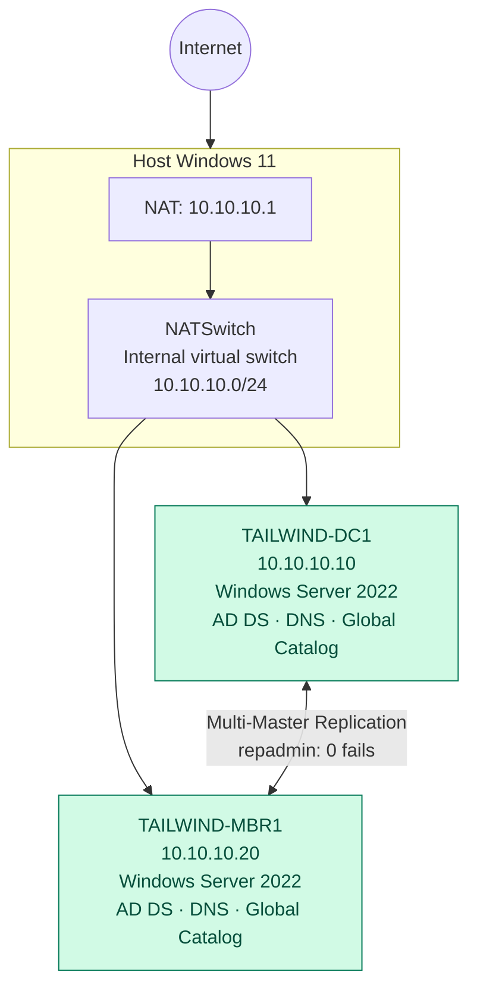

# Arquitectura del Laboratorio AD DS

> Estado documentado: `TAILWIND-DC1` y `TAILWIND-MBR1` están completamente desplegados y operativos como Domain Controllers con replicación activa (0 fallos).

## Diagrama de red y roles

## Componentes

| Componente | Dirección / red | Estado | Rol o configuración |
|---|---|---|---|
| Host Windows 11 | `10.10.10.1` | Operativo | Host Hyper-V y gateway NAT de la red interna. |
| `NATSwitch` | `10.10.10.0/24` | Operativo | Switch virtual Internal con salida NAT a Internet. |
| `TAILWIND-DC1` | `10.10.10.10` | Operativo | Primer DC del bosque, DNS Server y Global Catalog. |
| `TAILWIND-MBR1` | `10.10.10.20` | Operativo | Segundo DC réplica, DNS Server y Global Catalog. |

## Active Directory

| Parámetro | Valor |
|---|---|
| Bosque y dominio raíz | `tailwindtraders.internal` |
| Nombre NetBIOS | `TAILWINDTRADERS` |
| Nivel funcional de bosque y dominio | Windows Server 2016 |
| Domain Controllers | `TAILWIND-DC1` y `TAILWIND-MBR1` |
| Roles instalados | AD DS, DNS Server, Global Catalog (en ambos DCs) |
| Replicación | Multimaestro activa sin errores (`repadmin /replsummary`) |

## Decisiones de red y Alta Disponibilidad

Se utiliza un switch **Internal + NAT** para mantener el dominio aislado de la red física y, al mismo tiempo, permitir conectividad saliente. La existencia de dos Domain Controllers elimina puntos únicos de fallo (SPOF) en la infraestructura de identidades.

## Próximo estado previsto

Creación de la estructura organizativa de OUs (`Employees`, `Computers`, `Groups`), usuarios corporativos, políticas de grupos y delegación con principio de mínimo privilegio.

