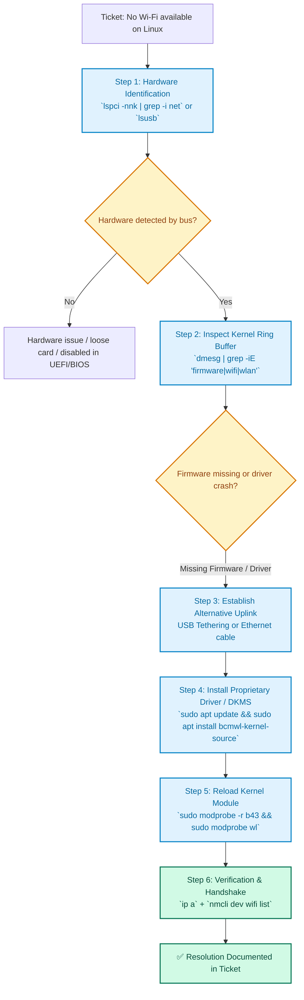

# Linux Hardware Troubleshooting — Wi-Fi Driver & Kernel Module Fix

[🏠 Home](../../README.md) · [📂 All Labs](../README.md) · [📋 Roadmap](../../LABS-ROADMAP.md)

---

> **A practical hands-on Linux support scenario: diagnosing an unrecognized wireless network interface after OS installation, inspecting kernel ring buffer messages (`dmesg`), managing kernel modules (`modprobe`/`lsmod`), and compiling proprietary drivers via DKMS.**

| Field | Detail |
|---|---|
| **CompTIA A+ Objective** | Core 1 (220-1201) Domain 1.6 — Given a scenario, troubleshoot OS & hardware issues |
| **Level** | Intermediate |
| **Target OS** | Ubuntu Desktop / Debian-based distributions |
| **Real Scenario** | Wi-Fi adapter absent from NetworkManager/settings post-update or fresh OS install |
| **Troubleshooting Path** | `lspci` / `lsusb` ➔ `dmesg` ➔ `lsmod` ➔ `dkms` / `apt` ➔ `modprobe` ➔ `ip a` |

## Diagnostic & Remediation Workflow

## 📋 Ticket Details & Scenario

> [!NOTE]
> **Help Desk Ticket #1042:** *"User installed Ubuntu Desktop on an ASUS laptop, but Wi-Fi options are completely missing in system settings. No wireless SSIDs are listed."*

---

## 🔧 Essential Linux Diagnostic Toolkit

| Command | Purpose |
|---------|---------|
| `lspci` | List PCI devices (shows network controllers) |
| `lsusb` | List USB devices |
| `dmesg` | Kernel ring buffer (hardware logs and driver crashes) |
| `lsmod` | Show loaded kernel modules (drivers) |
| `sudo dkms` / `apt` | Install driver packages |

---

## 📸 Step-by-Step Walkthrough

### **Step 1: Identify the Hardware**

1. Run `lspci | grep -i network` to identify the exact model of the WiFi card (e.g., Realtek RTL8821AE or Broadcom BCM43142).
2. Note the chipset name.

### **Step 2: Check for Loaded Modules**

1. Run `lsmod | grep <chipset_name>` (e.g., `lsmod | grep rtl`).
2. If nothing appears, the driver is not loaded.

### **Step 3: Check Kernel Logs for Errors**

1. Run `dmesg | grep -i firmware` or `dmesg | grep -i network`.
2. Look for errors like "Direct firmware load failed". This indicates missing firmware files.

### **Step 4: Install the Missing Driver/Firmware**

*(Note: The exact command depends on the chipset found in Step 1. Below is a common example for Broadcom)*
1. Connect via Ethernet (or USB tethering from phone).
2. Update repositories: `sudo apt update`
3. Install driver: `sudo apt install bcmwl-kernel-source`
4. Reboot or reload module: `sudo modprobe -r b43 && sudo modprobe wl`

### **Step 5: Verify Connectivity**

1. Check if WiFi interfaces appear: `ip a` (look for `wlan0` or similar).
2. Try connecting to a network via the GUI or `nmcli`.

---

## ✅ Verification Checklist

- [ ] Identified network card hardware using `lspci`
- [ ] Searched kernel logs using `dmesg`
- [ ] Understand the concept of kernel modules (`lsmod`)
- [ ] Successfully installed or loaded the correct driver
- [ ] WiFi connection established

---

## 🎓 Key Concepts

**1.6 — OS Troubleshooting**
- Kernel vs User Space
- Kernel Modules (Linux equivalent of Windows drivers)
- Open-source vs Proprietary drivers
- Using alternate connections (USB tethering/Ethernet) to download drivers

---

**Author:** José María Aparicio Portillo  
**Status:** 🔄 In Progress
