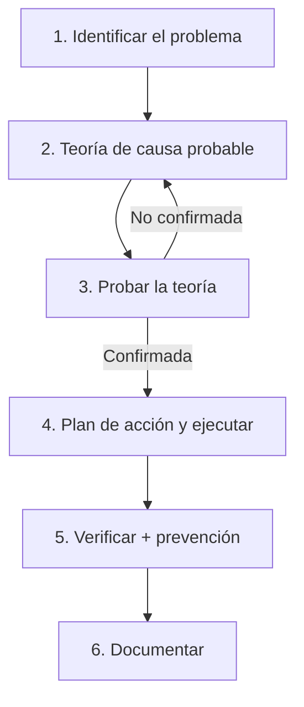
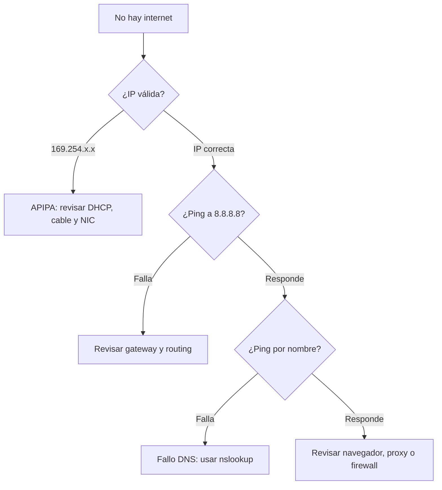

# Dominio 5 · Hardware & Network Troubleshooting (28%)
> 🧭 **Metodología CompTIA — 6 pasos (memorízalos en orden):** ① Identificar el problema. ② Establecer una teoría de causa probable (cuestiona lo obvio). ③ Probar la teoría para determinar la causa. ④ Establecer un plan de acción y ejecutarlo. ⑤ Verificar la funcionalidad completa y aplicar medidas preventivas. ⑥ Documentar hallazgos, acciones y resultados.

> 🧠 **Regla de oro del examen:** ante *¿cuál es el PRIMER paso?*, casi siempre es **identificar el problema** o **cuestionar lo obvio**. Ante *BEST*, prioriza la **seguridad de datos y personas**.

> 🧠 **Mnemotecnia de los 6 pasos:** *I Eat Tacos Every Very Day* → **I**dentificar, **E**stablecer teoría, **T**estear la teoría, **E**stablecer un plan, **V**erificar, **D**ocumentar.

> 🎯 **Cómo distinguir FIRST / NEXT / BEST en el examen:** • **FIRST / NEXT** → pide el **siguiente paso del proceso**, casi siempre el paso posterior al que ya se hizo. Ejemplo: *"Has confirmado que un disco falla. ¿Cuál es el siguiente paso?"* → Establecer un plan de acción, no reemplazar el disco todavía sin plan. • **BEST** → pide la opción que **prioriza seguridad, integridad de datos o la solución más completa**, aunque no sea la más rápida. Ejemplo: *"Un usuario huele a quemado en su torre. ¿Cuál es la MEJOR acción?"* → Apagar y desconectar de inmediato. • Ante dos respuestas técnicamente correctas, elige la que **respeta el orden de la metodología** o la que **protege datos y personas**.

## 5.0 · Diagramas de troubleshooting
> 🧭 Estos diagramas resumen visualmente la metodología y el diagnóstico de red. Repásalos antes de un PBQ de ordenación.

**Flujo de la metodología CompTIA (6 pasos):**

**Árbol de decisión: "No hay internet":**

## 5.1 · Síntomas de hardware de PC
<table header-row="true">
<tr>
<td>Síntoma</td>
<td>Causa probable</td>
<td>Acción</td>
</tr>
<tr>
<td>No enciende nada</td>
<td>Sin alimentación o PSU</td>
<td>Comprobar cable, toma e interruptor de la PSU</td>
</tr>
<tr>
<td>Pitidos POST, sin vídeo</td>
<td>RAM o GPU mal asentada</td>
<td>Reasentar módulos y tarjeta</td>
</tr>
<tr>
<td>Apagados aleatorios</td>
<td>Sobrecalentamiento o PSU</td>
<td>Limpiar polvo, revisar ventiladores y PSU</td>
</tr>
<tr>
<td>BSOD / pantallazo</td>
<td>Driver, RAM o disco</td>
<td>Actualizar driver, test de memoria, SFC</td>
</tr>
<tr>
<td>Olor a quemado o humo</td>
<td>PSU o condensadores</td>
<td>**Apagar y desconectar de inmediato**</td>
</tr>
<tr>
<td>Fecha y hora se resetean</td>
<td>Pila CMOS agotada</td>
<td>Sustituir la pila CR2032</td>
</tr>
<tr>
<td>Ruido de clic o rozamiento</td>
<td>HDD mecánico fallando</td>
<td>**Copia de seguridad inmediata** y sustituir</td>
</tr>
<tr>
<td>Rendimiento muy lento</td>
<td>Disco lleno, malware o poca RAM</td>
<td>Liberar espacio, escanear, ampliar RAM</td>
</tr>
</table>
> 🟡 **Códigos POST:** los pitidos exactos dependen del fabricante de BIOS/UEFI (AMI, Award, Phoenix), pero el examen espera que sepas el patrón general: repetidos o continuos sin vídeo → **memoria o GPU mal asentada**; consulta siempre la documentación del fabricante antes de interpretar un código como universal.

> 🔴 **Trampa:** ante un fallo de POST, el examen espera **reasentar RAM y tarjetas primero**, no sustituir el componente directamente — es la causa más común y el paso más barato antes de gastar dinero.

## 5.2 · Almacenamiento y RAID
<table header-row="true">
<tr>
<td>Síntoma</td>
<td>Causa probable</td>
</tr>
<tr>
<td>Errores S.M.A.R.T.</td>
<td>Disco degradándose; respalda ya</td>
</tr>
<tr>
<td>"RAID not found"</td>
<td>Controladora, orden de arranque o disco fuera del array</td>
</tr>
<tr>
<td>Clic rítmico</td>
<td>Fallo mecánico de HDD</td>
</tr>
<tr>
<td>Lectura/escritura lenta</td>
<td>Disco lleno, fragmentación o cable SATA dañado</td>
</tr>
<tr>
<td>El sistema no arranca</td>
<td>Bootloader, orden de arranque o disco muerto</td>
</tr>
</table>
> 🔴 **Trampa:** un error S.M.A.R.T. es una **alerta predictiva**, el disco todavía funciona — el paso correcto es **respaldar de inmediato**, no esperar a que falle del todo para actuar.

## 5.3 · Vídeo y pantalla
<table header-row="true">
<tr>
<td>Síntoma</td>
<td>Causa probable</td>
</tr>
<tr>
<td>Sin imagen</td>
<td>Cable, fuente de entrada o GPU/RAM mal asentada</td>
</tr>
<tr>
<td>Imagen muy tenue</td>
<td>Backlight o inverter</td>
</tr>
<tr>
<td>Artefactos o colores raros</td>
<td>GPU sobrecalentada o driver</td>
</tr>
<tr>
<td>Parpadeo</td>
<td>Refresh rate mal configurado o cable</td>
</tr>
<tr>
<td>Píxeles muertos / burn-in</td>
<td>Panel defectuoso o imagen estática prolongada</td>
</tr>
</table>
> 🔴 **Trampa:** una imagen muy tenue casi siempre es el **backlight o el inverter**, no el panel — antes de cambiar la pantalla completa, ilumina de cerca con una linterna para comprobar si la imagen aparece débilmente.

## 5.4 · Red
<table header-row="true">
<tr>
<td>Síntoma</td>
<td>Causa probable</td>
</tr>
<tr>
<td>Sin conectividad</td>
<td>Cable, NIC o IP 169.254 (sin DHCP)</td>
</tr>
<tr>
<td>Conexión intermitente</td>
<td>Interferencia o cable dañado</td>
</tr>
<tr>
<td>Red lenta</td>
<td>Saturación, dúplex mal negociado o malware</td>
</tr>
<tr>
<td>Latencia y jitter altos</td>
<td>Congestión o Wi-Fi saturado</td>
</tr>
<tr>
<td>Ping por IP sí, por nombre no</td>
<td>Problema de **DNS**</td>
</tr>
<tr>
<td>Conflicto de IP</td>
<td>Dos equipos con la misma IP estática o reserva mal configurada</td>
</tr>
</table>
> 🧠 **Truco de red:** si haces `ping 8.8.8.8` y responde pero `ping google.com` falla, el problema es **DNS**, no la conectividad.

> 🔴 **Trampa:** un dúplex mal negociado (half vs full) provoca **colisiones y lentitud extrema**, no una desconexión — el enlace sigue activo pero rinde muy por debajo de lo esperado.

## 5.5 · Dispositivos móviles
<table header-row="true">
<tr>
<td>Síntoma</td>
<td>Causa probable</td>
</tr>
<tr>
<td>No carga</td>
<td>Cable, puerto sucio o batería</td>
</tr>
<tr>
<td>Sobrecalentamiento</td>
<td>App exigente o carga intensa</td>
</tr>
<tr>
<td>Sin señal</td>
<td>Modo avión activo o SIM mal puesta</td>
</tr>
<tr>
<td>Pantalla no responde</td>
<td>Digitizer o congelación del SO</td>
</tr>
<tr>
<td>Batería se agota rápido</td>
<td>Apps en segundo plano o batería gastada</td>
</tr>
</table>
> 🔴 **Trampa:** "sin señal" no siempre es la antena o la SIM — **comprueba primero el modo avión**, es la causa más común y la que el examen espera que descartes antes de sospechar de hardware.

## 5.6 · Impresoras
<table header-row="true">
<tr>
<td>Síntoma</td>
<td>Causa probable</td>
</tr>
<tr>
<td>Atascos de papel</td>
<td>Rodillos gastados o papel húmedo</td>
</tr>
<tr>
<td>Líneas o manchas</td>
<td>Tambor rayado o tóner defectuoso</td>
</tr>
<tr>
<td>Impresión tenue</td>
<td>Tóner o tinta baja</td>
</tr>
<tr>
<td>Imágenes fantasma</td>
<td>Fusor o tambor</td>
</tr>
<tr>
<td>No imprime nada</td>
<td>Cola atascada: reiniciar el **spooler**</td>
</tr>
</table>
> 🔴 **Trampa:** imágenes fantasma que se repiten a intervalos regulares en láser apuntan al **tambor (drum/OPC)**, no al tóner — si el patrón se repite cada cierta distancia en la página, sustituye el tambor.

### 🔗 Empareja síntoma con causa — tapa la derecha y recita
<table header-row="true">
<tr>
<td>Síntoma</td>
<td>Causa</td>
</tr>
<tr>
<td>Olor a quemado</td>
<td>Apagar y desconectar ya</td>
</tr>
<tr>
<td>Pitidos de POST repetidos</td>
<td>Reasentar RAM/GPU antes de sustituir</td>
</tr>
<tr>
<td>Pila CMOS agotada</td>
<td>Fecha/hora se resetea</td>
</tr>
<tr>
<td>Clic rítmico en HDD</td>
<td>Fallo mecánico, backup urgente</td>
</tr>
<tr>
<td>Errores S.M.A.R.T.</td>
<td>Alerta predictiva, respaldar ya</td>
</tr>
<tr>
<td>Pantalla muy tenue</td>
<td>Backlight / inverter, no el panel</td>
</tr>
<tr>
<td>Ping IP sí, nombre no</td>
<td>Fallo de DNS</td>
</tr>
<tr>
<td>Dúplex mal negociado</td>
<td>Lentitud extrema, no caída total</td>
</tr>
<tr>
<td>Sin señal en el móvil</td>
<td>Comprobar modo avión primero</td>
</tr>
<tr>
<td>Imágenes fantasma repetidas</td>
<td>Tambor / OPC</td>
</tr>
<tr>
<td>No imprime nada</td>
<td>Reiniciar el spooler</td>
</tr>
</table>
## 5.7 · Red inalámbrica y sobrecalentamiento
<table header-row="true">
<tr>
<td>Síntoma</td>
<td>Causa probable</td>
<td>Acción</td>
</tr>
<tr>
<td>Señal Wi-Fi débil</td>
<td>Distancia, obstáculos o mala ubicación del AP</td>
<td>Acercar/reubicar el AP; antena o repetidor</td>
</tr>
<tr>
<td>Wi-Fi lento en zona concurrida</td>
<td>Canal saturado o interferencia (2,4 GHz)</td>
<td>Wi-Fi analyzer; cambiar de canal o pasar a 5/6 GHz</td>
</tr>
<tr>
<td>Desconexiones intermitentes</td>
<td>Interferencia, roaming o firmware</td>
<td>Actualizar firmware; revisar solapamiento de canales</td>
</tr>
<tr>
<td>El equipo se apaga por calor</td>
<td>Polvo, ventilador parado o pasta seca</td>
<td>Limpiar, revisar ventiladores, renovar pasta térmica</td>
</tr>
<tr>
<td>Thermal throttling (bajo rendimiento)</td>
<td>CPU/GPU baja la frecuencia por temperatura</td>
<td>Mejorar refrigeración y flujo de aire</td>
</tr>
</table>
> 🔴 **Trampa:** la banda de **2,4 GHz** solo tiene 3 canales sin solape (1, 6, 11) — la mayoría de interferencias Wi-Fi domésticas vienen de ahí; pasar a **5 GHz** suele resolverlo.

## 5.8 · Entrenamiento FIRST / BEST / NEXT
> 🎯 Tapa la respuesta y primero decide qué pide la pregunta. **FIRST/NEXT** = siguiente paso del proceso; **BEST** = prioriza seguridad de personas e integridad de datos.

1. Un usuario huele a quemado en la torre. ¿Qué haces FIRST?

	**Apagar y desconectar la alimentación de inmediato.** La seguridad manda antes de diagnosticar.

2. Confirmaste con S.M.A.R.T. que un disco se degrada. ¿Cuál es el NEXT?

	**Hacer copia de seguridad de los datos ya**, antes de planificar la sustitución.

3. Reasentaste la RAM y el equipo arranca. ¿NEXT según la metodología?

	**Verificar la funcionalidad completa** y aplicar prevención, antes de documentar.

4. Ping a 8.8.8.8 OK, pero no resuelve nombres. ¿FIRST paso lógico?

	**Comprobar el DNS** (nslookup / servidor DNS), no reiniciar el router a ciegas.

5. Varios PC pierden red tras cambiar un switch. ¿BEST primer enfoque?

	**Identificar el alcance** (¿a cuántos afecta?) y cuestionar lo que cambió, para acotar la causa.

6. Un portátil no envía vídeo a un monitor externo. ¿Qué revisas FIRST?

	**La tecla Fn de salida de vídeo** y su ciclo de modos, antes de sospechar del cable o la GPU.

7. Un disco con datos críticos hace clic rítmico. ¿BEST acción?

	**Respaldar de inmediato** y luego sustituir: prioriza la integridad de los datos.

8. Tras resolver una incidencia, ¿cuál es siempre el último paso?

	**Documentar** hallazgos, acciones y resultados.

### 🧩 PBQ — Dominio 5 (ordena la metodología)

Un usuario reporta que "internet no va". Ordena los 6 pasos de la metodología CompTIA aplicados a este caso.

	1. **Identificar** el problema (preguntar, reproducir). 2. **Teoría** de causa probable (¿DHCP? ¿DNS? ¿cable?). 3. **Probar** la teoría (`ipconfig`, ping a IP y a nombre). 4. **Plan de acción** y ejecutarlo (renovar IP, corregir DNS). 5. **Verificar** la funcionalidad completa y prevención. 6. **Documentar** hallazgos y solución.

Ping a 8.8.8.8 correcto, pero ping a un nombre falla. ¿Causa y comando de verificación?

	**DNS.** Verifica con `nslookup` y revisa el servidor DNS configurado.

🔍 Repaso rápido del dominio 5

	- **Primer paso siempre:** identificar el problema.
	- **Olor a quemado:** apagar y desconectar de inmediato.
	- **Ping IP sí, nombre no:** fallo de DNS.
	- **Fecha/hora se resetea:** pila CMOS.
	- **Ruido de clic en disco:** backup urgente, HDD muriendo.
	- **Antes de sustituir por fallo de POST:** reasienta RAM y tarjetas primero.
	- **Pantalla tenue:** sospecha backlight/inverter antes que el panel.
	- **Dúplex mal negociado:** lentitud extrema, no caída total del enlace.

### 🧪 Autoevalúate — Dominio 5

1. ¿Cuál es el primer paso de la metodología de troubleshooting?

	**Identificar el problema.**  	❌ Reiniciar el equipo → es un paso de prueba, no el primero. Antes hay que identificar qué pasa. 	❌ Establecer un plan de acción → es el paso 4, después de probar la teoría. 	❌ Documentar → es el último paso (6), no el primero.

2. Un equipo hace ping a 8.8.8.8 pero no resuelve google.com. ¿Qué falla?

	El **DNS**. La conectividad IP funciona.  	❌ El cable de red → si el ping a IP funciona, la capa física y de red están bien. 	❌ El firewall → si responde a 8.8.8.8, el firewall no está bloqueando el tráfico ICMP. 	❌ El servidor DHCP → si ya tiene IP y hace ping, DHCP ya asignó correctamente.

3. El reloj del PC se reinicia cada vez que se apaga. ¿Causa?

	La **pila CMOS** (CR2032) está agotada.  	❌ El sistema operativo → la hora del SO depende del reloj de hardware (CMOS) al arrancar. 	❌ La fuente de alimentación → aunque falle, no afecta al reloj CMOS (tiene su propia pila). 	❌ Un virus → es posible pero muy poco probable como causa principal; la pila CMOS es lo primero a comprobar.

4. Notas olor a quemado en la torre. ¿Qué haces primero?

	**Apagar y desconectar la alimentación de inmediato** por seguridad.  	❌ Abrir la torre para investigar → solo después de apagar y desconectar; la seguridad manda. 	❌ Llamar al fabricante → es un paso posterior, no la primera acción. 	❌ Seguir trabajando y monitorizar → nunca ignores olor a quemado; es riesgo de incendio.

5. ¿Cuál es el último paso de la metodología CompTIA?

	**Documentar** hallazgos, acciones y resultados.  	❌ Verificar la funcionalidad → es el paso 5, no el último. 	❌ Cerrar el ticket → documentar es el paso 6; cerrar el ticket es una acción administrativa relacionada pero no es el paso oficial. 	❌ Probar la teoría → es el paso 3, muy anterior.

6. Un técnico reasienta la RAM tras un pitido de POST y el equipo arranca bien. Según la metodología, ¿cuál es el siguiente paso (NEXT)?

	**Verificar la funcionalidad completa del sistema** y aplicar medidas preventivas, antes de documentar y cerrar el caso.  	❌ Documentar inmediatamente → no, primero hay que verificar (paso 5) y luego documentar (paso 6). 	❌ Sustituir la RAM por si acaso → no es necesario si ya funciona; estás gastando dinero sin motivo. 	❌ Cerrar el caso sin verificar → va contra la metodología; siempre verifica antes de cerrar.

> ⚠️ **Top 5 trampas del dominio 5:** ① El PRIMER paso es identificar el problema, no reiniciar ni cambiar piezas. ② Ping por IP sí y por nombre no = **DNS**, no falta de conexión. ③ Ante olor a quemado o humo, la seguridad manda: apagar antes de diagnosticar. ④ Pantalla muy tenue = backlight/inverter, no el panel completo. ⑤ Ante fallo de POST, reasienta antes de sustituir cualquier componente.

### 🎯 Si ves X, piensa Y — Dominio 5
<table header-row="true">
<tr>
<td>Si ves...</td>
<td>Piensa...</td>
</tr>
<tr>
<td>FIRST / primer paso</td>
<td>Identificar el problema. NO es reiniciar ni cambiar piezas</td>
</tr>
<tr>
<td>BEST</td>
<td>Priorizar seguridad de personas e integridad de datos</td>
</tr>
<tr>
<td>Olor a quemado / humo</td>
<td>Apagar y desconectar de inmediato. Seguridad primero</td>
</tr>
<tr>
<td>Ping IP sí, nombre no</td>
<td>DNS. Verificar con nslookup</td>
</tr>
<tr>
<td>169.254.x.x</td>
<td>APIPA: sin DHCP. Revisar cable, NIC, servicio DHCP</td>
</tr>
<tr>
<td>Fecha/hora se resetea al apagar</td>
<td>Pila CMOS (CR2032) agotada</td>
</tr>
<tr>
<td>Clic rítmico en disco</td>
<td>HDD muriendo. Backup urgente ya, luego sustituir</td>
</tr>
<tr>
<td>Errores S.M.A.R.T.</td>
<td>Alerta predictiva. Disco funciona pero respalda ya</td>
</tr>
<tr>
<td>Pantalla muy tenue</td>
<td>Backlight/inverter. Verificar con linterna antes de cambiar panel</td>
</tr>
<tr>
<td>Pitidos POST repetidos</td>
<td>Reasentar RAM/GPU primero, antes de sustituir nada</td>
</tr>
<tr>
<td>Impresora no imprime nada</td>
<td>Reiniciar el spooler de impresión</td>
</tr>
<tr>
<td>Imágenes fantasma repetidas</td>
<td>Tambor/OPC, no el tóner</td>
</tr>
<tr>
<td>Dúplex mal negociado</td>
<td>Lentitud extrema, no caída total</td>
</tr>
<tr>
<td>Último paso siempre</td>
<td>Documentar hallazgos, acciones y resultados</td>
</tr>
</table>
[⬆ Volver al índice](#índice-y-pesos-oficiales)
---
# 🎯 Emparejamientos finales — repaso relámpago
> 🧠 Tapa la columna derecha y recita en voz alta. Si fallas una fila, anótala en el rastreador de abajo.

<table header-row="true">
<tr>
<td>Pista</td>
<td>Respuesta</td>
</tr>
<tr>
<td>169.254.x.x</td>
<td>APIPA — falló DHCP</td>
</tr>
<tr>
<td>Alcance ≤ 4 cm</td>
<td>NFC</td>
</tr>
<tr>
<td>udp/123</td>
<td>NTP</td>
</tr>
<tr>
<td>DORA</td>
<td>Proceso DHCP</td>
</tr>
<tr>
<td>Switch / Router</td>
<td>Capa 2 (MAC) / Capa 3 (IP)</td>
</tr>
<tr>
<td>RAID 5 / RAID 6</td>
<td>1 fallo (3 discos) / 2 fallos (4 discos)</td>
</tr>
<tr>
<td>M.2</td>
<td>Formato físico, no siempre NVMe</td>
</tr>
<tr>
<td>Hypervisor tipo 1</td>
<td>Bare-metal, sobre el hardware</td>
</tr>
<tr>
<td>Ping IP sí, nombre no</td>
<td>Fallo de DNS</td>
</tr>
<tr>
<td>Fecha/hora se resetea</td>
<td>Pila CMOS</td>
</tr>
<tr>
<td>Proceso láser (7 pasos)</td>
<td>Processing, Charging, Exposing, Developing, Transferring, Fusing, Cleaning</td>
</tr>
<tr>
<td>Primer paso de troubleshooting</td>
<td>Identificar el problema</td>
</tr>
</table>
# 🃏 Flashcards autoevaluables
> 🃏 Despliega cada tarjeta solo después de responder en voz alta. Ideal para el repaso espaciado.

## 🔐 Tabla maestra de puertos (seguro vs inseguro)
<table header-row="true">
<tr>
<td>Puerto</td>
<td>Protocolo</td>
<td>Servicio</td>
<td>Seguridad</td>
</tr>
<tr>
<td>20/21 TCP</td>
<td>FTP</td>
<td>Transferencia de archivos</td>
<td>🔴 Inseguro (usar SFTP/FTPS)</td>
</tr>
<tr>
<td>22 TCP</td>
<td>SSH / SFTP</td>
<td>Administración y copia cifradas</td>
<td>🟢 Seguro</td>
</tr>
<tr>
<td>23 TCP</td>
<td>Telnet</td>
<td>Consola remota</td>
<td>🔴 Inseguro</td>
</tr>
<tr>
<td>25 TCP</td>
<td>SMTP</td>
<td>Envío/relay de correo</td>
<td>🔴 Inseguro (587/465 cifran)</td>
</tr>
<tr>
<td>53 TCP/UDP</td>
<td>DNS</td>
<td>Resolución de nombres</td>
<td>🔴 Inseguro (DoH/DoT cifran)</td>
</tr>
<tr>
<td>67/68 UDP</td>
<td>DHCP</td>
<td>Asignación de IP</td>
<td>⚪ N/A</td>
</tr>
<tr>
<td>80 TCP</td>
<td>HTTP</td>
<td>Web</td>
<td>🔴 Inseguro</td>
</tr>
<tr>
<td>110 TCP</td>
<td>POP3</td>
<td>Descarga de correo</td>
<td>🔴 Inseguro (995 seguro)</td>
</tr>
<tr>
<td>123 UDP</td>
<td>NTP</td>
<td>Sincronización de hora</td>
<td>⚪ N/A</td>
</tr>
<tr>
<td>137–139 TCP/UDP</td>
<td>NetBIOS</td>
<td>Nombres y sesión heredados</td>
<td>🔴 Inseguro</td>
</tr>
<tr>
<td>143 TCP</td>
<td>IMAP4</td>
<td>Sincroniza correo</td>
<td>🔴 Inseguro (993 seguro)</td>
</tr>
<tr>
<td>161/162 UDP</td>
<td>SNMP</td>
<td>Gestión de red</td>
<td>🔴 Inseguro (v3 seguro)</td>
</tr>
<tr>
<td>389 TCP</td>
<td>LDAP</td>
<td>Directorio</td>
<td>🔴 Inseguro (636 LDAPS)</td>
</tr>
<tr>
<td>443 TCP</td>
<td>HTTPS</td>
<td>Web cifrada (TLS)</td>
<td>🟢 Seguro</td>
</tr>
<tr>
<td>445 TCP</td>
<td>SMB</td>
<td>Archivos e impresoras</td>
<td>🟡 Cifrado en SMB3</td>
</tr>
<tr>
<td>465/587 TCP</td>
<td>SMTPS / Submission</td>
<td>Envío de correo cifrado</td>
<td>🟢 Seguro</td>
</tr>
<tr>
<td>636 TCP</td>
<td>LDAPS</td>
<td>Directorio cifrado</td>
<td>🟢 Seguro</td>
</tr>
<tr>
<td>993 TCP</td>
<td>IMAPS</td>
<td>IMAP sobre TLS</td>
<td>🟢 Seguro</td>
</tr>
<tr>
<td>995 TCP</td>
<td>POP3S</td>
<td>POP3 sobre TLS</td>
<td>🟢 Seguro</td>
</tr>
<tr>
<td>3389 TCP</td>
<td>RDP</td>
<td>Escritorio remoto</td>
<td>🟢 Cifrado</td>
</tr>
</table>
## Puertos

¿Puerto de SSH?

	**22 TCP** (administración remota cifrada).

¿Puerto de RDP?

	**3389 TCP** (escritorio remoto).

¿Puertos de DHCP?

	**67 (servidor) / 68 (cliente) UDP.**

¿Puerto de DNS?

	**53** (UDP para consultas).

¿Puerto de HTTPS?

	**443 TCP** (web cifrada con TLS).

¿Puerto de SMB?

	**445 TCP** (archivos e impresoras Windows).

¿Puerto de NTP?

	**123 UDP** (sincronización de hora).

## RAID

RAID 0 — discos mínimos y tolerancia

	2 discos, **0 fallos** (solo striping/velocidad).

RAID 1 — discos mínimos y tolerancia

	2 discos, tolera **1 fallo** (espejo).

RAID 5 — discos mínimos y tolerancia

	3 discos, tolera **1 fallo** (striping con paridad).

RAID 6 — discos mínimos y tolerancia

	4 discos, tolera **2 fallos** (doble paridad).

RAID 10 — discos mínimos y tolerancia

	4 discos, stripe de espejos (velocidad + redundancia).

# 📉 Rastreador de puntos débiles
> 📝 Cada vez que falles una pregunta, apúntala aquí. Revísala antes del examen hasta que la marques como dominada.

<table header-row="true">
<tr>
<td>Fecha</td>
<td>Dominio</td>
<td>Concepto que fallé</td>
<td>¿Dominado?</td>
</tr>
<tr>
<td></td>
<td></td>
<td></td>
<td>☐</td>
</tr>
<tr>
<td></td>
<td></td>
<td></td>
<td>☐</td>
</tr>
<tr>
<td></td>
<td></td>
<td></td>
<td>☐</td>
</tr>
<tr>
<td></td>
<td></td>
<td></td>
<td>☐</td>
</tr>
<tr>
<td></td>
<td></td>
<td></td>
<td>☐</td>
</tr>
</table>
---
# 🗂️ Chuleta final — todo lo memorizable en una sola página
> 🗂️ Repásala el día antes del examen. Si te sabes todo esto de memoria, dominas las cifras y siglas que más se repiten en el 220-1201.

## 🔢 Cifras de examen
<table header-row="true">
<tr>
<td>Dato</td>
<td>Cifra</td>
</tr>
<tr>
<td>Duración del examen</td>
<td>90 minutos</td>
</tr>
<tr>
<td>Preguntas máximas</td>
<td>90</td>
</tr>
<tr>
<td>Puntuación para aprobar</td>
<td>675 / 900</td>
</tr>
<tr>
<td>Alcance NFC</td>
<td>≤ 4 cm</td>
</tr>
<tr>
<td>Satélites GPS necesarios</td>
<td>4 (latitud, longitud, altitud)</td>
</tr>
<tr>
<td>Rango APIPA</td>
<td>169.254.0.0/16</td>
</tr>
</table>
## 🔌 Puertos TCP/UDP clave
<table header-row="true">
<tr>
<td>Puerto</td>
<td>Servicio</td>
</tr>
<tr>
<td>20/21 TCP</td>
<td>FTP</td>
</tr>
<tr>
<td>22 TCP</td>
<td>SSH</td>
</tr>
<tr>
<td>23 TCP</td>
<td>Telnet</td>
</tr>
<tr>
<td>25 TCP</td>
<td>SMTP</td>
</tr>
<tr>
<td>53 TCP/UDP</td>
<td>DNS</td>
</tr>
<tr>
<td>67/68 UDP</td>
<td>DHCP</td>
</tr>
<tr>
<td>80 TCP</td>
<td>HTTP</td>
</tr>
<tr>
<td>110 TCP</td>
<td>POP3</td>
</tr>
<tr>
<td>123 UDP</td>
<td>NTP</td>
</tr>
<tr>
<td>137–139</td>
<td>NetBIOS</td>
</tr>
<tr>
<td>143 TCP</td>
<td>IMAP4</td>
</tr>
<tr>
<td>389 TCP</td>
<td>LDAP</td>
</tr>
<tr>
<td>443 TCP</td>
<td>HTTPS</td>
</tr>
<tr>
<td>445 TCP</td>
<td>SMB</td>
</tr>
<tr>
<td>3389 TCP</td>
<td>RDP</td>
</tr>
</table>
## 📶 Rangos IP privados
<table header-row="true">
<tr>
<td>Rango</td>
<td>CIDR</td>
</tr>
<tr>
<td>10.0.0.0 – 10.255.255.255</td>
<td>/8</td>
</tr>
<tr>
<td>172.16.0.0 – 172.31.255.255</td>
<td>/12</td>
</tr>
<tr>
<td>192.168.0.0 – 192.168.255.255</td>
<td>/16</td>
</tr>
</table>
## 💾 Velocidades que hay que memorizar
<table header-row="true">
<tr>
<td>Tecnología</td>
<td>Velocidad</td>
</tr>
<tr>
<td>USB 2.0</td>
<td>480 Mbit/s</td>
</tr>
<tr>
<td>USB 3.0</td>
<td>5 Gbit/s</td>
</tr>
<tr>
<td>USB 3.1</td>
<td>10 Gbit/s</td>
</tr>
<tr>
<td>USB 3.2</td>
<td>20 Gbit/s</td>
</tr>
<tr>
<td>Thunderbolt 3/4</td>
<td>40 Gbit/s</td>
</tr>
<tr>
<td>SATA 3.0</td>
<td>6 Gbit/s</td>
</tr>
<tr>
<td>4G LTE</td>
<td>150 Mbit/s</td>
</tr>
<tr>
<td>LTE-A</td>
<td>300 Mbit/s</td>
</tr>
<tr>
<td>PoE / PoE+ / PoE++</td>
<td>15,4 W / 25,5 W / 51–71,3 W</td>
</tr>
</table>
## 🧱 RAID en una tabla
<table header-row="true">
<tr>
<td>Nivel</td>
<td>Mín. discos</td>
<td>Tolera</td>
</tr>
<tr>
<td>RAID 0</td>
<td>2</td>
<td>0 fallos</td>
</tr>
<tr>
<td>RAID 1</td>
<td>2</td>
<td>1 disco (espejo)</td>
</tr>
<tr>
<td>RAID 5</td>
<td>3</td>
<td>1 fallo</td>
</tr>
<tr>
<td>RAID 6</td>
<td>4</td>
<td>2 fallos</td>
</tr>
<tr>
<td>RAID 10</td>
<td>4</td>
<td>Según qué discos fallen</td>
</tr>
</table>
## 🧠 Todas las mnemotecnias juntas
<table header-row="true">
<tr>
<td>Mnemotecnia</td>
<td>Para qué sirve</td>
</tr>
<tr>
<td>Please Do Not Throw Sausage Pizza Away</td>
<td>OSI de abajo arriba: Physical, Data Link, Network, Transport, Session, Presentation, Application</td>
</tr>
<tr>
<td>All People Seem To Need Data Processing</td>
<td>OSI de arriba abajo</td>
</tr>
<tr>
<td>DORA</td>
<td>Discover, Offer, Request, Acknowledge (DHCP)</td>
</tr>
<tr>
<td>Please Come Every Day To Fetch Coffee</td>
<td>Proceso láser: Processing, Charging, Exposing, Developing, Transferring, Fusing, Cleaning</td>
</tr>
<tr>
<td>I Eat Tacos Every Very Day</td>
<td>6 pasos de troubleshooting: Identificar, Establecer teoría, Testear, Establecer plan, Verificar, Documentar</td>
</tr>
<tr>
<td>BYOD / COPE / CYOD</td>
<td>Empleado compra+elige / Empresa compra+elige / Empresa compra, empleado elige de catálogo</td>
</tr>
<tr>
<td>RAID 0 = Zero, RAID 1 = One copy</td>
<td>Recordar tolerancia a fallos de RAID</td>
</tr>
</table>
## ☁️ Modelos de nube — quién gestiona qué
<table header-row="true">
<tr>
<td>Modelo</td>
<td>Tú gestionas</td>
</tr>
<tr>
<td>IaaS</td>
<td>SO, apps y datos</td>
</tr>
<tr>
<td>PaaS</td>
<td>Solo tu app y datos</td>
</tr>
<tr>
<td>SaaS</td>
<td>Solo configuración de usuario</td>
</tr>
</table>
## ⚠️ Las 5 trampas más repetidas de todo el temario
> ⚠️ ① RAM soldada = no ampliable, hay que cambiar la placa base. ② APIPA (169.254.x.x) = sin DHCP, no sin internet por otra causa. ③ Switch decide en capa 2 (MAC), router en capa 3 (IP). ④ M.2 no es sinónimo de NVMe: puede ser SATA. ⑤ RAID no es backup: no protege de borrado, malware ni incendio.

---
# 🚫 NO CONFUNDAS — comparativa de conceptos trampa
> 🚫 El examen mezcla estos pares a propósito. Si los distingues de memoria, ganas varias preguntas fáciles.

<table header-row="true">
<tr>
<td>Concepto A</td>
<td>Concepto B</td>
<td>Diferencia clave</td>
</tr>
<tr>
<td>**Elasticity**</td>
<td>**Scalability**</td>
<td>Automática y reversible vs crecimiento planificado a largo plazo</td>
</tr>
<tr>
<td>**M.2**</td>
<td>**NVMe**</td>
<td>Formato físico (ranura) vs protocolo de alta velocidad sobre PCIe</td>
</tr>
<tr>
<td>**TPM**</td>
<td>**HSM**</td>
<td>Un solo dispositivo (placa base) vs muchos sistemas (tarjeta/appliance)</td>
</tr>
<tr>
<td>**Access Point**</td>
<td>**Wireless Router**</td>
<td>Solo Wi-Fi (puente) vs router + switch + AP en un solo aparato</td>
</tr>
<tr>
<td>**TCP**</td>
<td>**UDP**</td>
<td>Fiable, orientado a conexión, retransmite vs rápido, sin conexión, sin garantía</td>
</tr>
<tr>
<td>**APIPA (169.254)**</td>
<td>**Sin internet por firewall**</td>
<td>Fallo de DHCP, solo red local vs bloqueo de tráfico por regla de seguridad</td>
</tr>
<tr>
<td>**ECC**</td>
<td>**Parity**</td>
<td>Detecta y corrige errores vs solo detecta, no corrige</td>
</tr>
<tr>
<td>**Docking station**</td>
<td>**Port replicator**</td>
<td>Admite tarjetas de expansión vs solo replica puertos, sin expansión</td>
</tr>
<tr>
<td>**RAID**</td>
<td>**Backup**</td>
<td>Protege de fallo de disco vs protege de borrado, malware y desastres</td>
</tr>
<tr>
<td>**Híbrida**</td>
<td>**Comunitaria**</td>
<td>Una organización (pública+privada) vs varias organizaciones con intereses comunes</td>
</tr>
<tr>
<td>**DMZ**</td>
<td>**Port forwarding**</td>
<td>Expone todo el host vs redirige un solo puerto a un host concreto</td>
</tr>
<tr>
<td>**NFC**</td>
<td>**Bluetooth**</td>
<td>≤ 4 cm, punto a punto, pagos vs \~10 m, PAN, periféricos y audio</td>
</tr>
<tr>
<td>**VGA**</td>
<td>**DVI/HDMI**</td>
<td>Analógico, necesita conversor activo vs digital, compatible con adaptador pasivo</td>
</tr>
</table>
---
> ✅ **Cómo usar estos apuntes:** ① Lee un dominio entero de una sentada siguiendo el orden qué es → términos → dato → trampa. ② Cierra la página y responde el bloque 🧪 Autoevalúate sin mirar. ③ Repasa las ⚠️ Top 3 trampas y el 🎯 emparejamiento final. ④ Apunta los fallos en el rastreador y vuelve a por ellos al día siguiente.

> 📚 **Créditos:** apuntes de estudio para CompTIA A+ 220-1201 (Core 1), reorganizados por objetivos oficiales. Uso personal de estudio.

---
## 📂 Guías, resúmenes y material de apoyo
**1. Mobile Devices — Guía de estudio (13%)**
**2. Networking — Guía de estudio (23%)**
**3. Hardware — Guía de estudio (25%)**
**4. Virtualization & Cloud — Guía de estudio (11%)**
**5. Hardware & Network Troubleshooting — Guía (28%)**
<mention-page url="https://app.notion.com/p/f55b7ff75bbe4c4aa8cef8dee8f553be"/>
<mention-page url="https://app.notion.com/p/74864b322a8c4d4689fb3d3a142afd4a"/>
<mention-page url="https://app.notion.com/p/f75645c882b64eb2a87307f726d8dbde"/>
<mention-page url="https://app.notion.com/p/29e40fed0be543ab8bb6693134fcba98"/>
<mention-page url="https://app.notion.com/p/8ea281d8dbb34692978b8fa1bf0fc4bd"/>
<mention-page url="https://app.notion.com/p/b05a61a66493490ba8c17c723ad1a8f7"/>
<mention-page url="https://app.notion.com/p/8a202527929744868efa8b3b5c9cac17"/>
<mention-page url="https://app.notion.com/p/8d9fc7a9edf445f49be4991515b0f69d"/>
<mention-page url="https://app.notion.com/p/464db1b2ecb9418dbd354a803972ca1d"/>
<mention-page url="https://app.notion.com/p/db5ffa431c694805b8a2a766e889a6a0"/>
<mention-page url="https://app.notion.com/p/285230ec81364a0ca7885a125ad17105"/>
<mention-page url="https://app.notion.com/p/19aaab7df36a4147b384a892e4303c28"/>
[5. Hardware & Network Troubleshooting — Guía (28%)](https://app.notion.com/p/0c8d6925e5f94e2a8fe6a28773309234)
[1. Mobile Devices — Guía de estudio (13%)](https://app.notion.com/p/05c852ebc7744c35a4a63c836a3136d6)
[3. Hardware — Guía de estudio (25%)](https://app.notion.com/p/ceb2a182fbb9470aa9afa08f4a0c793f)
[4. Virtualization & Cloud — Guía de estudio (11%)](https://app.notion.com/p/d0400e7fdfaa4ab999b7d60a27776495)
[2. Networking — Guía de estudio (23%)](https://app.notion.com/p/76a7e4212fbb4c54ae4a2a4437d1154e)
